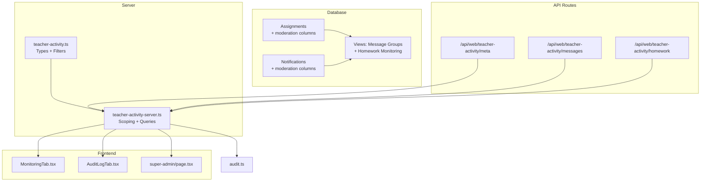
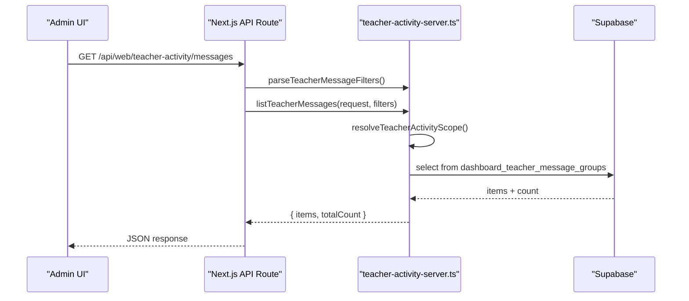
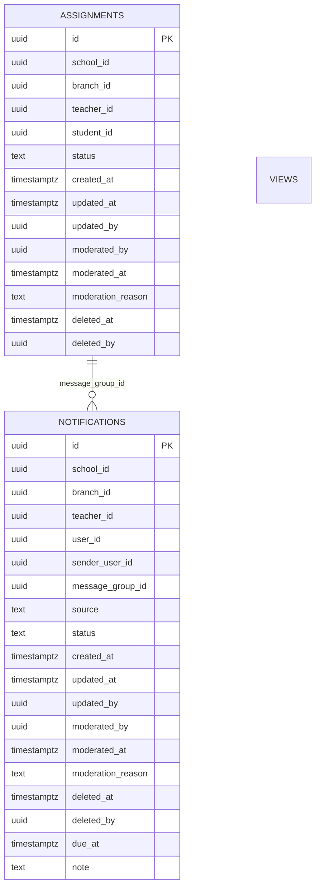
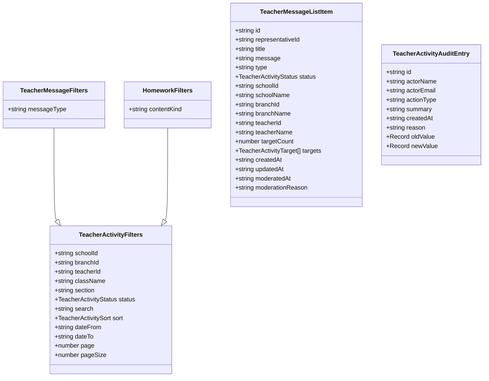
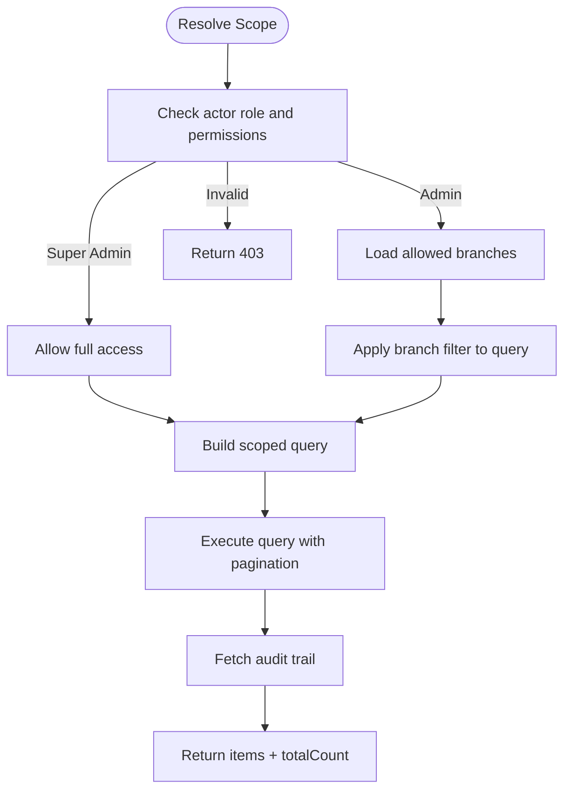
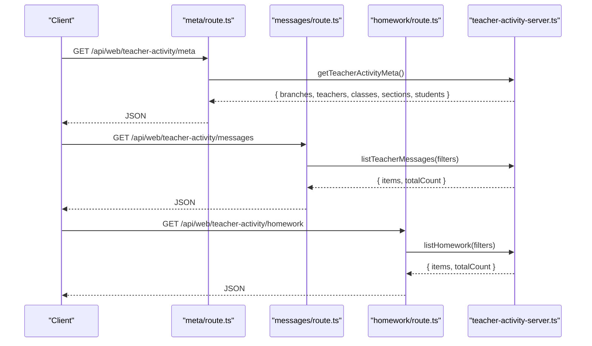
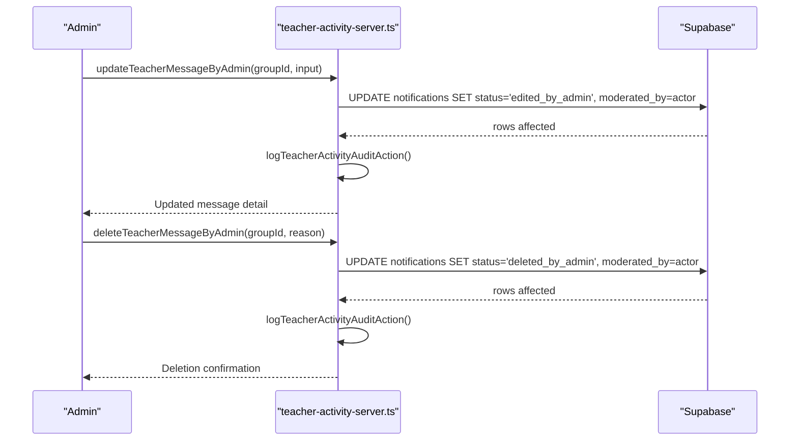
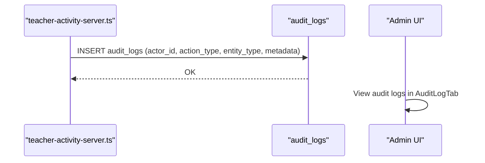
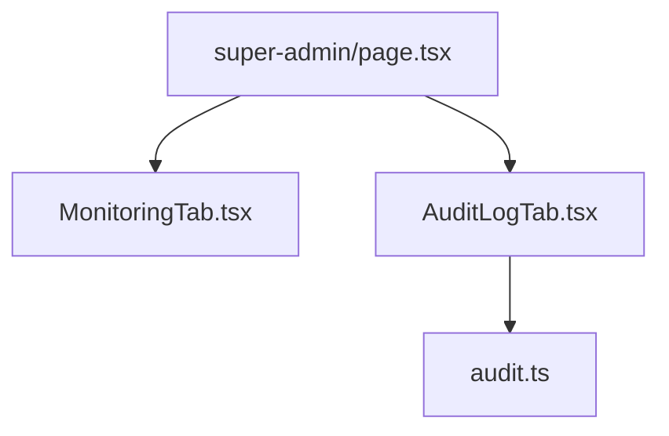
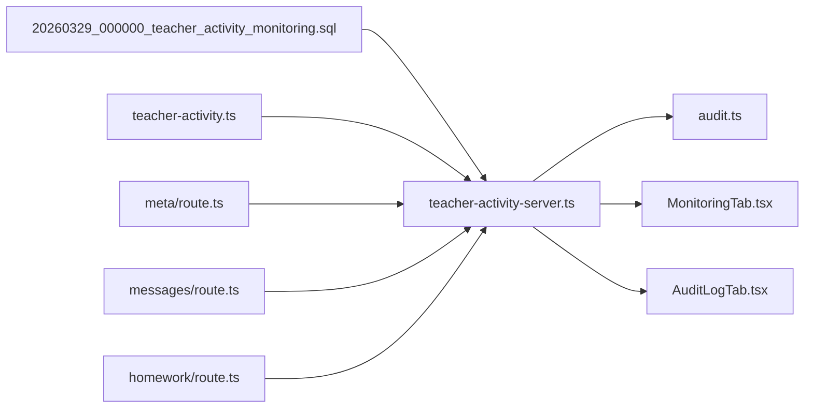

# Activity Monitoring

<cite>
**Referenced Files in This Document**
- [20260329_000000_teacher_activity_monitoring.sql](file://migrations/20260329_000000_teacher_activity_monitoring.sql)
- [teacher-activity.ts](file://lib/teacher-activity.ts)
- [teacher-activity-server.ts](file://lib/teacher-activity-server.ts)
- [meta/route.ts](file://app/api/web/teacher-activity/meta/route.ts)
- [messages/route.ts](file://app/api/web/teacher-activity/messages/route.ts)
- [homework/route.ts](file://app/api/web/teacher-activity/homework/route.ts)
- [audit.ts](file://lib/audit.ts)
- [MonitoringTab.tsx](file://app/[locale]/super-admin/components/MonitoringTab.tsx)
- [AuditLogTab.tsx](file://app/[locale]/super-admin/components/AuditLogTab.tsx)
- [super-admin/page.tsx](file://app/[locale]/super-admin/page.tsx)
</cite>

## Table of Contents
1. [Introduction](#introduction)
2. [Project Structure](#project-structure)
3. [Core Components](#core-components)
4. [Architecture Overview](#architecture-overview)
5. [Detailed Component Analysis](#detailed-component-analysis)
6. [Dependency Analysis](#dependency-analysis)
7. [Performance Considerations](#performance-considerations)
8. [Troubleshooting Guide](#troubleshooting-guide)
9. [Conclusion](#conclusion)
10. [Appendices](#appendices)

## Introduction
This document describes the teacher activity monitoring system, focusing on activity tracking, content moderation workflows, performance analytics, and activity logging. It covers teacher message monitoring, homework supervision, and content approval processes, along with audit trail functionality for activity logging, change tracking, and compliance reporting. Practical examples illustrate monitoring workflows, moderation scenarios, and performance evaluation processes. Integration points with notification systems, reporting dashboards, and administrative oversight tools are documented, alongside guidance for addressing common monitoring challenges such as false positives, content filtering, and performance measurement.

## Project Structure
The monitoring system spans database migrations, server-side APIs, client-side dashboards, and audit utilities:
- Database schema and views for teacher activity and moderation
- TypeScript libraries for typed filters, validation, and server-side queries
- Next.js API routes for listing and retrieving teacher activity
- Frontend monitoring and audit panels for administrative oversight
- Audit logging utilities for compliance reporting

**Diagram sources**
- [20260329_000000_teacher_activity_monitoring.sql:1-501](file://migrations/20260329_000000_teacher_activity_monitoring.sql#L1-L501)
- [teacher-activity.ts:1-404](file://lib/teacher-activity.ts#L1-L404)
- [teacher-activity-server.ts:1-1191](file://lib/teacher-activity-server.ts#L1-L1191)
- [meta/route.ts:1-23](file://app/api/web/teacher-activity/meta/route.ts#L1-L23)
- [messages/route.ts:1-20](file://app/api/web/teacher-activity/messages/route.ts#L1-L20)
- [homework/route.ts:1-20](file://app/api/web/teacher-activity/homework/route.ts#L1-L20)
- [MonitoringTab.tsx:1-233](file://app/[locale]/super-admin/components/MonitoringTab.tsx#L1-L233)
- [AuditLogTab.tsx:1-246](file://app/[locale]/super-admin/components/AuditLogTab.tsx#L1-L246)
- [audit.ts:1-63](file://lib/audit.ts#L1-L63)

**Section sources**
- [20260329_000000_teacher_activity_monitoring.sql:1-501](file://migrations/20260329_000000_teacher_activity_monitoring.sql#L1-L501)
- [teacher-activity.ts:1-404](file://lib/teacher-activity.ts#L1-L404)
- [teacher-activity-server.ts:1-1191](file://lib/teacher-activity-server.ts#L1-L1191)
- [meta/route.ts:1-23](file://app/api/web/teacher-activity/meta/route.ts#L1-L23)
- [messages/route.ts:1-20](file://app/api/web/teacher-activity/messages/route.ts#L1-L20)
- [homework/route.ts:1-20](file://app/api/web/teacher-activity/homework/route.ts#L1-L20)
- [MonitoringTab.tsx:1-233](file://app/[locale]/super-admin/components/MonitoringTab.tsx#L1-L233)
- [AuditLogTab.tsx:1-246](file://app/[locale]/super-admin/components/AuditLogTab.tsx#L1-L246)
- [audit.ts:1-63](file://lib/audit.ts#L1-L63)

## Core Components
- Database schema extensions for assignments and notifications with moderation fields and scopes
- Typed filters and validation for teacher messages and homework
- Server-side scoping and query builders enforcing admin branch-level visibility
- API routes for listing and retrieving teacher activity with pagination and search
- Audit logging for moderation actions and compliance reporting
- Frontend monitoring and audit panels for administrative oversight

Key capabilities:
- Teacher message monitoring via grouped notifications with status tracking and moderation
- Homework supervision with due dates, content kinds, and attachments
- Content approval workflows with admin moderation actions and audit trails
- Performance analytics through paginated lists and indexed queries
- Compliance reporting via audit logs with actor, action, entity, and metadata

**Section sources**
- [20260329_000000_teacher_activity_monitoring.sql:1-501](file://migrations/20260329_000000_teacher_activity_monitoring.sql#L1-L501)
- [teacher-activity.ts:1-404](file://lib/teacher-activity.ts#L1-L404)
- [teacher-activity-server.ts:1-1191](file://lib/teacher-activity-server.ts#L1-L1191)
- [audit.ts:1-63](file://lib/audit.ts#L1-L63)

## Architecture Overview
The system follows a layered architecture:
- Data layer: Supabase tables with triggers and views for teacher activity
- Service layer: Server-side functions for scoping, filtering, and audit logging
- API layer: Next.js routes exposing REST endpoints for monitoring
- Presentation layer: Administrative dashboards for monitoring and audit

**Diagram sources**
- [messages/route.ts:1-20](file://app/api/web/teacher-activity/messages/route.ts#L1-L20)
- [teacher-activity-server.ts:451-486](file://lib/teacher-activity-server.ts#L451-L486)
- [teacher-activity.ts:248-264](file://lib/teacher-activity.ts#L248-L264)

**Section sources**
- [messages/route.ts:1-20](file://app/api/web/teacher-activity/messages/route.ts#L1-L20)
- [teacher-activity-server.ts:451-486](file://lib/teacher-activity-server.ts#L451-L486)
- [teacher-activity.ts:248-264](file://lib/teacher-activity.ts#L248-L264)

## Detailed Component Analysis

### Database Schema and Views
The migration adds moderation and scoping columns to assignments and notifications, defines constraints, and creates views for dashboard monitoring:
- Assignments: status, moderation fields, updated_by, deleted markers
- Notifications: source, status, moderation fields, message grouping, due_at, note
- Triggers and defaults infer branch scope and set timestamps
- Indexes optimize monitoring queries by school, branch, status, and created_at
- Views:
  - dashboard_teacher_message_groups aggregates grouped teacher messages
  - dashboard_homework_monitoring surfaces assignment details with metadata

**Diagram sources**
- [20260329_000000_teacher_activity_monitoring.sql:5-111](file://migrations/20260329_000000_teacher_activity_monitoring.sql#L5-L111)
- [20260329_000000_teacher_activity_monitoring.sql:413-498](file://migrations/20260329_000000_teacher_activity_monitoring.sql#L413-L498)

**Section sources**
- [20260329_000000_teacher_activity_monitoring.sql:1-501](file://migrations/20260329_000000_teacher_activity_monitoring.sql#L1-L501)

### Types and Filters
The library defines:
- Status enums and sorting options for teacher activity
- Filters for messages and homework with pagination, search, date ranges, and scoping
- Validation helpers for moderation inputs and fee notification creation
- Typed DTOs for message groups, homework items, audit entries, and fee notification history

**Diagram sources**
- [teacher-activity.ts:24-35](file://lib/teacher-activity.ts#L24-L35)
- [teacher-activity.ts:37-43](file://lib/teacher-activity.ts#L37-L43)
- [teacher-activity.ts:41-43](file://lib/teacher-activity.ts#L41-L43)
- [teacher-activity.ts:65-98](file://lib/teacher-activity.ts#L65-L98)
- [teacher-activity.ts:53-63](file://lib/teacher-activity.ts#L53-L63)

**Section sources**
- [teacher-activity.ts:1-404](file://lib/teacher-activity.ts#L1-L404)

### Server-Side Scoping and Queries
The server enforces administrative scoping:
- Resolves actor context and permissions
- Applies branch-level filters for admins
- Builds queries with ordering, search, and pagination
- Fetches audit trails per entity
- Logs moderation actions with metadata

**Diagram sources**
- [teacher-activity-server.ts:123-197](file://lib/teacher-activity-server.ts#L123-L197)
- [teacher-activity-server.ts:199-214](file://lib/teacher-activity-server.ts#L199-L214)
- [teacher-activity-server.ts:223-253](file://lib/teacher-activity-server.ts#L223-L253)

**Section sources**
- [teacher-activity-server.ts:1-1191](file://lib/teacher-activity-server.ts#L1-L1191)

### API Endpoints
REST endpoints expose monitoring data:
- GET /api/web/teacher-activity/meta: fetches monitoring metadata (branches, teachers, classes, sections, students)
- GET /api/web/teacher-activity/messages: lists grouped teacher messages with filters
- GET /api/web/teacher-activity/homework: lists homework with filters

**Diagram sources**
- [meta/route.ts:1-23](file://app/api/web/teacher-activity/meta/route.ts#L1-L23)
- [messages/route.ts:1-20](file://app/api/web/teacher-activity/messages/route.ts#L1-L20)
- [homework/route.ts:1-20](file://app/api/web/teacher-activity/homework/route.ts#L1-L20)
- [teacher-activity-server.ts:361-449](file://lib/teacher-activity-server.ts#L361-L449)
- [teacher-activity-server.ts:451-486](file://lib/teacher-activity-server.ts#L451-L486)
- [teacher-activity-server.ts:687-719](file://lib/teacher-activity-server.ts#L687-L719)

**Section sources**
- [meta/route.ts:1-23](file://app/api/web/teacher-activity/meta/route.ts#L1-L23)
- [messages/route.ts:1-20](file://app/api/web/teacher-activity/messages/route.ts#L1-L20)
- [homework/route.ts:1-20](file://app/api/web/teacher-activity/homework/route.ts#L1-L20)
- [teacher-activity-server.ts:361-449](file://lib/teacher-activity-server.ts#L361-L449)
- [teacher-activity-server.ts:451-486](file://lib/teacher-activity-server.ts#L451-L486)
- [teacher-activity-server.ts:687-719](file://lib/teacher-activity-server.ts#L687-L719)

### Moderation Workflows
Administrators can moderate teacher messages and homework:
- Update teacher message: modifies title, message, note, link, due_at, reason; sets edited_by_admin status
- Delete teacher message: marks as deleted_by_admin with moderation metadata
- Update homework: modifies title, description, subject, due_at, content_kind, reason; sets edited_by_admin status
- Delete homework: marks as deleted_by_admin with moderation metadata

**Diagram sources**
- [teacher-activity-server.ts:548-628](file://lib/teacher-activity-server.ts#L548-L628)
- [teacher-activity-server.ts:630-685](file://lib/teacher-activity-server.ts#L630-L685)

**Section sources**
- [teacher-activity-server.ts:548-685](file://lib/teacher-activity-server.ts#L548-L685)

### Audit Trail and Compliance Reporting
The system logs moderation actions with:
- Actor identity and role
- Action type (create/update/delete)
- Entity type and ID
- Summary and metadata (reason, old/new values)
- Timestamps and scoping info (school, branch)

**Diagram sources**
- [teacher-activity-server.ts:255-298](file://lib/teacher-activity-server.ts#L255-L298)
- [audit.ts:40-62](file://lib/audit.ts#L40-L62)
- [AuditLogTab.tsx:1-246](file://app/[locale]/super-admin/components/AuditLogTab.tsx#L1-L246)

**Section sources**
- [teacher-activity-server.ts:255-298](file://lib/teacher-activity-server.ts#L255-L298)
- [audit.ts:1-63](file://lib/audit.ts#L1-L63)
- [AuditLogTab.tsx:1-246](file://app/[locale]/super-admin/components/AuditLogTab.tsx#L1-L246)

### Frontend Dashboards and Administrative Oversight
- MonitoringTab displays system health, counts, and recent events with optional audit log integration
- AuditLogTab presents paginated audit logs with filters for action and entity types
- Super-admin page orchestrates tabs and integrates with infrastructure flags

**Diagram sources**
- [super-admin/page.tsx:1-1073](file://app/[locale]/super-admin/page.tsx#L1-L1073)
- [MonitoringTab.tsx:1-233](file://app/[locale]/super-admin/components/MonitoringTab.tsx#L1-L233)
- [AuditLogTab.tsx:1-246](file://app/[locale]/super-admin/components/AuditLogTab.tsx#L1-L246)
- [audit.ts:1-63](file://lib/audit.ts#L1-L63)

**Section sources**
- [super-admin/page.tsx:1-1073](file://app/[locale]/super-admin/page.tsx#L1-L1073)
- [MonitoringTab.tsx:1-233](file://app/[locale]/super-admin/components/MonitoringTab.tsx#L1-L233)
- [AuditLogTab.tsx:1-246](file://app/[locale]/super-admin/components/AuditLogTab.tsx#L1-L246)
- [audit.ts:1-63](file://lib/audit.ts#L1-L63)

## Dependency Analysis
The monitoring system exhibits clear separation of concerns:
- Database schema provides the foundation for scoping and moderation
- Server module encapsulates business logic and audit
- API routes depend on server module and return standardized responses
- Frontend dashboards consume API endpoints and render audit data

**Diagram sources**
- [20260329_000000_teacher_activity_monitoring.sql:1-501](file://migrations/20260329_000000_teacher_activity_monitoring.sql#L1-L501)
- [teacher-activity.ts:1-404](file://lib/teacher-activity.ts#L1-L404)
- [teacher-activity-server.ts:1-1191](file://lib/teacher-activity-server.ts#L1-L1191)
- [meta/route.ts:1-23](file://app/api/web/teacher-activity/meta/route.ts#L1-L23)
- [messages/route.ts:1-20](file://app/api/web/teacher-activity/messages/route.ts#L1-L20)
- [homework/route.ts:1-20](file://app/api/web/teacher-activity/homework/route.ts#L1-L20)
- [audit.ts:1-63](file://lib/audit.ts#L1-L63)
- [MonitoringTab.tsx:1-233](file://app/[locale]/super-admin/components/MonitoringTab.tsx#L1-L233)
- [AuditLogTab.tsx:1-246](file://app/[locale]/super-admin/components/AuditLogTab.tsx#L1-L246)

**Section sources**
- [20260329_000000_teacher_activity_monitoring.sql:1-501](file://migrations/20260329_000000_teacher_activity_monitoring.sql#L1-L501)
- [teacher-activity.ts:1-404](file://lib/teacher-activity.ts#L1-L404)
- [teacher-activity-server.ts:1-1191](file://lib/teacher-activity-server.ts#L1-L1191)
- [meta/route.ts:1-23](file://app/api/web/teacher-activity/meta/route.ts#L1-L23)
- [messages/route.ts:1-20](file://app/api/web/teacher-activity/messages/route.ts#L1-L20)
- [homework/route.ts:1-20](file://app/api/web/teacher-activity/homework/route.ts#L1-L20)
- [audit.ts:1-63](file://lib/audit.ts#L1-L63)
- [MonitoringTab.tsx:1-233](file://app/[locale]/super-admin/components/MonitoringTab.tsx#L1-L233)
- [AuditLogTab.tsx:1-246](file://app/[locale]/super-admin/components/AuditLogTab.tsx#L1-L246)

## Performance Considerations
- Indexed queries: dedicated indexes on school_id, branch_id, status, created_at improve filtering and sorting
- Pagination: range-based pagination prevents large result sets
- Search optimization: ILIKE with OR clauses require careful index usage; consider full-text search for large datasets
- Audit logging overhead: ensure audit inserts are non-blocking and consider batching for high-volume moderation
- Frontend rendering: virtualized tables and lazy loading for audit logs reduce UI latency

[No sources needed since this section provides general guidance]

## Troubleshooting Guide
Common issues and resolutions:
- Missing audit_logs table: audit logging is disabled until migration is applied
- Insufficient permissions: ensure actor has required permissions for viewing/moderating teacher activity
- Branch scope violations: admins can only access allowed branches; verify admin_branch_scopes
- Invalid moderation inputs: validation returns field-specific errors; correct inputs and retry
- Deleted entities: cannot modify deleted_by_admin items; restore or recreate as needed

**Section sources**
- [teacher-activity-server.ts:112-150](file://lib/teacher-activity-server.ts#L112-L150)
- [teacher-activity-server.ts:199-214](file://lib/teacher-activity-server.ts#L199-L214)
- [teacher-activity-server.ts:255-298](file://lib/teacher-activity-server.ts#L255-L298)
- [teacher-activity.ts:284-341](file://lib/teacher-activity.ts#L284-L341)
- [AuditLogTab.tsx:82-86](file://app/[locale]/super-admin/components/AuditLogTab.tsx#L82-L86)

## Conclusion
The teacher activity monitoring system provides robust moderation, auditing, and oversight capabilities. Its modular design separates data, service, API, and presentation layers, enabling scalable monitoring of teacher messages and homework while maintaining compliance through detailed audit trails. Administrators benefit from intuitive dashboards and powerful filtering, while developers can extend functionality with minimal coupling.

[No sources needed since this section summarizes without analyzing specific files]

## Appendices

### Practical Examples

- Monitoring Workflow Example
  - Fetch monitoring metadata to populate filters
  - List teacher messages with status and date range filters
  - Review audit trail for changes and reasons

- Content Moderation Scenario
  - Update a teacher message with a reason for edit
  - Delete a message with a moderation reason
  - Verify audit logs reflect action, actor, and changes

- Performance Evaluation Process
  - Use paginated lists with appropriate sorting
  - Monitor response times and adjust pagination sizes
  - Track moderation volume and audit log growth

[No sources needed since this section provides general guidance]