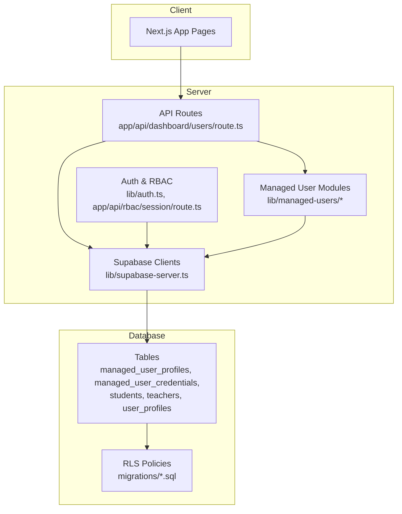
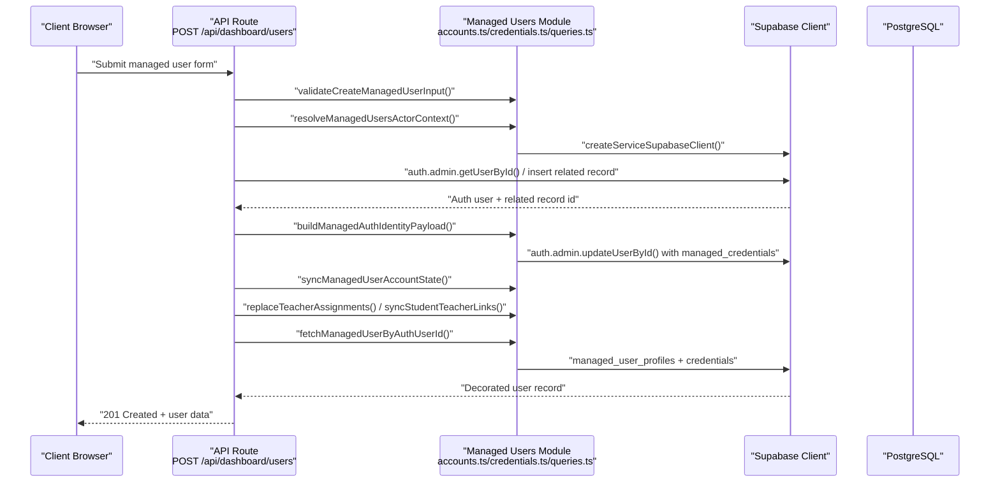
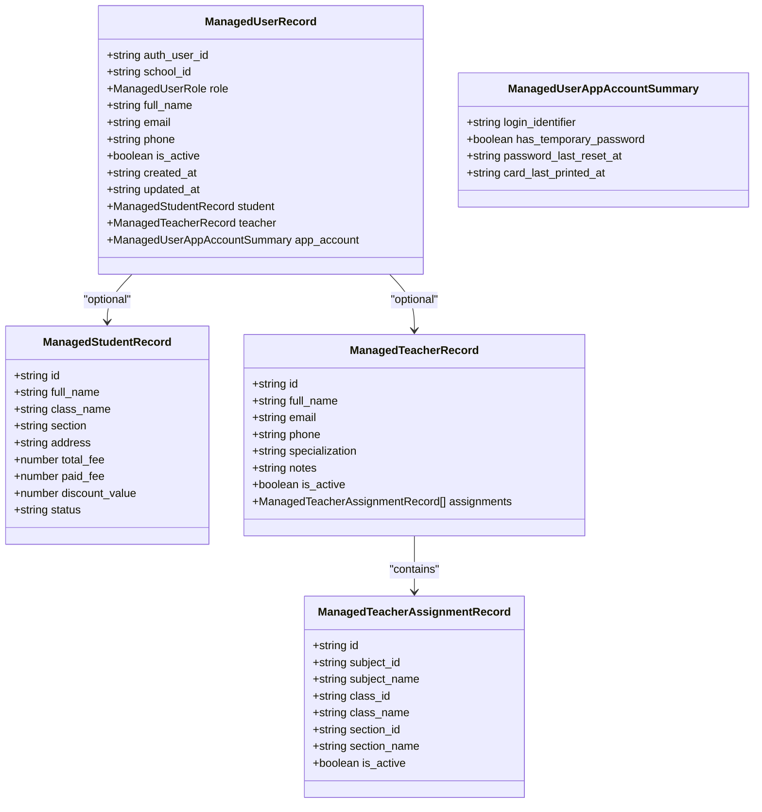
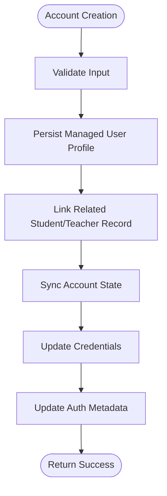
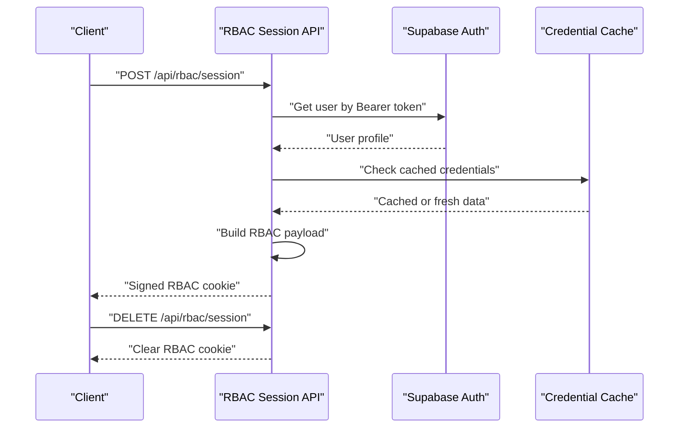
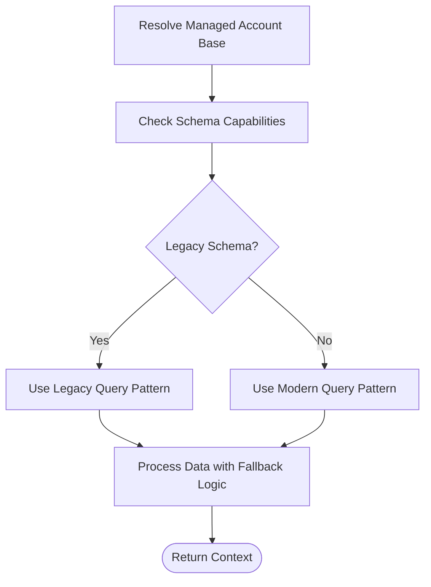
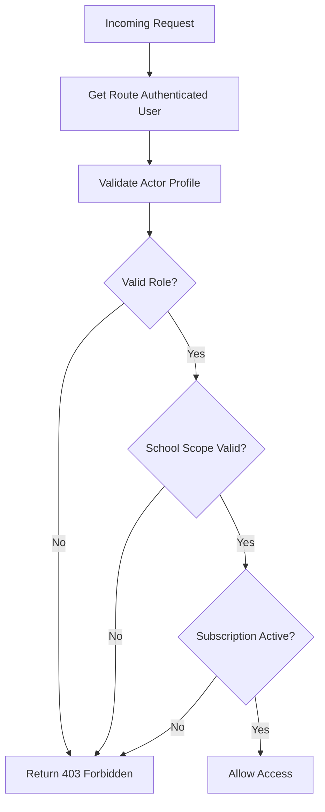
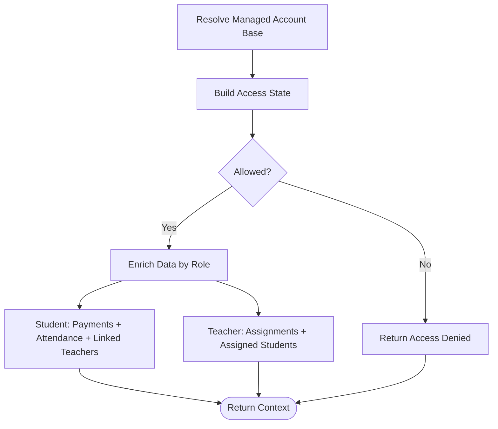
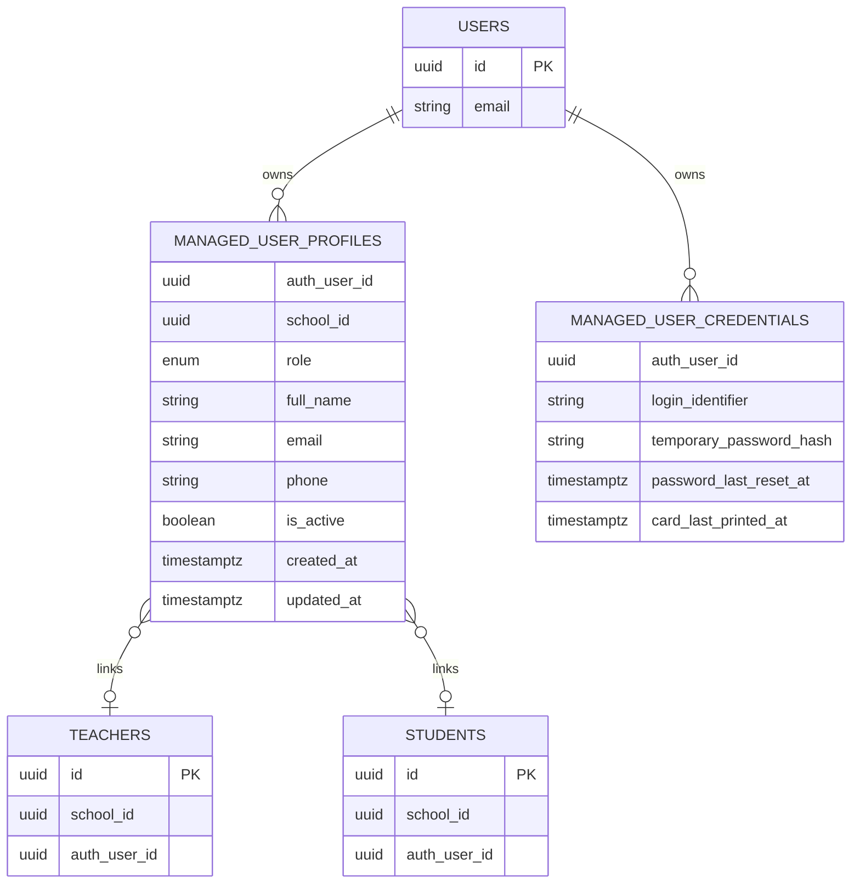
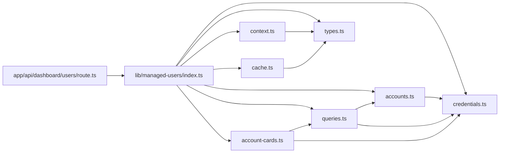

# Managed Users

<cite>
**Referenced Files in This Document**
- [lib/managed-users.ts](file://lib/managed-users.ts)
- [lib/managed-users/index.ts](file://lib/managed-users/index.ts)
- [lib/managed-users/accounts.ts](file://lib/managed-users/accounts.ts)
- [lib/managed-users/credentials.ts](file://lib/managed-users/credentials.ts)
- [lib/managed-users/queries.ts](file://lib/managed-users/queries.ts)
- [lib/managed-users/context.ts](file://lib/managed-users/context.ts)
- [lib/managed-users/account-cards.ts](file://lib/managed-users/account-cards.ts)
- [lib/managed-users/cache.ts](file://lib/managed-users/cache.ts)
- [lib/managed-users/types.ts](file://lib/managed-users/types.ts)
- [lib/managed-user-app-context.ts](file://lib/managed-user-app-context.ts)
- [lib/auth.ts](file://lib/auth.ts)
- [types/roles.ts](file://types/roles.ts)
- [lib/supabase-server.ts](file://lib/supabase-server.ts)
- [app/api/dashboard/users/route.ts](file://app/api/dashboard/users/route.ts)
- [app/api/rbac/session/route.ts](file://app/api/rbac/session/route.ts)
- [migrations/20260322_managed_mobile_rls.sql](file://migrations/20260322_managed_mobile_rls.sql)
- [migrations/20260323_010000_managed_account_schema_backfill.sql](file://migrations/20260323_010000_managed_account_schema_backfill.sql)
</cite>

## Update Summary
**Changes Made**
- Complete refactoring of lib/managed-users-server.ts (2191 lines) into organized module structure under lib/managed-users/
- Separation of concerns into dedicated modules for accounts, credentials, queries, context management, and account cards
- Enhanced code maintainability and improved separation of responsibilities
- Updated API routes to use new modular structure while maintaining backward compatibility

## Table of Contents
1. [Introduction](#introduction)
2. [Project Structure](#project-structure)
3. [Core Components](#core-components)
4. [Architecture Overview](#architecture-overview)
5. [Detailed Component Analysis](#detailed-component-analysis)
6. [Dependency Analysis](#dependency-analysis)
7. [Performance Considerations](#performance-considerations)
8. [Troubleshooting Guide](#troubleshooting-guide)
9. [Conclusion](#conclusion)

## Introduction
This document explains the managed user system for teachers and students, focusing on profile management, credential handling, and access permissions. The system has been completely refactored to improve maintainability and separation of concerns. It covers the teacher onboarding workflow (registration, profile setup, role assignment), credential management and authentication integration, and the managed user context supporting multi-school access, branch-level permissions, and hierarchical role management. Practical scenarios and workflows are included, along with troubleshooting guidance for common issues such as credential conflicts, permission inheritance, and user provisioning.

## Project Structure
The managed user system has been restructured into a modular architecture under lib/managed-users/ with clear separation of concerns. The new structure provides better maintainability and scalability while preserving all existing functionality.

**Updated** The monolithic lib/managed-users-server.ts (2191 lines) has been decomposed into focused modules:

- **Accounts Module** (`lib/managed-users/accounts.ts`): Handles user profile creation, linking, and synchronization
- **Credentials Module** (`lib/managed-users/credentials.ts`): Manages authentication credentials, password handling, and metadata updates
- **Queries Module** (`lib/managed-users/queries.ts`): Provides database query utilities and data fetching operations
- **Context Module** (`lib/managed-users/context.ts`): Manages actor context resolution and role-based access control
- **Account Cards Module** (`lib/managed-users/account-cards.ts`): Handles printable account cards and branding
- **Cache Module** (`lib/managed-users/cache.ts`): Implements caching strategies for performance optimization
- **Types Module** (`lib/managed-users/types.ts`): Defines TypeScript interfaces and type definitions
- **Index Module** (`lib/managed-users/index.ts`): Exports all modules for unified access

**Diagram sources**
- [app/api/dashboard/users/route.ts](file://app/api/dashboard/users/route.ts)
- [lib/managed-users/index.ts](file://lib/managed-users/index.ts)
- [lib/managed-users/accounts.ts](file://lib/managed-users/accounts.ts)
- [lib/managed-users/credentials.ts](file://lib/managed-users/credentials.ts)
- [lib/managed-users/queries.ts](file://lib/managed-users/queries.ts)
- [lib/managed-users/context.ts](file://lib/managed-users/context.ts)
- [lib/managed-users/account-cards.ts](file://lib/managed-users/account-cards.ts)
- [lib/managed-users/cache.ts](file://lib/managed-users/cache.ts)
- [lib/managed-users/types.ts](file://lib/managed-users/types.ts)
- [lib/managed-user-app-context.ts](file://lib/managed-user-app-context.ts)
- [lib/auth.ts](file://lib/auth.ts)
- [app/api/rbac/session/route.ts](file://app/api/rbac/session/route.ts)
- [lib/supabase-server.ts](file://lib/supabase-server.ts)
- [migrations/20260322_managed_mobile_rls.sql](file://migrations/20260322_managed_mobile_rls.sql)
- [migrations/20260323_010000_managed_account_schema_backfill.sql](file://migrations/20260323_010000_managed_account_schema_backfill.sql)

**Section sources**
- [lib/managed-users/index.ts](file://lib/managed-users/index.ts)
- [lib/managed-users/accounts.ts](file://lib/managed-users/accounts.ts)
- [lib/managed-users/credentials.ts](file://lib/managed-users/credentials.ts)
- [lib/managed-users/queries.ts](file://lib/managed-users/queries.ts)
- [lib/managed-users/context.ts](file://lib/managed-users/context.ts)
- [lib/managed-users/account-cards.ts](file://lib/managed-users/account-cards.ts)
- [lib/managed-users/cache.ts](file://lib/managed-users/cache.ts)
- [lib/managed-users/types.ts](file://lib/managed-users/types.ts)

## Core Components
The refactored system maintains all core functionality while improving modularity and maintainability:

- **Managed user data model and validation**:
  - Defines roles, fields, and normalization/validation for student and teacher records, including teacher assignments and credential summaries.
- **Accounts module**:
  - Handles profile creation, linking, and synchronization between managed profiles and related records.
  - Provides utilities for normalizing user records and building legacy compatibility layers.
- **Credentials module**:
  - Manages authentication credentials, password generation/hashing, and metadata updates.
  - Implements caching strategies for credential lookups and metadata operations.
- **Queries module**:
  - Provides database query utilities including table capability probing, teacher assignment fetching, and managed user resolution.
  - Handles fallback mechanisms for legacy schemas and infrastructure compatibility.
- **Context module**:
  - Resolves actor context for API requests with role-based access control.
  - Validates school subscriptions and handles different role hierarchies.
- **Application context builder**:
  - Builds the managed user app context including access state, linkage, profile, and role-specific data for students and teachers.
- **Authentication and RBAC**:
  - Session initialization via API, cookie signing/verification, and client helpers for RBAC session lifecycle.
- **Role-based access control**:
  - Role definitions, permission groups, route access rules, and sidebar navigation mapping.
- **Supabase integration**:
  - Route and service clients, bearer token extraction, and authenticated user retrieval.
- **Database RLS**:
  - Policies enabling multi-school scoping and admin-level checks for managed user profiles and credentials.

**Section sources**
- [lib/managed-users.ts](file://lib/managed-users.ts)
- [lib/managed-users/accounts.ts](file://lib/managed-users/accounts.ts)
- [lib/managed-users/credentials.ts](file://lib/managed-users/credentials.ts)
- [lib/managed-users/queries.ts](file://lib/managed-users/queries.ts)
- [lib/managed-users/context.ts](file://lib/managed-users/context.ts)
- [lib/managed-user-app-context.ts](file://lib/managed-user-app-context.ts)
- [lib/auth.ts](file://lib/auth.ts)
- [types/roles.ts](file://types/roles.ts)
- [lib/supabase-server.ts](file://lib/supabase-server.ts)
- [migrations/20260322_managed_mobile_rls.sql](file://migrations/20260322_managed_mobile_rls.sql)
- [migrations/20260323_010000_managed_account_schema_backfill.sql](file://migrations/20260323_010000_managed_account_schema_backfill.sql)

## Architecture Overview
The managed user system integrates client-side pages, server-side API routes, and Supabase for authentication and data persistence. The refactored modular architecture improves maintainability while preserving all functionality. RLS policies ensure that administrative actions are scoped to the current school and role. The server orchestrates onboarding, credential metadata updates, and cross-record linking through specialized modules.

**Diagram sources**
- [app/api/dashboard/users/route.ts](file://app/api/dashboard/users/route.ts)
- [lib/managed-users/accounts.ts](file://lib/managed-users/accounts.ts)
- [lib/managed-users/credentials.ts](file://lib/managed-users/credentials.ts)
- [lib/managed-users/queries.ts](file://lib/managed-users/queries.ts)
- [lib/supabase-server.ts](file://lib/supabase-server.ts)

**Section sources**
- [app/api/dashboard/users/route.ts](file://app/api/dashboard/users/route.ts)
- [lib/managed-users/accounts.ts](file://lib/managed-users/accounts.ts)
- [lib/managed-users/credentials.ts](file://lib/managed-users/credentials.ts)
- [lib/managed-users/queries.ts](file://lib/managed-users/queries.ts)
- [lib/supabase-server.ts](file://lib/supabase-server.ts)

## Detailed Component Analysis

### Managed User Data Model and Validation
The data model remains consistent with the previous implementation, providing comprehensive validation and normalization for managed user records.

- **Roles and fields**:
  - Supports "student" and "teacher" roles with distinct payloads for profile, student, and teacher records.
  - Includes teacher assignments with deduplication and normalization.
- **Validation**:
  - Validates required fields, email format, money values, and teacher assignments.
  - Provides separate validators for create vs update operations.

**Diagram sources**
- [lib/managed-users.ts](file://lib/managed-users.ts)

**Section sources**
- [lib/managed-users.ts](file://lib/managed-users.ts)

### Modular Accounts Management
The accounts module handles all user profile operations with improved separation of concerns.

- **Profile creation and linking**:
  - Persists managed user profiles with automatic fallback to legacy user profiles.
  - Ensures proper linking between auth users and related student/teacher records.
- **Normalization utilities**:
  - Provides robust normalization for user records and lookup operations.
  - Handles legacy schema compatibility and edge cases.
- **Account state synchronization**:
  - Synchronizes account state across multiple systems including credentials and auth metadata.

**Diagram sources**
- [lib/managed-users/accounts.ts](file://lib/managed-users/accounts.ts)

**Section sources**
- [lib/managed-users/accounts.ts](file://lib/managed-users/accounts.ts)

### Enhanced Credential Management
The credentials module provides comprehensive authentication credential management with improved caching and error handling.

- **Credential generation**:
  - Generates secure temporary passwords and login identifiers.
  - Implements proper password hashing and security measures.
- **Metadata management**:
  - Updates app_metadata and user_metadata atomically via Supabase admin APIs.
  - Implements caching strategies to reduce repeated database calls.
- **Session integration**:
  - Provides functions to refresh or clear RBAC session cookies and sign out.

**Diagram sources**
- [app/api/rbac/session/route.ts](file://app/api/rbac/session/route.ts)
- [lib/auth.ts](file://lib/auth.ts)
- [lib/managed-users/credentials.ts](file://lib/managed-users/credentials.ts)
- [lib/managed-users/cache.ts](file://lib/managed-users/cache.ts)

**Section sources**
- [lib/managed-users/credentials.ts](file://lib/managed-users/credentials.ts)
- [lib/managed-users/cache.ts](file://lib/managed-users/cache.ts)
- [app/api/rbac/session/route.ts](file://app/api/rbac/session/route.ts)
- [lib/auth.ts](file://lib/auth.ts)

### Query Optimization and Database Operations
The queries module provides optimized database operations with fallback mechanisms for different schema versions.

- **Schema capability probing**:
  - Dynamically detects table and column availability across different schema versions.
  - Implements caching for schema capability lookups to improve performance.
- **Data fetching**:
  - Provides efficient queries for managed user data with fallback to legacy schemas.
  - Handles complex joins and relationship resolution.
- **Assignment management**:
  - Manages teacher assignments with proper subject/class/section resolution.
  - Provides fallback mechanisms for legacy assignment storage formats.

**Diagram sources**
- [lib/managed-users/queries.ts](file://lib/managed-users/queries.ts)
- [lib/managed-users/cache.ts](file://lib/managed-users/cache.ts)

**Section sources**
- [lib/managed-users/queries.ts](file://lib/managed-users/queries.ts)
- [lib/managed-users/cache.ts](file://lib/managed-users/cache.ts)

### Role-Based Access Control and Context Management
The context module provides robust role-based access control with proper hierarchy validation.

- **Actor context resolution**:
  - Validates actor roles and school associations for API requests.
  - Handles different role hierarchies including super_admin, admin, and employee roles.
- **Subscription validation**:
  - Checks school subscription status and expiration dates.
  - Prevents operations on expired or suspended subscriptions.
- **Permission enforcement**:
  - Implements fine-grained permission checking based on roles and scopes.
  - Provides clear error messages for access denials.

**Diagram sources**
- [lib/managed-users/context.ts](file://lib/managed-users/context.ts)
- [types/roles.ts](file://types/roles.ts)

**Section sources**
- [lib/managed-users/context.ts](file://lib/managed-users/context.ts)
- [types/roles.ts](file://types/roles.ts)

### Managed User Context and Multi-School Access
The application context continues to provide comprehensive user context building with enhanced data enrichment.

- **Identity and linkage**:
  - Resolves managed account identity, linkage status, and role.
- **Access state**:
  - Determines whether the account can access the app based on role, school scope, and linked record status.
- **Data enrichment**:
  - For students: payment summary, attendance summary, and linked teachers.
  - For teachers: assignments and assigned students.
- **Branch-level permissions**:
  - Admins may be scoped to specific branches via admin_branch_scopes.

**Diagram sources**
- [lib/managed-user-app-context.ts](file://lib/managed-user-app-context.ts)
- [lib/managed-users/queries.ts](file://lib/managed-users/queries.ts)

**Section sources**
- [lib/managed-user-app-context.ts](file://lib/managed-user-app-context.ts)
- [lib/managed-users/queries.ts](file://lib/managed-users/queries.ts)

### Database RLS and Policy Scoping
The database layer maintains comprehensive RLS policies for multi-school and admin scoping.

- **Managed user profiles and credentials**:
  - Enable RLS and define policies allowing super_admin or admin scoped to current school.
- **Self-select policy**:
  - Authenticated users can select their own managed profile.
- **Function grants**:
  - Functions for current managed role, school ID, and access checks are granted to authenticated users.

**Diagram sources**
- [migrations/20260322_managed_mobile_rls.sql](file://migrations/20260322_managed_mobile_rls.sql)
- [migrations/20260323_010000_managed_account_schema_backfill.sql](file://migrations/20260323_010000_managed_account_schema_backfill.sql)

**Section sources**
- [migrations/20260322_managed_mobile_rls.sql](file://migrations/20260322_managed_mobile_rls.sql)
- [migrations/20260323_010000_managed_account_schema_backfill.sql](file://migrations/20260323_010000_managed_account_schema_backfill.sql)

## Dependency Analysis
The refactored modular architecture significantly improves dependency management and reduces coupling between components.

**Updated** The new modular structure provides clear boundaries between concerns:

- **Component coupling**:
  - API routes depend on the unified index module which exports all necessary functions.
  - Individual modules have minimal internal dependencies, promoting single responsibility.
  - Application context depends on specific modules rather than the entire server library.
- **External dependencies**:
  - Supabase for authentication, admin operations, and database queries.
  - PostgreSQL RLS for enforcing multi-school and role-based access.
- **Internal module dependencies**:
  - Queries module depends on credentials and accounts modules for data operations.
  - Context module depends on types and role validation utilities.
  - Account cards module depends on credentials and queries for data retrieval.

**Diagram sources**
- [app/api/dashboard/users/route.ts](file://app/api/dashboard/users/route.ts)
- [lib/managed-users/index.ts](file://lib/managed-users/index.ts)
- [lib/managed-users/accounts.ts](file://lib/managed-users/accounts.ts)
- [lib/managed-users/credentials.ts](file://lib/managed-users/credentials.ts)
- [lib/managed-users/queries.ts](file://lib/managed-users/queries.ts)
- [lib/managed-users/context.ts](file://lib/managed-users/context.ts)
- [lib/managed-users/account-cards.ts](file://lib/managed-users/account-cards.ts)
- [lib/managed-users/cache.ts](file://lib/managed-users/cache.ts)
- [lib/managed-users/types.ts](file://lib/managed-users/types.ts)

**Section sources**
- [app/api/dashboard/users/route.ts](file://app/api/dashboard/users/route.ts)
- [lib/managed-users/index.ts](file://lib/managed-users/index.ts)
- [lib/managed-users/accounts.ts](file://lib/managed-users/accounts.ts)
- [lib/managed-users/credentials.ts](file://lib/managed-users/credentials.ts)
- [lib/managed-users/queries.ts](file://lib/managed-users/queries.ts)
- [lib/managed-users/context.ts](file://lib/managed-users/context.ts)
- [lib/managed-users/account-cards.ts](file://lib/managed-users/account-cards.ts)
- [lib/managed-users/cache.ts](file://lib/managed-users/cache.ts)
- [lib/managed-users/types.ts](file://lib/managed-users/types.ts)

## Performance Considerations
The refactored modular architecture introduces several performance improvements:

- **Enhanced caching**:
  - Schema capability probing and credential metadata lookups use sophisticated caching with TTL to reduce repeated database calls.
  - Separate caches for different types of data (schema capabilities, credentials, teacher table capabilities).
- **Optimized batch operations**:
  - Decorated user retrieval and credential fetching use Promise.all to parallelize queries.
  - Batch processing of multiple user operations reduces database round trips.
- **Improved query efficiency**:
  - Queries module implements fallback mechanisms to handle different schema versions efficiently.
  - Dynamic column selection based on table capabilities reduces unnecessary data transfer.
- **Recommendations**:
  - Monitor cache hit rates for credential metadata and schema capabilities.
  - Consider indexing frequently filtered columns (e.g., school_id, role, is_active) in managed_user_profiles.
  - Evaluate cache invalidation strategies for high-frequency changing data.

## Troubleshooting Guide
The modular architecture improves error handling and debugging capabilities:

- **Credential conflicts**:
  - Symptom: Duplicate managed login identifier or conflicting auth metadata.
  - Resolution: Ensure unique login identifiers and verify managed_credentials updates via patchManagedCredentialMetadata.
- **Permission inheritance**:
  - Symptom: Unexpected access denied errors.
  - Resolution: Verify role-to-permission mapping and route permission rules; confirm school subscription status and expiry.
- **User provisioning**:
  - Symptom: Onboarding fails due to missing auth_user_id column.
  - Resolution: Run migrations to add auth_user_id to students/teachers tables; retry onboarding.
- **Access state issues**:
  - Symptom: Managed account marked inactive or missing linked record.
  - Resolution: Check managed profile and linked record statuses; ensure teacher is_active and student status allows app access.
- **Module-specific issues**:
  - **Accounts module**: Check profile creation logs and related record linking status.
  - **Credentials module**: Verify cache invalidation and metadata update operations.
  - **Queries module**: Monitor schema capability probing and fallback mechanisms.
  - **Context module**: Validate role resolution and subscription status checks.

**Section sources**
- [lib/managed-users/accounts.ts](file://lib/managed-users/accounts.ts)
- [lib/managed-users/credentials.ts](file://lib/managed-users/credentials.ts)
- [lib/managed-users/queries.ts](file://lib/managed-users/queries.ts)
- [lib/managed-users/context.ts](file://lib/managed-users/context.ts)
- [lib/managed-user-app-context.ts](file://lib/managed-user-app-context.ts)
- [lib/auth.ts](file://lib/auth.ts)
- [types/roles.ts](file://types/roles.ts)
- [app/api/dashboard/users/route.ts](file://app/api/dashboard/users/route.ts)

## Conclusion
The refactored managed user system provides a significantly improved foundation for teacher and student onboarding, credential management, and role-based access control. The modular architecture under lib/managed-users/ enhances maintainability, improves separation of concerns, and provides better scalability for future enhancements. The system leverages Supabase authentication, service roles, and PostgreSQL RLS to enforce multi-school scoping and admin privileges. The APIs and libraries are structured to support scalable provisioning, permission enforcement, and contextual data enrichment for both students and teachers while maintaining backward compatibility with existing functionality.