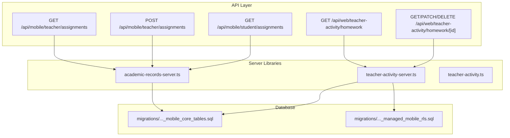
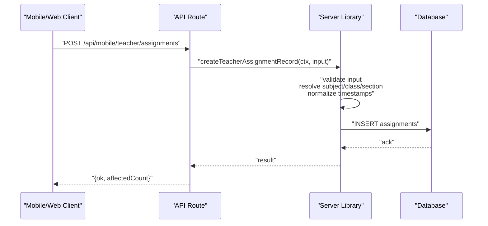
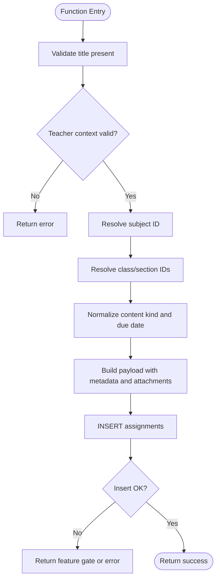
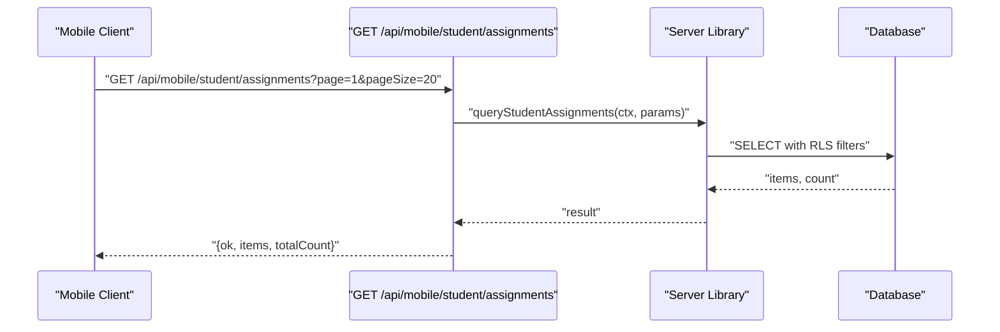
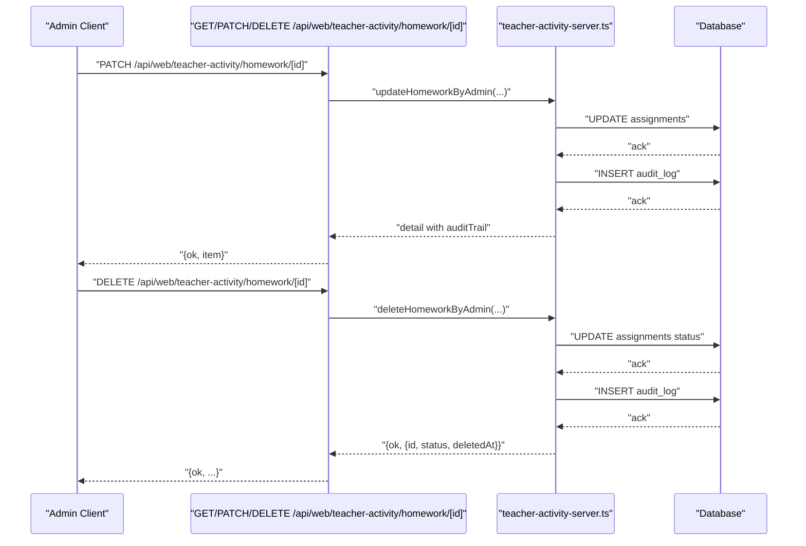
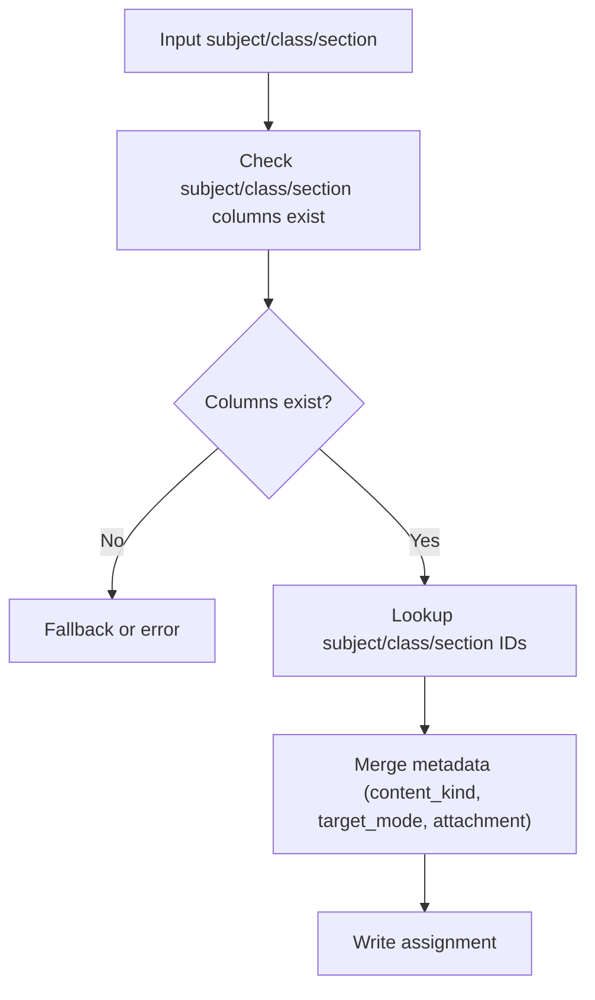
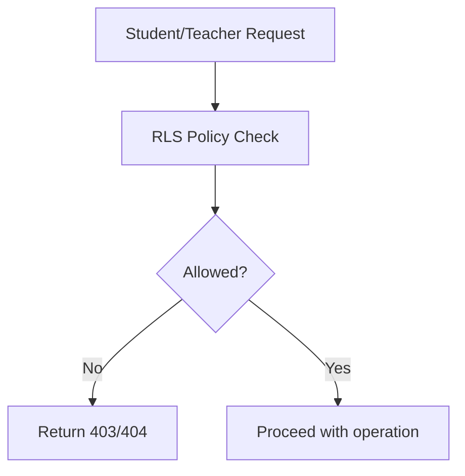
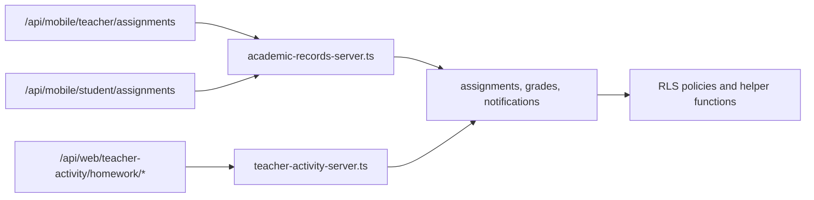

# Teacher Assignments

<cite>
**Referenced Files in This Document**
- [app/api/mobile/teacher/assignments/route.ts](file://app/api/mobile/teacher/assignments/route.ts)
- [app/api/web/teacher-activity/homework/route.ts](file://app/api/web/teacher-activity/homework/route.ts)
- [app/api/web/teacher-activity/homework/[id]/route.ts](file://app/api/web/teacher-activity/homework/[id]/route.ts)
- [app/api/mobile/student/assignments/route.ts](file://app/api/mobile/student/assignments/route.ts)
- [lib/academic-records-server.ts](file://lib/academic-records-server.ts)
- [lib/teacher-activity-server.ts](file://lib/teacher-activity-server.ts)
- [lib/teacher-activity.ts](file://lib/teacher-activity.ts)
- [migrations/20260322_000000_mobile_core_tables.sql](file://migrations/20260322_000000_mobile_core_tables.sql)
- [migrations/20260322_managed_mobile_rls.sql](file://migrations/20260322_managed_mobile_rls.sql)
</cite>

## Table of Contents
1. [Introduction](#introduction)
2. [Project Structure](#project-structure)
3. [Core Components](#core-components)
4. [Architecture Overview](#architecture-overview)
5. [Detailed Component Analysis](#detailed-component-analysis)
6. [Dependency Analysis](#dependency-analysis)
7. [Performance Considerations](#performance-considerations)
8. [Troubleshooting Guide](#troubleshooting-guide)
9. [Conclusion](#conclusion)

## Introduction
This document describes the teacher assignment management system, focusing on how teachers create, schedule, and moderate assignments; how students receive and track submissions; and how administrators monitor and moderate teacher activity. It covers:
- Teacher assignment workflow: creation, scoping by class/section, due dates, and content kinds
- Subject teaching distribution and workload balancing via teacher scope validation
- Conflict resolution strategies: RLS policies, scope checks, and moderation controls
- Integration with class management, student enrollment, and content delivery
- Practical scenarios and automated distribution patterns

## Project Structure
The system spans API routes, server-side libraries, and database migrations:
- Mobile and web APIs expose endpoints for teacher and student assignment queries and mutations
- Server libraries encapsulate validation, normalization, scoping, and persistence
- Migrations define the schema and Row Level Security (RLS) policies governing access

**Diagram sources**
- [app/api/mobile/teacher/assignments/route.ts:1-43](file://app/api/mobile/teacher/assignments/route.ts#L1-L43)
- [app/api/web/teacher-activity/homework/route.ts:1-20](file://app/api/web/teacher-activity/homework/route.ts#L1-L20)
- [app/api/web/teacher-activity/homework/[id]/route.ts](file://app/api/web/teacher-activity/homework/[id]/route.ts#L1-L83)
- [app/api/mobile/student/assignments/route.ts:1-22](file://app/api/mobile/student/assignments/route.ts#L1-L22)
- [lib/academic-records-server.ts:509-684](file://lib/academic-records-server.ts#L509-L684)
- [lib/teacher-activity-server.ts:687-891](file://lib/teacher-activity-server.ts#L687-L891)
- [migrations/20260322_000000_mobile_core_tables.sql:105-147](file://migrations/20260322_000000_mobile_core_tables.sql#L105-L147)
- [migrations/20260322_managed_mobile_rls.sql:440-487](file://migrations/20260322_managed_mobile_rls.sql#L440-L487)

**Section sources**
- [app/api/mobile/teacher/assignments/route.ts:1-43](file://app/api/mobile/teacher/assignments/route.ts#L1-L43)
- [app/api/web/teacher-activity/homework/route.ts:1-20](file://app/api/web/teacher-activity/homework/route.ts#L1-L20)
- [app/api/web/teacher-activity/homework/[id]/route.ts](file://app/api/web/teacher-activity/homework/[id]/route.ts#L1-L83)
- [app/api/mobile/student/assignments/route.ts:1-22](file://app/api/mobile/student/assignments/route.ts#L1-L22)
- [lib/academic-records-server.ts:509-684](file://lib/academic-records-server.ts#L509-L684)
- [lib/teacher-activity-server.ts:687-891](file://lib/teacher-activity-server.ts#L687-L891)
- [migrations/20260322_000000_mobile_core_tables.sql:105-147](file://migrations/20260322_000000_mobile_core_tables.sql#L105-L147)
- [migrations/20260322_managed_mobile_rls.sql:440-487](file://migrations/20260322_managed_mobile_rls.sql#L440-L487)

## Core Components
- Teacher assignment creation and scoping:
  - Validates teacher’s subject/class/section scope and resolves subject/class/section identifiers
  - Normalizes content kind and due date; attaches optional metadata and attachments
  - Persists to assignments table with computed metadata and indexes
- Student assignment retrieval:
  - Filters by school, class/section, due date, and content kind
  - Enforces read access via RLS functions
- Administration monitoring and moderation:
  - Lists and details homework with audit trail
  - Updates/deletes with admin moderation logs and status transitions
- Class/section and subject resolution:
  - Resolves subject ID and class/section IDs with fallbacks and error handling
- Access control:
  - Managed user profiles and RLS functions enforce teacher/student scopes and write/read boundaries

**Section sources**
- [lib/academic-records-server.ts:509-684](file://lib/academic-records-server.ts#L509-L684)
- [lib/teacher-activity-server.ts:687-891](file://lib/teacher-activity-server.ts#L687-L891)
- [migrations/20260322_000000_mobile_core_tables.sql:105-147](file://migrations/20260322_000000_mobile_core_tables.sql#L105-L147)
- [migrations/20260322_managed_mobile_rls.sql:440-487](file://migrations/20260322_managed_mobile_rls.sql#L440-L487)

## Architecture Overview
The system separates concerns across API routes, server libraries, and database policies:
- API routes accept requests and delegate to server libraries
- Server libraries validate inputs, resolve scopes, and persist data
- Migrations define tables and RLS policies ensuring correct scoping and access

**Diagram sources**
- [app/api/mobile/teacher/assignments/route.ts:24-42](file://app/api/mobile/teacher/assignments/route.ts#L24-L42)
- [lib/academic-records-server.ts:509-684](file://lib/academic-records-server.ts#L509-L684)

## Detailed Component Analysis

### Teacher Assignment Creation
- Responsibilities:
  - Validate presence of title and teacher identity
  - Resolve subject/class/section IDs with fallbacks
  - Normalize content kind and due date
  - Attach metadata and optional file attachment fields
  - Persist record and return mutation result
- Scoping and constraints:
  - Enforces teacher’s subject/class/section scope
  - Uses managed user profile and helper functions to compute access
- Error handling:
  - Returns feature gates for missing tables/columns
  - Returns user-friendly messages for invalid inputs or scope violations

**Diagram sources**
- [lib/academic-records-server.ts:509-684](file://lib/academic-records-server.ts#L509-L684)

**Section sources**
- [lib/academic-records-server.ts:509-684](file://lib/academic-records-server.ts#L509-L684)

### Student Assignment Retrieval
- Responsibilities:
  - Parse pagination and filters (school, class, section, due date range, content kind)
  - Apply RLS-based visibility checks
  - Return paginated items and total count
- Access control:
  - Uses helper functions to ensure student can read assignments scoped to their class/section

**Diagram sources**
- [app/api/mobile/student/assignments/route.ts:1-22](file://app/api/mobile/student/assignments/route.ts#L1-L22)
- [migrations/20260322_managed_mobile_rls.sql:208-238](file://migrations/20260322_managed_mobile_rls.sql#L208-L238)

**Section sources**
- [app/api/mobile/student/assignments/route.ts:1-22](file://app/api/mobile/student/assignments/route.ts#L1-L22)
- [migrations/20260322_managed_mobile_rls.sql:208-238](file://migrations/20260322_managed_mobile_rls.sql#L208-L238)

### Administration Monitoring and Moderation
- Responsibilities:
  - List homework with filters and sorting
  - Retrieve detailed view with audit trail
  - Moderate (update/delete) with admin logging and status transitions
- Validation and normalization:
  - Validates required fields and due date formats
  - Normalizes content kind and updates metadata accordingly

**Diagram sources**
- [app/api/web/teacher-activity/homework/[id]/route.ts](file://app/api/web/teacher-activity/homework/[id]/route.ts#L32-L82)
- [lib/teacher-activity-server.ts:754-834](file://lib/teacher-activity-server.ts#L754-L834)
- [lib/teacher-activity-server.ts:836-891](file://lib/teacher-activity-server.ts#L836-L891)

**Section sources**
- [app/api/web/teacher-activity/homework/route.ts:1-20](file://app/api/web/teacher-activity/homework/route.ts#L1-L20)
- [app/api/web/teacher-activity/homework/[id]/route.ts](file://app/api/web/teacher-activity/homework/[id]/route.ts#L1-L83)
- [lib/teacher-activity-server.ts:687-891](file://lib/teacher-activity-server.ts#L687-L891)
- [lib/teacher-activity.ts:316-341](file://lib/teacher-activity.ts#L316-L341)

### Class/Subject Resolution and Workload Balancing
- Mechanisms:
  - Resolve subject/class/section IDs with fallbacks and error handling
  - Enforce teacher’s taught scope before allowing writes
  - Normalize content kind and due date for consistency
- Workload balancing:
  - Scope checks prevent teachers from assigning outside their taught classes/sections
  - Content kind and metadata help categorize and filter workload

**Diagram sources**
- [lib/academic-records-server.ts:272-443](file://lib/academic-records-server.ts#L272-L443)
- [lib/academic-records-server.ts:509-684](file://lib/academic-records-server.ts#L509-L684)

**Section sources**
- [lib/academic-records-server.ts:272-443](file://lib/academic-records-server.ts#L272-L443)
- [lib/academic-records-server.ts:509-684](file://lib/academic-records-server.ts#L509-L684)

### Access Control and Conflict Resolution
- Policies:
  - Student/teacher RLS functions restrict reads/writes to appropriate scopes
  - Managed user profiles tie auth users to school/role and IDs
- Conflict resolution:
  - Scope checks prevent cross-class assignments
  - Status transitions and moderation logs resolve disputes
  - Unique indexes on auth_user_id ensure consistent mapping

**Diagram sources**
- [migrations/20260322_managed_mobile_rls.sql:440-487](file://migrations/20260322_managed_mobile_rls.sql#L440-L487)
- [migrations/20260322_000000_mobile_core_tables.sql:15-21](file://migrations/20260322_000000_mobile_core_tables.sql#L15-L21)

**Section sources**
- [migrations/20260322_managed_mobile_rls.sql:440-487](file://migrations/20260322_managed_mobile_rls.sql#L440-L487)
- [migrations/20260322_000000_mobile_core_tables.sql:15-21](file://migrations/20260322_000000_mobile_core_tables.sql#L15-L21)

## Dependency Analysis
- API routes depend on server libraries for validation and persistence
- Server libraries depend on Supabase client and helper functions
- Database migrations define schema and RLS policies that underpin access control

**Diagram sources**
- [app/api/mobile/teacher/assignments/route.ts:1-43](file://app/api/mobile/teacher/assignments/route.ts#L1-L43)
- [app/api/mobile/student/assignments/route.ts:1-22](file://app/api/mobile/student/assignments/route.ts#L1-L22)
- [app/api/web/teacher-activity/homework/[id]/route.ts](file://app/api/web/teacher-activity/homework/[id]/route.ts#L1-L83)
- [lib/academic-records-server.ts:509-684](file://lib/academic-records-server.ts#L509-L684)
- [lib/teacher-activity-server.ts:687-891](file://lib/teacher-activity-server.ts#L687-L891)
- [migrations/20260322_managed_mobile_rls.sql:440-487](file://migrations/20260322_managed_mobile_rls.sql#L440-L487)

**Section sources**
- [app/api/mobile/teacher/assignments/route.ts:1-43](file://app/api/mobile/teacher/assignments/route.ts#L1-L43)
- [app/api/mobile/student/assignments/route.ts:1-22](file://app/api/mobile/student/assignments/route.ts#L1-L22)
- [app/api/web/teacher-activity/homework/[id]/route.ts](file://app/api/web/teacher-activity/homework/[id]/route.ts#L1-L83)
- [lib/academic-records-server.ts:509-684](file://lib/academic-records-server.ts#L509-L684)
- [lib/teacher-activity-server.ts:687-891](file://lib/teacher-activity-server.ts#L687-L891)
- [migrations/20260322_managed_mobile_rls.sql:440-487](file://migrations/20260322_managed_mobile_rls.sql#L440-L487)

## Performance Considerations
- Indexes:
  - Assignments indexed by school_id, created_at, student_id, teacher_id, class scope, and due_at
- Pagination:
  - Web APIs support page/pageSize with bounded limits
- Normalization:
  - Timestamp normalization and content kind normalization reduce storage variance and improve filtering
- RLS overhead:
  - Helper functions and policies are marked STABLE/SECURITY DEFINER; keep filters selective to minimize policy evaluation cost

[No sources needed since this section provides general guidance]

## Troubleshooting Guide
Common issues and resolutions:
- Missing assignments table or columns:
  - Feature gates return structured errors indicating missing tables or insufficient permissions
- Invalid due date format:
  - Validation rejects malformed dates; ensure ISO-like strings
- Scope violation:
  - Teacher cannot assign outside their taught class/section; verify teacher assignment records
- Duplicate or conflicting records:
  - Use moderation endpoints to edit or delete; audit trail captures changes
- Student cannot see assignments:
  - Verify student’s class/section and school match; check RLS policies

**Section sources**
- [lib/academic-records-server.ts:84-108](file://lib/academic-records-server.ts#L84-L108)
- [lib/teacher-activity.ts:316-341](file://lib/teacher-activity.ts#L316-L341)
- [lib/teacher-activity-server.ts:754-834](file://lib/teacher-activity-server.ts#L754-L834)

## Conclusion
The teacher assignment management system integrates robust validation, scoping, and moderation with strong access control enforced by RLS. It supports teacher-driven assignment creation, student-centric visibility, and administrative oversight, while leveraging schema and helper functions to maintain consistency and prevent conflicts.