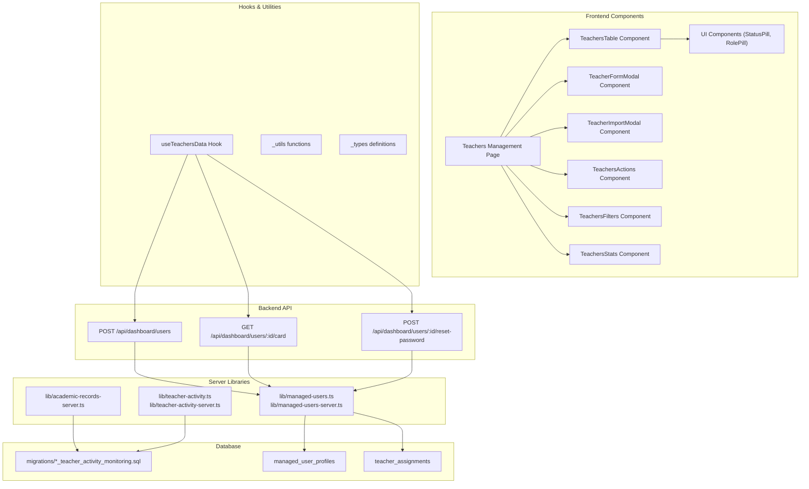
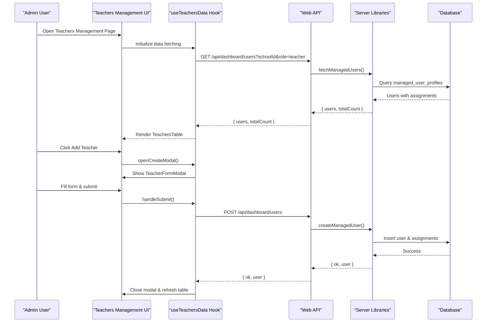
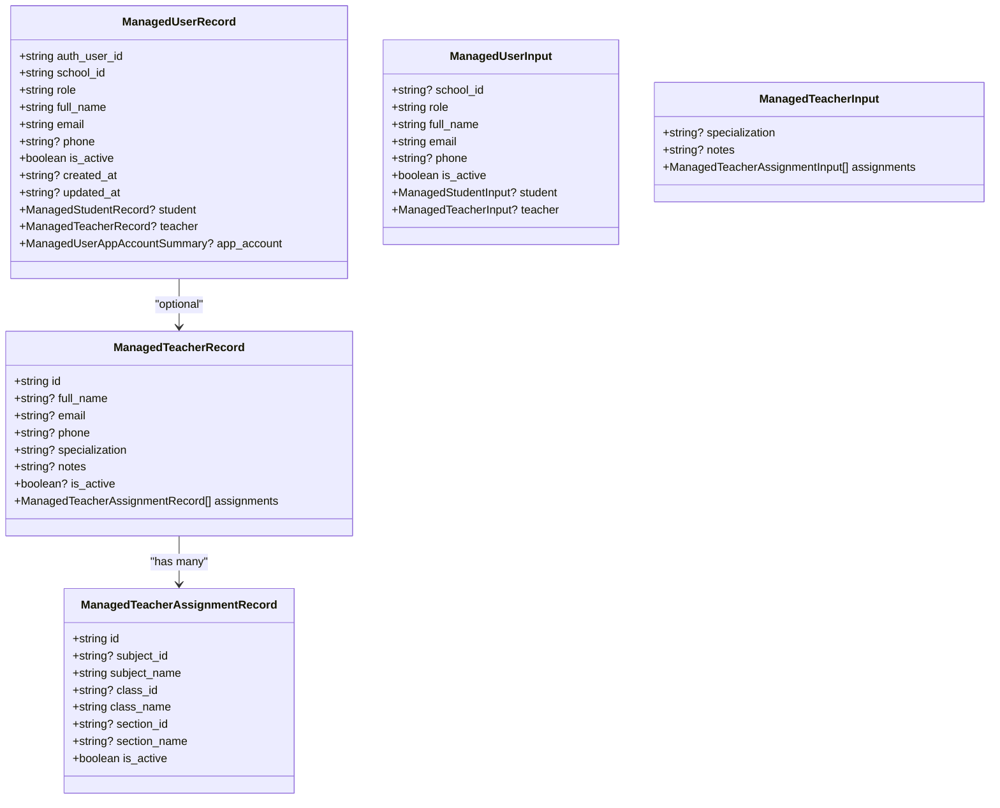
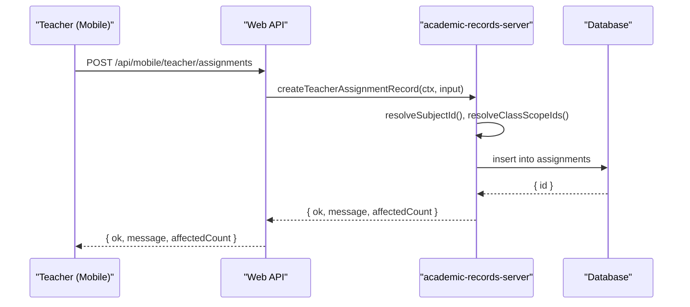
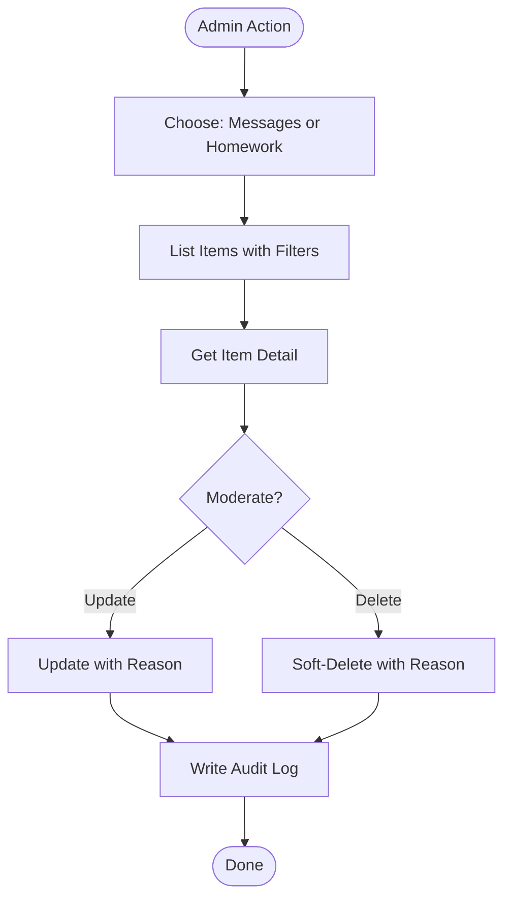
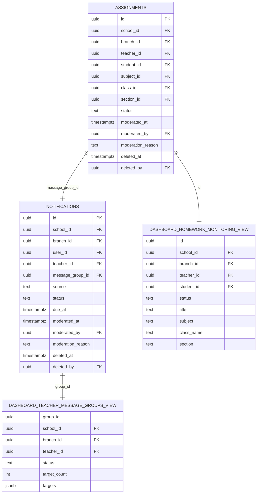
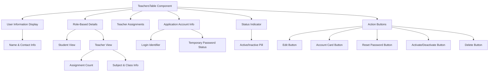
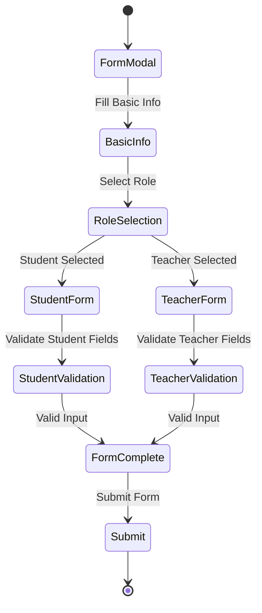
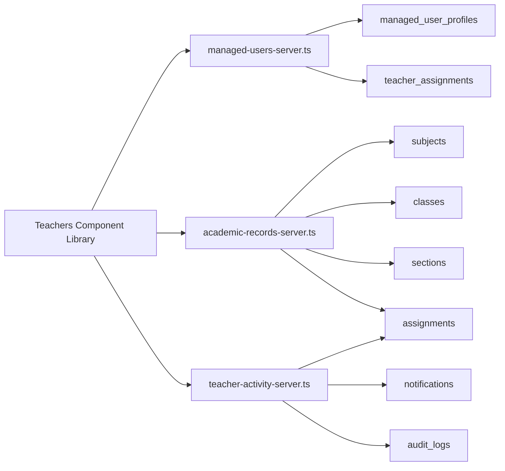

# Teacher Management

<cite>
**Referenced Files in This Document**
- [lib/managed-users.ts](file://lib/managed-users.ts)
- [lib/managed-users-server.ts](file://lib/managed-users-server.ts)
- [app/api/dashboard/users/route.ts](file://app/api/dashboard/users/route.ts)
- [migrations/20260323_010000_managed_account_schema_backfill.sql](file://migrations/20260323_010000_managed_account_schema_backfill.sql)
- [lib/academic-records-server.ts](file://lib/academic-records-server.ts)
- [app/api/mobile/teacher/assignments/route.ts](file://app/api/mobile/teacher/assignments/route.ts)
- [migrations/20260329_000000_teacher_activity_monitoring.sql](file://migrations/20260329_000000_teacher_activity_monitoring.sql)
- [lib/teacher-activity.ts](file://lib/teacher-activity.ts)
- [lib/teacher-activity-server.ts](file://lib/teacher-activity-server.ts)
- [app/api/web/teacher-activity/meta/route.ts](file://app/api/web/teacher-activity/meta/route.ts)
- [app/api/web/teacher-activity/messages/route.ts](file://app/api/web/teacher-activity/messages/route.ts)
- [app/api/web/teacher-activity/messages/[id]/route.ts](file://app/api/web/teacher-activity/messages/[id]/route.ts)
- [app/api/web/teacher-activity/homework/route.ts](file://app/api/web/teacher-activity/homework/route.ts)
- [app/api/web/teacher-activity/homework/[id]/route.ts](file://app/api/web/teacher-activity/homework/[id]/route.ts)
- [app/[locale]/monitoring/page.tsx](file://app/[locale]/monitoring/page.tsx)
- [app/[locale]/teachers/_components/TeachersTable.tsx](file://app/[locale]/teachers/_components/TeachersTable.tsx)
- [app/[locale]/teachers/_components/TeacherFormModal.tsx](file://app/[locale]/teachers/_components/TeacherFormModal.tsx)
- [app/[locale]/teachers/_components/TeacherImportModal.tsx](file://app/[locale]/teachers/_components/TeacherImportModal.tsx)
- [app/[locale]/teachers/_components/TeachersActions.tsx](file://app/[locale]/teachers/_components/TeachersActions.tsx)
- [app/[locale]/teachers/_components/TeachersFilters.tsx](file://app/[locale]/teachers/_components/TeachersFilters.tsx)
- [app/[locale]/teachers/_components/TeachersStats.tsx](file://app/[locale]/teachers/_components/TeachersStats.tsx)
- [app/[locale]/teachers/_components/ui.tsx](file://app/[locale]/teachers/_components/ui.tsx)
- [app/[locale]/teachers/_components/index.ts](file://app/[locale]/teachers/_components/index.ts)
- [app/[locale]/teachers/_hooks/useTeachersData.ts](file://app/[locale]/teachers/_hooks/useTeachersData.ts)
- [app/[locale]/teachers/page.tsx](file://app/[locale]/teachers/page.tsx)
</cite>

## Update Summary
**Changes Made**
- Added comprehensive teacher management component library with new UI components
- Integrated TeachersTable, TeacherFormModal, and TeacherImportModal components
- Enhanced teacher status management and subject specialization tracking
- Expanded teacher onboarding workflows with import/export capabilities
- Added detailed teacher assignment management with class/section tracking

## Table of Contents
1. [Introduction](#introduction)
2. [Project Structure](#project-structure)
3. [Core Components](#core-components)
4. [Architecture Overview](#architecture-overview)
5. [Detailed Component Analysis](#detailed-component-analysis)
6. [Teacher Management Component Library](#teacher-management-component-library)
7. [Dependency Analysis](#dependency-analysis)
8. [Performance Considerations](#performance-considerations)
9. [Troubleshooting Guide](#troubleshooting-guide)
10. [Conclusion](#conclusion)
11. [Appendices](#appendices)

## Introduction
This document describes the teacher management system with a focus on teacher assignment management and activity monitoring. The system has been expanded with a comprehensive component library that includes TeachersTable.tsx, TeacherFormModal.tsx, TeacherImportModal.tsx, and supporting components. It explains how teachers are assigned to classes and subjects, how workload is distributed, and how teacher activities (messages and homework) are monitored, moderated, and audited. The system now provides enhanced teacher status management, subject specialization tracking, and streamlined onboarding workflows with import/export capabilities.

## Project Structure
The teacher management system spans several layers with a rich component library:
- Managed user profiles and credentials for teachers and students
- Comprehensive teacher management components with table display, forms, and modals
- Assignment creation and scoping for teachers with status tracking
- Activity monitoring for teacher messages and homework
- Audit logging for moderation actions
- Web and mobile API endpoints for CRUD operations and filtering
- Excel import/export functionality for bulk teacher management



**Diagram sources**
- [app/[locale]/teachers/_components/TeachersTable.tsx:1-232](file://app/[locale]/teachers/_components/TeachersTable.tsx#L1-L232)
- [app/[locale]/teachers/_components/TeacherFormModal.tsx:1-291](file://app/[locale]/teachers/_components/TeacherFormModal.tsx#L1-L291)
- [app/[locale]/teachers/_components/TeacherImportModal.tsx:1-159](file://app/[locale]/teachers/_components/TeacherImportModal.tsx#L1-L159)
- [app/[locale]/teachers/_hooks/useTeachersData.ts:1-996](file://app/[locale]/teachers/_hooks/useTeachersData.ts#L1-L996)
- [app/api/dashboard/users/route.ts:1046-1096](file://app/api/dashboard/users/route.ts#L1046-L1096)
- [lib/managed-users.ts:1-375](file://lib/managed-users.ts#L1-L375)
- [lib/managed-users-server.ts:1061-1114](file://lib/managed-users-server.ts#L1061-L1114)
- [lib/academic-records-server.ts:509-684](file://lib/academic-records-server.ts#L509-L684)
- [lib/teacher-activity.ts:1-404](file://lib/teacher-activity.ts#L1-L404)
- [lib/teacher-activity-server.ts:361-743](file://lib/teacher-activity-server.ts#L361-L743)
- [migrations/20260329_000000_teacher_activity_monitoring.sql:1-501](file://migrations/20260329_000000_teacher_activity_monitoring.sql#L1-L501)

**Section sources**
- [app/[locale]/teachers/_components/index.ts:1-11](file://app/[locale]/teachers/_components/index.ts#L1-L11)
- [app/[locale]/teachers/page.tsx:1-25](file://app/[locale]/teachers/page.tsx#L1-L25)
- [migrations/20260329_000000_teacher_activity_monitoring.sql:1-501](file://migrations/20260329_000000_teacher_activity_monitoring.sql#L1-L501)

## Core Components
- Managed user profiles and credentials:
  - Defines teacher and student records, validation, and normalized inputs.
  - Supports creating and updating managed accounts with assignments and credentials.
- Comprehensive teacher management components:
  - TeachersTable displays teacher profiles with status, assignments, and actions.
  - TeacherFormModal handles teacher creation/editing with subject/class/section assignment.
  - TeacherImportModal enables bulk teacher import from Excel with validation.
- Teacher assignment management:
  - Resolves subjects, classes, and sections to assignment records.
  - Supports replacing teacher assignments and building legacy "classes taught" summaries.
- Activity monitoring:
  - Lists and details teacher messages and homework with moderation controls.
  - Provides metadata and audit trails for administrative actions.
- Database schema:
  - Adds status, moderation, and branch scoping to assignments and notifications.
  - Creates views for monitoring dashboards and admin scopes.

**Section sources**
- [lib/managed-users.ts:1-375](file://lib/managed-users.ts#L1-L375)
- [lib/managed-users-server.ts:1061-1114](file://lib/managed-users-server.ts#L1061-L1114)
- [lib/academic-records-server.ts:509-684](file://lib/academic-records-server.ts#L509-L684)
- [lib/teacher-activity.ts:1-404](file://lib/teacher-activity.ts#L1-L404)
- [lib/teacher-activity-server.ts:361-743](file://lib/teacher-activity-server.ts#L361-L743)
- [migrations/20260329_000000_teacher_activity_monitoring.sql:1-501](file://migrations/20260329_000000_teacher_activity_monitoring.sql#L1-L501)

## Architecture Overview
The system integrates teacher onboarding, assignment scheduling, and activity monitoring with robust moderation and audit capabilities through a comprehensive component library.



**Diagram sources**
- [app/[locale]/teachers/page.tsx:22-25](file://app/[locale]/teachers/page.tsx#L22-L25)
- [app/[locale]/teachers/_hooks/useTeachersData.ts:317-357](file://app/[locale]/teachers/_hooks/useTeachersData.ts#L317-L357)
- [app/api/dashboard/users/route.ts:1046-1096](file://app/api/dashboard/users/route.ts#L1046-L1096)
- [lib/managed-users-server.ts:1061-1114](file://lib/managed-users-server.ts#L1061-L1114)

## Detailed Component Analysis

### Managed User System (Teacher Profiles, Credentials, Permissions)
- Data model:
  - Managed user record includes role, profile, and optional teacher/student details.
  - Teacher assignment records define subject/class/section scope and activation status.
- Validation and normalization:
  - Validates required fields, emails, passwords, and money values.
  - Normalizes teacher assignments and de-duplicates entries.
- Onboarding and updates:
  - On successful managed user creation, replaces teacher assignments atomically.
  - Syncs student-teacher links when applicable.



**Diagram sources**
- [lib/managed-users.ts:1-375](file://lib/managed-users.ts#L1-L375)

**Section sources**
- [lib/managed-users.ts:1-375](file://lib/managed-users.ts#L1-L375)
- [app/api/dashboard/users/route.ts:1046-1096](file://app/api/dashboard/users/route.ts#L1046-L1096)
- [migrations/20260323_010000_managed_account_schema_backfill.sql:39-71](file://migrations/20260323_010000_managed_account_schema_backfill.sql#L39-L71)

### Teacher Assignment Management (Class Assignments, Subject Teaching, Workload Distribution)
- Assignment creation:
  - Teachers can create assignments with title, description, subject, class/section, due date, and attachments.
  - Scope resolution ensures subject/class/section exist and match teacher's assignments.
- Assignment replacement:
  - Replaces all existing teacher assignments for a school with new ones.
  - Supports legacy "classes taught" migration path.
- Class/section resolution:
  - Resolves class and section IDs with fallbacks and validation.



**Diagram sources**
- [app/api/mobile/teacher/assignments/route.ts:1-42](file://app/api/mobile/teacher/assignments/route.ts#L1-L42)
- [lib/academic-records-server.ts:509-684](file://lib/academic-records-server.ts#L509-L684)
- [migrations/20260329_000000_teacher_activity_monitoring.sql:460-498](file://migrations/20260329_000000_teacher_activity_monitoring.sql#L460-L498)

**Section sources**
- [lib/academic-records-server.ts:509-684](file://lib/academic-records-server.ts#L509-L684)
- [lib/managed-users-server.ts:1715-1774](file://lib/managed-users-server.ts#L1715-L1774)
- [lib/managed-users-server.ts:2015-2061](file://lib/managed-users-server.ts#L2015-L2061)
- [app/api/mobile/teacher/assignments/route.ts:1-42](file://app/api/mobile/teacher/assignments/route.ts#L1-L42)

### Teacher Activity Monitoring (Content Moderation, Performance Tracking, Activity Logging)
- Message monitoring:
  - Lists teacher broadcast messages with filters and pagination.
  - Updates/deletes messages with moderation reasons and audit trail.
- Homework monitoring:
  - Lists teacher-created assignments with filters and pagination.
  - Updates/deletes assignments with moderation reasons and audit trail.
- Metadata and scope:
  - Provides branches, teachers, classes, sections, and students for filtering.
  - Applies branch-level scoping for admins and super admins.



**Diagram sources**
- [lib/teacher-activity-server.ts:451-743](file://lib/teacher-activity-server.ts#L451-L743)
- [lib/teacher-activity.ts:248-282](file://lib/teacher-activity.ts#L248-L282)
- [app/api/web/teacher-activity/messages/[id]/route.ts](file://app/api/web/teacher-activity/messages/[id]/route.ts#L1-L83)
- [app/api/web/teacher-activity/homework/[id]/route.ts](file://app/api/web/teacher-activity/homework/[id]/route.ts#L1-L83)

**Section sources**
- [lib/teacher-activity.ts:1-404](file://lib/teacher-activity.ts#L1-L404)
- [lib/teacher-activity-server.ts:361-743](file://lib/teacher-activity-server.ts#L361-L743)
- [app/api/web/teacher-activity/meta/route.ts:1-23](file://app/api/web/teacher-activity/meta/route.ts#L1-L23)
- [app/api/web/teacher-activity/messages/route.ts:1-20](file://app/api/web/teacher-activity/messages/route.ts#L1-L20)
- [app/api/web/teacher-activity/homework/route.ts:1-20](file://app/api/web/teacher-activity/homework/route.ts#L1-L20)

### Database Schema and Views for Monitoring
- Status and moderation columns:
  - Adds status, moderation timestamps, and soft-deletion to assignments and notifications.
- Triggers and defaults:
  - Sets branch scope defaults and generates message group IDs.
- Views:
  - dashboard_teacher_message_groups aggregates teacher broadcasts.
  - dashboard_homework_monitoring exposes assignment details for monitoring.



**Diagram sources**
- [migrations/20260329_000000_teacher_activity_monitoring.sql:1-501](file://migrations/20260329_000000_teacher_activity_monitoring.sql#L1-L501)

**Section sources**
- [migrations/20260329_000000_teacher_activity_monitoring.sql:1-501](file://migrations/20260329_000000_teacher_activity_monitoring.sql#L1-L501)

## Teacher Management Component Library

### TeachersTable Component
The TeachersTable component provides a comprehensive display of teacher profiles with detailed information and action controls.

**Key Features:**
- Displays teacher user information (name, email, phone)
- Shows role-based details (student vs teacher)
- Lists teacher assignments with subject/class/section information
- Provides application account details (login identifier, temporary password status)
- Shows teacher status with visual indicators
- Offers action buttons for editing, printing account cards, resetting passwords, activating/deactivating, and deleting



**Diagram sources**
- [app/[locale]/teachers/_components/TeachersTable.tsx:37-232](file://app/[locale]/teachers/_components/TeachersTable.tsx#L37-L232)

**Section sources**
- [app/[locale]/teachers/_components/TeachersTable.tsx:1-232](file://app/[locale]/teachers/_components/TeachersTable.tsx#L1-L232)
- [app/[locale]/teachers/_components/ui.tsx:12-27](file://app/[locale]/teachers/_components/ui.tsx#L12-L27)

### TeacherFormModal Component
The TeacherFormModal component handles teacher creation and editing with comprehensive form validation and assignment management.

**Key Features:**
- Handles both teacher and student account creation
- Manages teacher-specific assignments (subject, class, section)
- Provides real-time validation with field error display
- Supports dynamic section selection based on class choice
- Generates temporary passwords automatically for new teacher accounts
- Integrates with the managed user validation system



**Diagram sources**
- [app/[locale]/teachers/_components/TeacherFormModal.tsx:28-291](file://app/[locale]/teachers/_components/TeacherFormModal.tsx#L28-L291)

**Section sources**
- [app/[locale]/teachers/_components/TeacherFormModal.tsx:1-291](file://app/[locale]/teachers/_components/TeacherFormModal.tsx#L1-L291)
- [app/[locale]/teachers/_hooks/useTeachersData.ts:407-425](file://app/[locale]/teachers/_hooks/useTeachersData.ts#L407-L425)

### TeacherImportModal Component
The TeacherImportModal component enables bulk teacher import from Excel files with comprehensive validation and error handling.

**Key Features:**
- Excel file upload with drag-and-drop interface
- Column validation (role, full name, phone, login identifier, class, section, subject, status)
- Real-time import preview with up to 6 rows shown
- Detailed error reporting for invalid rows
- Template download functionality
- Batch processing with individual row validation

```mermaid
flowchart TD
Start([Upload Excel File]) --> ValidateFile["Validate File Type & Size"]
ValidateFile --> ParseFile["Parse Excel Content"]
ParseFile --> ValidateColumns["Validate Required Columns"]
ValidateColumns --> ProcessRows["Process Each Row"]
ProcessRows --> ValidateRow["Validate Individual Row"]
ValidateRow --> ValidRow{"Valid Row?"}
ValidRow --> |Yes| AddToPayload["Add to Import Payload"]
ValidRow --> |No| AddToErrors["Add to Error List"]
AddToPayload --> NextRow["Next Row"]
AddToErrors --> NextRow
NextRow --> MoreRows{"More Rows?"}
MoreRows --> |Yes| ValidateRow
MoreRows --> |No| ShowResults["Show Results & Preview"]
ShowResults --> ImportDecision{"Ready to Import?"}
ImportDecision --> |Yes| ExecuteImport["Execute Bulk Import"]
ImportDecision --> |No| Cancel["Cancel Import"]
ExecuteImport --> Success["Import Success"]
Cancel --> [*]
```

**Diagram sources**
- [app/[locale]/teachers/_components/TeacherImportModal.tsx:22-159](file://app/[locale]/teachers/_components/TeacherImportModal.tsx#L22-L159)

**Section sources**
- [app/[locale]/teachers/_components/TeacherImportModal.tsx:1-159](file://app/[locale]/teachers/_components/TeacherImportModal.tsx#L1-L159)
- [app/[locale]/teachers/_hooks/useTeachersData.ts:516-674](file://app/[locale]/teachers/_hooks/useTeachersData.ts#L516-L674)

### Supporting Components and Hooks

#### useTeachersData Hook
The useTeachersData hook manages all teacher-related state, data fetching, and business logic for the teacher management system.

**Key Responsibilities:**
- Fetches and manages teacher data with pagination and filtering
- Handles form state for teacher creation/editing
- Manages import/export operations with Excel processing
- Coordinates account card generation and password reset functionality
- Implements debounced search functionality
- Provides computed statistics and filtered user lists

**Section sources**
- [app/[locale]/teachers/_hooks/useTeachersData.ts:1-996](file://app/[locale]/teachers/_hooks/useTeachersData.ts#L1-L996)

#### UI Components
- StatusPill: Visual indicator for teacher active/inactive status
- RolePill: Displays user role with appropriate styling
- FieldError: Error message display component

**Section sources**
- [app/[locale]/teachers/_components/ui.tsx:1-27](file://app/[locale]/teachers/_components/ui.tsx#L1-L27)

#### Action Components
- TeachersActions: Primary action buttons (add teacher, import, export, template download)
- TeachersFilters: Advanced filtering for teachers (search, subject, class, section, status)
- TeachersStats: Statistical overview cards for teacher metrics

**Section sources**
- [app/[locale]/teachers/_components/TeachersActions.tsx:1-80](file://app/[locale]/teachers/_components/TeachersActions.tsx#L1-L80)
- [app/[locale]/teachers/_components/TeachersFilters.tsx:1-182](file://app/[locale]/teachers/_components/TeachersFilters.tsx#L1-L182)
- [app/[locale]/teachers/_components/TeachersStats.tsx:1-28](file://app/[locale]/teachers/_components/TeachersStats.tsx#L1-L28)

## Dependency Analysis
- Managed users depend on managed user profiles and teacher assignment tables.
- Academic records depend on subjects, classes, sections, and assignments.
- Activity monitoring depends on notifications and assignments with status and moderation columns.
- Audit logs capture moderation actions for both messages and homework.
- **Updated** Teacher management components depend on the comprehensive component library with specialized UI components.



**Diagram sources**
- [lib/managed-users-server.ts:1061-1114](file://lib/managed-users-server.ts#L1061-L1114)
- [lib/academic-records-server.ts:272-443](file://lib/academic-records-server.ts#L272-L443)
- [lib/teacher-activity-server.ts:223-298](file://lib/teacher-activity-server.ts#L223-L298)
- [app/[locale]/teachers/_components/index.ts:1-11](file://app/[locale]/teachers/_components/index.ts#L1-L11)

**Section sources**
- [lib/managed-users-server.ts:1061-1114](file://lib/managed-users-server.ts#L1061-L1114)
- [lib/academic-records-server.ts:272-443](file://lib/academic-records-server.ts#L272-L443)
- [lib/teacher-activity-server.ts:223-298](file://lib/teacher-activity-server.ts#L223-L298)
- [app/[locale]/teachers/_components/index.ts:1-11](file://app/[locale]/teachers/_components/index.ts#L1-L11)

## Performance Considerations
- Indexes on assignments and notifications support efficient filtering and sorting by status, branch, and timestamps.
- Pagination is enforced in monitoring APIs to limit payload sizes.
- Batch operations (e.g., replacing teacher assignments) minimize redundant writes.
- Audit logging is asynchronous via inserts and does not block primary operations.
- **Updated** Component library uses virtualized rendering for large datasets and implements debounced search to optimize performance.

## Troubleshooting Guide
- Assignment creation fails:
  - Ensure subject/class/section exist and match teacher's scope.
  - Verify assignments table columns and schema readiness.
- Message/homework moderation errors:
  - Check status constraints and moderation reasons.
  - Confirm branch scoping and admin permissions.
- Audit trail missing:
  - Verify audit_logs table exists and inserts succeed.
- **Updated** Component rendering issues:
  - Check for proper component imports and prop validation.
  - Verify data fetching hooks are properly initialized.
  - Ensure proper error boundaries are in place for async operations.

**Section sources**
- [lib/academic-records-server.ts:509-684](file://lib/academic-records-server.ts#L509-L684)
- [lib/teacher-activity-server.ts:548-685](file://lib/teacher-activity-server.ts#L548-L685)
- [migrations/20260329_000000_teacher_activity_monitoring.sql:1-501](file://migrations/20260329_000000_teacher_activity_monitoring.sql#L1-L501)
- [app/[locale]/teachers/_hooks/useTeachersData.ts:317-357](file://app/[locale]/teachers/_hooks/useTeachersData.ts#L317-L357)

## Conclusion
The teacher management system provides a comprehensive solution for onboarding teachers, managing assignments, and monitoring teacher activities. The expanded component library with TeachersTable, TeacherFormModal, and TeacherImportModal components significantly enhances the user experience and operational efficiency. The system now offers robust teacher status management, subject specialization tracking, and streamlined onboarding workflows with import/export capabilities, while maintaining modular design and scalable database architecture.

## Appendices

### Practical Examples

- Teacher assignment management
  - Create an assignment for a specific class and section with a due date and optional attachment.
  - Replace a teacher's assignments for a school to reflect schedule changes.
  - Example paths:
    - [app/api/mobile/teacher/assignments/route.ts:1-42](file://app/api/mobile/teacher/assignments/route.ts#L1-L42)
    - [lib/academic-records-server.ts:509-684](file://lib/academic-records-server.ts#L509-L684)
    - [lib/managed-users-server.ts:2015-2061](file://lib/managed-users-server.ts#L2015-L2061)

- Activity monitoring workflows
  - List teacher messages with filters (branch, teacher, status, date range).
  - Update or delete a message with a moderation reason; audit trail recorded.
  - Example paths:
    - [app/api/web/teacher-activity/messages/route.ts:1-20](file://app/api/web/teacher-activity/messages/route.ts#L1-L20)
    - [app/api/web/teacher-activity/messages/[id]/route.ts](file://app/api/web/teacher-activity/messages/[id]/route.ts#L1-L83)
    - [lib/teacher-activity-server.ts:548-685](file://lib/teacher-activity-server.ts#L548-L685)

- Performance evaluation processes
  - Use monitoring dashboards to review message and homework statuses.
  - Track moderation actions via audit logs.
  - Example paths:
    - [app/[locale]/monitoring/page.tsx](file://app/[locale]/monitoring/page.tsx#L541-L567)
    - [lib/teacher-activity-server.ts:223-298](file://lib/teacher-activity-server.ts#L223-L298)

- **Updated** Teacher management component examples
  - Display teacher profiles with assignments and status in TeachersTable.
  - Create new teacher accounts with TeacherFormModal including subject/class/section assignment.
  - Import multiple teacher accounts from Excel using TeacherImportModal with validation.
  - Example paths:
    - [app/[locale]/teachers/_components/TeachersTable.tsx:1-232](file://app/[locale]/teachers/_components/TeachersTable.tsx#L1-L232)
    - [app/[locale]/teachers/_components/TeacherFormModal.tsx:1-291](file://app/[locale]/teachers/_components/TeacherFormModal.tsx#L1-L291)
    - [app/[locale]/teachers/_components/TeacherImportModal.tsx:1-159](file://app/[locale]/teachers/_components/TeacherImportModal.tsx#L1-L159)

### Integration Notes
- Class management integration:
  - Class and section resolution ensures assignments target valid scopes.
- Content moderation:
  - Status values and moderation fields enforce governance.
- Reporting systems:
  - Views aggregate messages and homework for reporting.
- **Updated** Component library integration:
  - Seamless integration with existing managed user system.
  - Consistent styling and theming across all teacher management components.
  - Unified error handling and validation across forms and modals.

**Section sources**
- [lib/academic-records-server.ts:350-443](file://lib/academic-records-server.ts#L350-L443)
- [migrations/20260329_000000_teacher_activity_monitoring.sql:413-498](file://migrations/20260329_000000_teacher_activity_monitoring.sql#L413-L498)
- [app/[locale]/teachers/_components/index.ts:1-11](file://app/[locale]/teachers/_components/index.ts#L1-L11)

### Common Scenarios and Strategies
- Assignment conflicts:
  - Resolve class/section mismatches and ensure subject/class/section exist.
- Performance improvement:
  - Monitor moderation trends and adjust teacher training or policies accordingly.
- Onboarding:
  - Validate teacher assignments during managed user creation and replace as needed.
- **Updated** Bulk operations:
  - Use TeacherImportModal for large-scale teacher onboarding.
  - Leverage TeachersFilters for efficient teacher search and management.
  - Utilize TeachersStats for monitoring teacher engagement and assignment distribution.

**Section sources**
- [lib/managed-users-server.ts:1715-1774](file://lib/managed-users-server.ts#L1715-L1774)
- [app/api/dashboard/users/route.ts:1046-1096](file://app/api/dashboard/users/route.ts#L1046-L1096)
- [app/[locale]/teachers/_hooks/useTeachersData.ts:186-212](file://app/[locale]/teachers/_hooks/useTeachersData.ts#L186-L212)