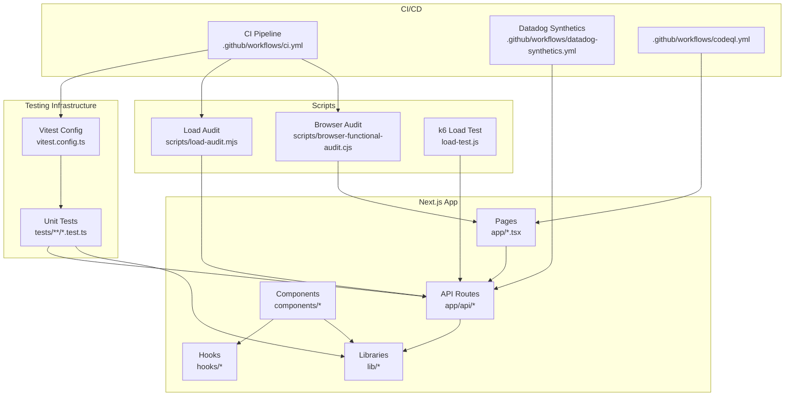
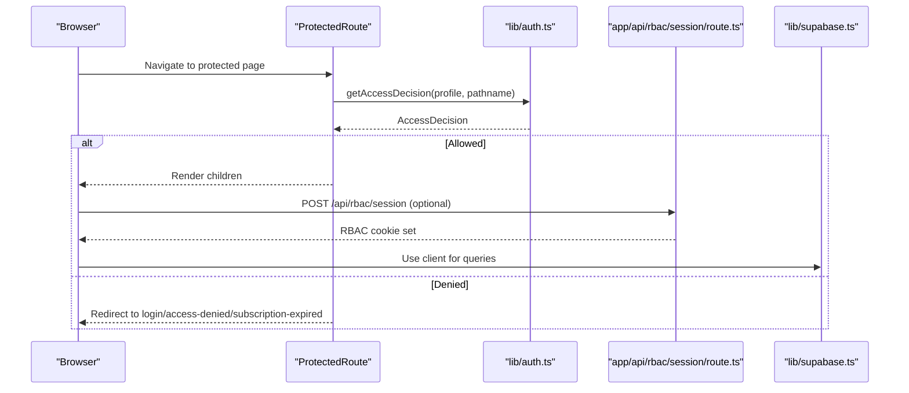
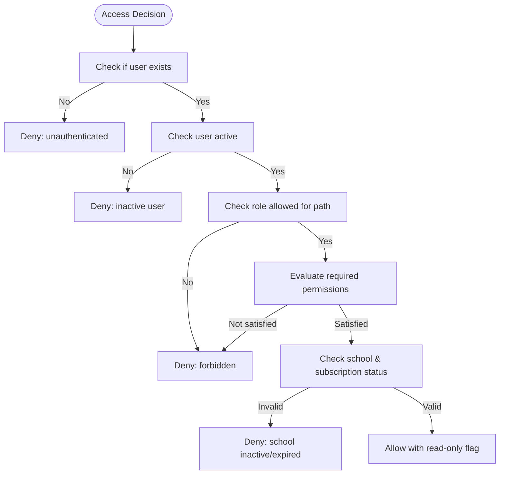
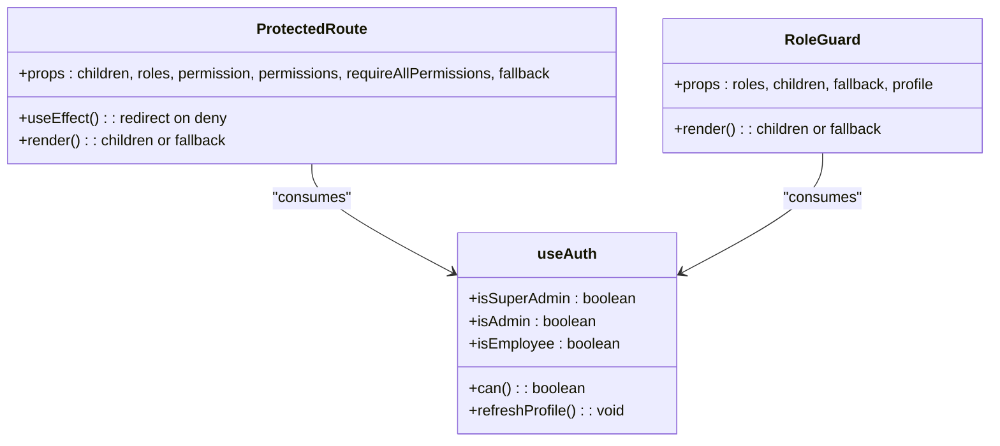
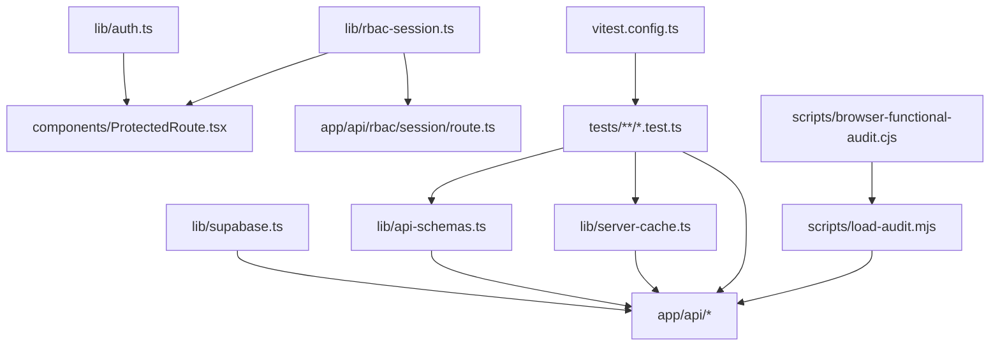

# Testing Strategy

<cite>
**Referenced Files in This Document**
- [vitest.config.ts](file://vitest.config.ts)
- [tests/api/expenses-route.test.ts](file://tests/api/expenses-route.test.ts)
- [tests/lib/api-schemas.test.ts](file://tests/lib/api-schemas.test.ts)
- [tests/lib/server-cache.test.ts](file://tests/lib/server-cache.test.ts)
- [.github/workflows/ci.yml](file://.github/workflows/ci.yml)
- [package.json](file://package.json)
- [load-test.js](file://load-test.js)
- [scripts/load-audit.mjs](file://scripts/load-audit.mjs)
- [scripts/browser-functional-audit.cjs](file://scripts/browser-functional-audit.cjs)
- [.github/workflows/datadog-synthetics.yml](file://.github/workflows/datadog-synthetics.yml)
- [.github/workflows/codeql.yml](file://.github/workflows/codeql.yml)
- [lib/api-schemas.ts](file://lib/api-schemas.ts)
- [lib/server-cache.ts](file://lib/server-cache.ts)
- [lib/auth.ts](file://lib/auth.ts)
- [lib/rbac-session.ts](file://lib/rbac-session.ts)
- [hooks/useAuth.ts](file://hooks/useAuth.ts)
- [components/ProtectedRoute.tsx](file://components/ProtectedRoute.tsx)
- [components/RoleGuard.tsx](file://components/RoleGuard.tsx)
- [lib/supabase.ts](file://lib/supabase.ts)
- [app/api/rbac/session/route.ts](file://app/api/rbac/session/route.ts)
- [app/api/ping/route.ts](file://app/api/ping/route.ts)
- [app/login/page.tsx](file://app/login/page.tsx)
- [app/dashboard/page.tsx](file://app/dashboard/page.tsx)
- [app/students/page.tsx](file://app/students/page.tsx)
- [app/teachers/page.tsx](file://app/teachers/page.tsx)
- [app/api/web/expenses/route.ts](file://app/api/web/expenses/route.ts)
- [app/api/web/students/list/route.ts](file://app/api/web/students/list/route.ts)
- [app/api/web/payments/overview/route.ts](file://app/api/web/payments/overview/route.ts)
- [app/api/web/reports/overview/route.ts](file://app/api/web/reports/overview/route.ts)
- [app/api/web/salaries/teachers/[teacherId]/route.ts](file://app/api/web/salaries/teachers/[teacherId]/route.ts)
- [app/api/web/super-admin/schools/[schoolId]/route.ts](file://app/api/web/super-admin/schools/[schoolId]/route.ts)
- [app/api/web/monitoring/branding/route.ts](file://app/api/web/monitoring/branding/route.ts)
- [app/api/web/schema-compat/route.ts](file://app/api/web/schema-compat/route.ts)
- [app/api/mobile/student/attendance/route.ts](file://app/api/mobile/student/attendance/route.ts)
- [app/api/mobile/teacher/grades/route.ts](file://app/api/mobile/teacher/grades/route.ts)
- [app/api/mobile/notifications/route.ts](file://app/api/mobile/notifications/route.ts)
- [app/api/mobile/session/route.ts](file://app/api/mobile/session/route.ts)
- [app/api/mobile/dashboard/route.ts](file://app/api/mobile/dashboard/route.ts)
- [app/api/web/dashboard/overview/route.ts](file://app/api/web/dashboard/overview/route.ts)
- [app/api/web/dashboard/branding/route.ts](file://app/api/web/dashboard/branding/route.ts)
- [app/api/web/payments/export/route.ts](file://app/api/web/payments/export/route.ts)
- [app/api/web/payments/archive/route.ts](file://app/api/web/payments/archive/route.ts)
- [app/api/web/payments/meta/route.ts](file://app/api/web/payments/meta/route.ts)
- [app/api/web/payments/records/[paymentId]/route.ts](file://app/api/web/payments/records/[paymentId]/route.ts)
- [app/api/web/payments/student-search/route.ts](file://app/api/web/payments/student-search/route.ts)
- [app/api/web/payments/students/[studentId]/route.ts](file://app/api/web/payments/students/[studentId]/route.ts)
- [app/api/web/reports/dataset/route.ts](file://app/api/web/reports/dataset/route.ts)
- [app/api/web/salaries/bootstrap/route.ts](file://app/api/web/salaries/bootstrap/route.ts)
- [app/api/web/salaries/deductions/route.ts](file://app/api/web/salaries/deductions/route.ts)
- [app/api/web/salaries/lectures/route.ts](file://app/api/web/salaries/lectures/route.ts)
- [app/api/web/salaries/pay/route.ts](file://app/api/web/salaries/pay/route.ts)
- [app/api/web/salaries/report/route.ts](file://app/api/web/salaries/report/route.ts)
- [app/api/web/salaries/teachers/route.ts](file://app/api/web/salaries/teachers/route.ts)
- [app/api/web/salaries/archive/route.ts](file://app/api/web/salaries/archive/route.ts)
- [app/api/web/fee-notifications/[id]/route.ts](file://app/api/web/fee-notifications/[id]/route.ts)
- [app/api/web/fee-notifications/route.ts](file://app/api/web/fee-notifications/route.ts)
- [app/api/web/teacher-activity/homework/route.ts](file://app/api/web/teacher-activity/homework/route.ts)
- [app/api/web/teacher-activity/messages/route.ts](file://app/api/web/teacher-activity/messages/route.ts)
- [app/api/web/teacher-activity/meta/route.ts](file://app/api/web/teacher-activity/meta/route.ts)
- [app/api/web/students/credential-cards/route.ts](file://app/api/web/students/credential-cards/route.ts)
- [app/api/web/students/demo-seed/route.ts](file://app/api/web/students/demo-seed/route.ts)
- [app/api/web/students/meta/route.ts](file://app/api/web/students/meta/route.ts)
- [app/api/web/super-admin/overview/route.ts](file://app/api/web/super-admin/overview/route.ts)
- [app/api/web/super-admin/subscriptions/[schoolId]/route.ts](file://app/api/web/super-admin/subscriptions/[schoolId]/route.ts)
- [app/api/web/super-admin/users/[userId]/route.ts](file://app/api/web/super-admin/users/[userId]/route.ts)
- [app/api/web/monitoring/overview/route.ts](file://app/api/web/monitoring/overview/route.ts)
- [app/api/web/monitoring/branding/route.ts](file://app/api/web/monitoring/branding/route.ts)
- [app/api/web/monitoring/schools/route.ts](file://app/api/web/monitoring/schools/route.ts)
- [app/api/web/monitoring/users/route.ts](file://app/api/web/monitoring/users/route.ts)
- [app/api/web/monitoring/teachers/route.ts](file://app/api/web/monitoring/teachers/route.ts)
- [app/api/web/monitoring/payments/route.ts](file://app/api/web/monitoring/payments/route.ts)
</cite>

## Update Summary
**Changes Made**
- Added comprehensive Vitest testing framework documentation with configuration and test examples
- Updated testing architecture to include unit testing capabilities for API endpoints, server-side logic, and utility functions
- Enhanced CI/CD pipeline documentation with automated testing procedures
- Expanded testing strategy to cover Zod schema validation testing and server cache functionality testing
- Added practical examples for writing unit tests for Next.js API routes and utility functions

## Table of Contents
1. [Introduction](#introduction)
2. [Project Structure](#project-structure)
3. [Core Components](#core-components)
4. [Architecture Overview](#architecture-overview)
5. [Detailed Component Analysis](#detailed-component-analysis)
6. [Vitest Testing Framework](#vitest-testing-framework)
7. [Unit Testing Strategy](#unit-testing-strategy)
8. [Integration Testing Strategy](#integration-testing-strategy)
9. [End-to-End Testing Strategy](#end-to-end-testing-strategy)
10. [Performance Testing](#performance-testing)
11. [Dependency Analysis](#dependency-analysis)
12. [Performance Considerations](#performance-considerations)
13. [Troubleshooting Guide](#troubleshooting-guide)
14. [Conclusion](#conclusion)
15. [Appendices](#appendices)

## Introduction
This document defines a comprehensive testing strategy for the Next.js application, covering unit testing, integration testing, and end-to-end testing. The testing framework has been enhanced with Vitest for unit testing capabilities, complementing existing load testing and functional auditing procedures. It explains the testing framework setup, test organization, automated testing procedures, and performance testing using k6 and Node.js scripts. It also documents authentication flows, API endpoint coverage, database operations via Supabase, and UI component protections. Multi-tenant scenarios, role-based access control (RBAC), and data isolation are addressed alongside internationalization and cross-browser compatibility considerations. Practical examples are provided through file paths to relevant source locations.

## Project Structure
The repository includes:
- Frontend Next.js application under the root app directory with API routes, pages, and shared components.
- Backend-like API routes organized under app/api for both web and mobile contexts.
- Authentication and RBAC utilities under lib and components for UI protection.
- Comprehensive unit test suite using Vitest under the tests directory.
- Load testing and functional auditing scripts under scripts.
- GitHub Actions workflows for CI/CD pipeline with automated testing.
- Enhanced testing infrastructure with Zod schema validation and server cache testing.

**Diagram sources**
- [vitest.config.ts](file://vitest.config.ts)
- [tests/api/expenses-route.test.ts](file://tests/api/expenses-route.test.ts)
- [tests/lib/api-schemas.test.ts](file://tests/lib/api-schemas.test.ts)
- [tests/lib/server-cache.test.ts](file://tests/lib/server-cache.test.ts)
- [app/login/page.tsx](file://app/login/page.tsx)
- [app/api/rbac/session/route.ts](file://app/api/rbac/session/route.ts)
- [lib/auth.ts](file://lib/auth.ts)
- [lib/rbac-session.ts](file://lib/rbac-session.ts)
- [components/ProtectedRoute.tsx](file://components/ProtectedRoute.tsx)
- [scripts/load-audit.mjs](file://scripts/load-audit.mjs)
- [scripts/browser-functional-audit.cjs](file://scripts/browser-functional-audit.cjs)
- [load-test.js](file://load-test.js)
- [.github/workflows/ci.yml](file://.github/workflows/ci.yml)
- [.github/workflows/datadog-synthetics.yml](file://.github/workflows/datadog-synthetics.yml)
- [.github/workflows/codeql.yml](file://.github/workflows/codeql.yml)

**Section sources**
- [package.json](file://package.json)
- [lib/supabase.ts](file://lib/supabase.ts)
- [vitest.config.ts](file://vitest.config.ts)

## Core Components
- Authentication and RBAC:
  - User profile resolution, permission evaluation, and access decisions are implemented in [lib/auth.ts](file://lib/auth.ts).
  - RBAC session cookie signing and verification are handled in [lib/rbac-session.ts](file://lib/rbac-session.ts).
  - UI guards and route protection are provided by [components/ProtectedRoute.tsx](file://components/ProtectedRoute.tsx) and [components/RoleGuard.tsx](file://components/RoleGuard.tsx).
  - Client-side RBAC session initialization is performed by [lib/auth.ts](file://lib/auth.ts) via the RBAC API route [app/api/rbac/session/route.ts](file://app/api/rbac/session/route.ts).
- Supabase integration:
  - Browser client creation and validation are in [lib/supabase.ts](file://lib/supabase.ts).
- API coverage:
  - Web APIs include dashboard, payments, reports, salaries, students, super-admin, monitoring, and more under [app/api/web/*](file://app/api/web/).
  - Mobile APIs include session, student, teacher, and notifications under [app/api/mobile/*](file://app/api/mobile/).
- Unit testing framework:
  - Vitest configuration and test organization are defined in [vitest.config.ts](file://vitest.config.ts).
  - Unit tests cover API endpoints, server-side logic, and utility functions under [tests/](file://tests/).
- Load and functional audits:
  - Functional audit saves authenticated sessions for later use in load audits [scripts/browser-functional-audit.cjs](file://scripts/browser-functional-audit.cjs).
  - Load audit performs concurrent requests and database query sets [scripts/load-audit.mjs](file://scripts/load-audit.mjs).
  - k6 load test targets public pages and API endpoints [load-test.js](file://load-test.js).
- CI/CD pipeline:
  - Automated testing through GitHub Actions CI workflow [ci.yml](file://.github/workflows/ci.yml).
  - Datadog synthetic tests run via GitHub Actions [datadog-synthetics.yml](file://.github/workflows/datadog-synthetics.yml).
  - CodeQL advanced scanning [codeql.yml](file://.github/workflows/codeql.yml).

**Section sources**
- [lib/auth.ts](file://lib/auth.ts)
- [lib/rbac-session.ts](file://lib/rbac-session.ts)
- [components/ProtectedRoute.tsx](file://components/ProtectedRoute.tsx)
- [components/RoleGuard.tsx](file://components/RoleGuard.tsx)
- [lib/supabase.ts](file://lib/supabase.ts)
- [app/api/rbac/session/route.ts](file://app/api/rbac/session/route.ts)
- [vitest.config.ts](file://vitest.config.ts)
- [tests/api/expenses-route.test.ts](file://tests/api/expenses-route.test.ts)
- [tests/lib/api-schemas.test.ts](file://tests/lib/api-schemas.test.ts)
- [tests/lib/server-cache.test.ts](file://tests/lib/server-cache.test.ts)
- [scripts/browser-functional-audit.cjs](file://scripts/browser-functional-audit.cjs)
- [scripts/load-audit.mjs](file://scripts/load-audit.mjs)
- [load-test.js](file://load-test.js)
- [.github/workflows/ci.yml](file://.github/workflows/ci.yml)
- [.github/workflows/datadog-synthetics.yml](file://.github/workflows/datadog-synthetics.yml)
- [.github/workflows/codeql.yml](file://.github/workflows/codeql.yml)

## Architecture Overview
The testing architecture integrates:
- UI-level protection via ProtectedRoute and RoleGuard.
- RBAC session lifecycle managed by the RBAC API route and client utilities.
- Comprehensive unit testing framework using Vitest for API endpoints, server-side logic, and utility functions.
- API coverage across web and mobile domains.
- Automated audits and load tests using Playwright and k6.
- CI/CD pipeline for automated testing and quality assurance.

**Diagram sources**
- [components/ProtectedRoute.tsx](file://components/ProtectedRoute.tsx)
- [lib/auth.ts](file://lib/auth.ts)
- [app/api/rbac/session/route.ts](file://app/api/rbac/session/route.ts)
- [lib/supabase.ts](file://lib/supabase.ts)

## Detailed Component Analysis

### Authentication and RBAC Session Management
- Access decision logic evaluates unauthenticated, inactive user, forbidden, school inactive, and subscription expired states [lib/auth.ts](file://lib/auth.ts).
- RBAC cookie signing and verification are implemented with HMAC-SHA256 and base64url encoding [lib/rbac-session.ts](file://lib/rbac-session.ts).
- Client-side RBAC session initialization and cleanup are handled in [lib/auth.ts](file://lib/auth.ts) by calling the RBAC API route [app/api/rbac/session/route.ts](file://app/api/rbac/session/route.ts).

**Diagram sources**
- [lib/auth.ts](file://lib/auth.ts)

**Section sources**
- [lib/auth.ts](file://lib/auth.ts)
- [lib/rbac-session.ts](file://lib/rbac-session.ts)
- [app/api/rbac/session/route.ts](file://app/api/rbac/session/route.ts)

### UI Protection Components
- ProtectedRoute enforces access control and redirects based on reasons derived from access decisions [components/ProtectedRoute.tsx](file://components/ProtectedRoute.tsx).
- RoleGuard provides role-based rendering [components/RoleGuard.tsx](file://components/RoleGuard.tsx).
- useAuth aggregates role checks for convenient consumption in components [hooks/useAuth.ts](file://hooks/useAuth.ts).

**Diagram sources**
- [components/ProtectedRoute.tsx](file://components/ProtectedRoute.tsx)
- [components/RoleGuard.tsx](file://components/RoleGuard.tsx)
- [hooks/useAuth.ts](file://hooks/useAuth.ts)

**Section sources**
- [components/ProtectedRoute.tsx](file://components/ProtectedRoute.tsx)
- [components/RoleGuard.tsx](file://components/RoleGuard.tsx)
- [hooks/useAuth.ts](file://hooks/useAuth.ts)

### API Endpoint Coverage
- Web API routes include:
  - Dashboard: [app/api/web/dashboard/overview/route.ts](file://app/api/web/dashboard/overview/route.ts), [app/api/web/dashboard/branding/route.ts](file://app/api/web/dashboard/branding/route.ts)
  - Payments: [app/api/web/payments/overview/route.ts](file://app/api/web/payments/overview/route.ts), [app/api/web/payments/export/route.ts](file://app/api/web/payments/export/route.ts), [app/api/web/payments/archive/route.ts](file://app/api/web/payments/archive/route.ts), [app/api/web/payments/meta/route.ts](file://app/api/web/payments/meta/route.ts), [app/api/web/payments/records/[paymentId]/route.ts](file://app/api/web/payments/records/[paymentId]/route.ts), [app/api/web/payments/student-search/route.ts](file://app/api/web/payments/student-search/route.ts), [app/api/web/payments/students/[studentId]/route.ts](file://app/api/web/payments/students/[studentId]/route.ts)
  - Reports: [app/api/web/reports/overview/route.ts](file://app/api/web/reports/overview/route.ts), [app/api/web/reports/dataset/route.ts](file://app/api/web/reports/dataset/route.ts)
  - Salaries: [app/api/web/salaries/teachers/[teacherId]/route.ts](file://app/api/web/salaries/teachers/[teacherId]/route.ts), [app/api/web/salaries/bootstrap/route.ts](file://app/api/web/salaries/bootstrap/route.ts), [app/api/web/salaries/deductions/route.ts](file://app/api/web/salaries/deductions/route.ts), [app/api/web/salaries/lectures/route.ts](file://app/api/web/salaries/lectures/route.ts), [app/api/web/salaries/pay/route.ts](file://app/api/web/salaries/pay/route.ts), [app/api/web/salaries/report/route.ts](file://app/api/web/salaries/report/route.ts), [app/api/web/salaries/teachers/route.ts](file://app/api/web/salaries/teachers/route.ts), [app/api/web/salaries/archive/route.ts](file://app/api/web/salaries/archive/route.ts)
  - Students: [app/api/web/students/list/route.ts](file://app/api/web/students/list/route.ts), [app/api/web/students/credential-cards/route.ts](file://app/api/web/students/credential-cards/route.ts), [app/api/web/students/demo-seed/route.ts](file://app/api/web/students/demo-seed/route.ts), [app/api/web/students/meta/route.ts](file://app/api/web/students/meta/route.ts)
  - Super Admin: [app/api/web/super-admin/overview/route.ts](file://app/api/web/super-admin/overview/route.ts), [app/api/web/super-admin/schools/[schoolId]/route.ts](file://app/api/web/super-admin/schools/[schoolId]/route.ts), [app/api/web/super-admin/subscriptions/[schoolId]/route.ts](file://app/api/web/super-admin/subscriptions/[schoolId]/route.ts), [app/api/web/super-admin/users/[userId]/route.ts](file://app/api/web/super-admin/users/[userId]/route.ts)
  - Monitoring: [app/api/web/monitoring/overview/route.ts](file://app/api/web/monitoring/overview/route.ts), [app/api/web/monitoring/branding/route.ts](file://app/api/web/monitoring/branding/route.ts), [app/api/web/monitoring/schools/route.ts](file://app/api/web/monitoring/schools/route.ts), [app/api/web/monitoring/users/route.ts](file://app/api/web/monitoring/users/route.ts), [app/api/web/monitoring/teachers/route.ts](file://app/api/web/monitoring/teachers/route.ts), [app/api/web/monitoring/payments/route.ts](file://app/api/web/monitoring/payments/route.ts)
  - Schema compatibility: [app/api/web/schema-compat/route.ts](file://app/api/web/schema-compat/route.ts)
  - Fee notifications: [app/api/web/fee-notifications/[id]/route.ts](file://app/api/web/fee-notifications/[id]/route.ts), [app/api/web/fee-notifications/route.ts](file://app/api/web/fee-notifications/route.ts)
  - Teacher activity: [app/api/web/teacher-activity/homework/route.ts](file://app/api/web/teacher-activity/homework/route.ts), [app/api/web/teacher-activity/messages/route.ts](file://app/api/web/teacher-activity/messages/route.ts), [app/api/web/teacher-activity/meta/route.ts](file://app/api/web/teacher-activity/meta/route.ts)
- Mobile API routes include:
  - Session: [app/api/mobile/session/route.ts](file://app/api/mobile/session/route.ts)
  - Student: [app/api/mobile/student/attendance/route.ts](file://app/api/mobile/student/attendance/route.ts), [app/api/mobile/student/assignments/route.ts](file://app/api/mobile/student/assignments/route.ts), [app/api/mobile/student/dashboard/route.ts](file://app/api/mobile/student/dashboard/route.ts), [app/api/mobile/student/grades/route.ts](file://app/api/mobile/student/grades/route.ts), [app/api/mobile/student/notifications/route.ts](file://app/api/mobile/student/notifications/route.ts), [app/api/mobile/student/payments/route.ts](file://app/api/mobile/student/payments/route.ts)
  - Teacher: [app/api/mobile/teacher/assignments/route.ts](file://app/api/mobile/teacher/assignments/route.ts), [app/api/mobile/teacher/classes/route.ts](file://app/api/mobile/teacher/classes/route.ts), [app/api/mobile/teacher/dashboard/route.ts](file://app/api/mobile/teacher/dashboard/route.ts), [app/api/mobile/teacher/grades/route.ts](file://app/api/mobile/teacher/grades/route.ts), [app/api/mobile/teacher/notifications/route.ts](file://app/api/mobile/teacher/notifications/route.ts), [app/api/mobile/teacher/students/route.ts](file://app/api/mobile/teacher/students/route.ts)
  - Notifications: [app/api/mobile/notifications/route.ts](file://app/api/mobile/notifications/route.ts)

**Section sources**
- [app/api/web/dashboard/overview/route.ts](file://app/api/web/dashboard/overview/route.ts)
- [app/api/web/dashboard/branding/route.ts](file://app/api/web/dashboard/branding/route.ts)
- [app/api/web/payments/overview/route.ts](file://app/api/web/payments/overview/route.ts)
- [app/api/web/payments/export/route.ts](file://app/api/web/payments/export/route.ts)
- [app/api/web/payments/archive/route.ts](file://app/api/web/payments/archive/route.ts)
- [app/api/web/payments/meta/route.ts](file://app/api/web/payments/meta/route.ts)
- [app/api/web/payments/records/[paymentId]/route.ts](file://app/api/web/payments/records/[paymentId]/route.ts)
- [app/api/web/payments/student-search/route.ts](file://app/api/web/payments/student-search/route.ts)
- [app/api/web/payments/students/[studentId]/route.ts](file://app/api/web/payments/students/[studentId]/route.ts)
- [app/api/web/reports/overview/route.ts](file://app/api/web/reports/overview/route.ts)
- [app/api/web/reports/dataset/route.ts](file://app/api/web/reports/dataset/route.ts)
- [app/api/web/salaries/teachers/[teacherId]/route.ts](file://app/api/web/salaries/teachers/[teacherId]/route.ts)
- [app/api/web/salaries/bootstrap/route.ts](file://app/api/web/salaries/bootstrap/route.ts)
- [app/api/web/salaries/deductions/route.ts](file://app/api/web/salaries/deductions/route.ts)
- [app/api/web/salaries/lectures/route.ts](file://app/api/web/salaries/lectures/route.ts)
- [app/api/web/salaries/pay/route.ts](file://app/api/web/salaries/pay/route.ts)
- [app/api/web/salaries/report/route.ts](file://app/api/web/salaries/report/route.ts)
- [app/api/web/salaries/teachers/route.ts](file://app/api/web/salaries/teachers/route.ts)
- [app/api/web/salaries/archive/route.ts](file://app/api/web/salaries/archive/route.ts)
- [app/api/web/students/list/route.ts](file://app/api/web/students/list/route.ts)
- [app/api/web/students/credential-cards/route.ts](file://app/api/web/students/credential-cards/route.ts)
- [app/api/web/students/demo-seed/route.ts](file://app/api/web/students/demo-seed/route.ts)
- [app/api/web/students/meta/route.ts](file://app/api/web/students/meta/route.ts)
- [app/api/web/super-admin/overview/route.ts](file://app/api/web/super-admin/overview/route.ts)
- [app/api/web/super-admin/schools/[schoolId]/route.ts](file://app/api/web/super-admin/schools/[schoolId]/route.ts)
- [app/api/web/super-admin/subscriptions/[schoolId]/route.ts](file://app/api/web/super-admin/subscriptions/[schoolId]/route.ts)
- [app/api/web/super-admin/users/[userId]/route.ts](file://app/api/web/super-admin/users/[userId]/route.ts)
- [app/api/web/monitoring/overview/route.ts](file://app/api/web/monitoring/overview/route.ts)
- [app/api/web/monitoring/branding/route.ts](file://app/api/web/monitoring/branding/route.ts)
- [app/api/web/monitoring/schools/route.ts](file://app/api/web/monitoring/schools/route.ts)
- [app/api/web/monitoring/users/route.ts](file://app/api/web/monitoring/users/route.ts)
- [app/api/web/monitoring/teachers/route.ts](file://app/api/web/monitoring/teachers/route.ts)
- [app/api/web/monitoring/payments/route.ts](file://app/api/web/monitoring/payments/route.ts)
- [app/api/web/schema-compat/route.ts](file://app/api/web/schema-compat/route.ts)
- [app/api/web/fee-notifications/[id]/route.ts](file://app/api/web/fee-notifications/[id]/route.ts)
- [app/api/web/fee-notifications/route.ts](file://app/api/web/fee-notifications/route.ts)
- [app/api/web/teacher-activity/homework/route.ts](file://app/api/web/teacher-activity/homework/route.ts)
- [app/api/web/teacher-activity/messages/route.ts](file://app/api/web/teacher-activity/messages/route.ts)
- [app/api/web/teacher-activity/meta/route.ts](file://app/api/web/teacher-activity/meta/route.ts)
- [app/api/mobile/session/route.ts](file://app/api/mobile/session/route.ts)
- [app/api/mobile/student/attendance/route.ts](file://app/api/mobile/student/attendance/route.ts)
- [app/api/mobile/student/assignments/route.ts](file://app/api/mobile/student/assignments/route.ts)
- [app/api/mobile/student/dashboard/route.ts](file://app/api/mobile/student/dashboard/route.ts)
- [app/api/mobile/student/grades/route.ts](file://app/api/mobile/student/grades/route.ts)
- [app/api/mobile/student/notifications/route.ts](file://app/api/mobile/student/notifications/route.ts)
- [app/api/mobile/student/payments/route.ts](file://app/api/mobile/student/payments/route.ts)
- [app/api/mobile/teacher/assignments/route.ts](file://app/api/mobile/teacher/assignments/route.ts)
- [app/api/mobile/teacher/classes/route.ts](file://app/api/mobile/teacher/classes/route.ts)
- [app/api/mobile/teacher/dashboard/route.ts](file://app/api/mobile/teacher/dashboard/route.ts)
- [app/api/mobile/teacher/grades/route.ts](file://app/api/mobile/teacher/grades/route.ts)
- [app/api/mobile/teacher/notifications/route.ts](file://app/api/mobile/teacher/notifications/route.ts)
- [app/api/mobile/teacher/students/route.ts](file://app/api/mobile/teacher/students/route.ts)
- [app/api/mobile/notifications/route.ts](file://app/api/mobile/notifications/route.ts)

## Vitest Testing Framework

### Configuration and Setup
The testing framework is powered by Vitest, a fast unit testing framework with native ES module support and TypeScript integration. The configuration establishes the testing environment and test discovery patterns.

**Vitest Configuration Highlights:**
- Environment: Node.js runtime for server-side testing
- Test Discovery: Automatic discovery of tests in `tests/**/*.test.ts` pattern
- Path Aliases: Root alias (`@`) pointing to project root for clean imports
- Mocking Support: Built-in mocking capabilities for dependencies

**Section sources**
- [vitest.config.ts](file://vitest.config.ts)

### Test Organization Structure
The test suite is organized into logical directories mirroring the application structure:

**API Tests:**
- Located in `tests/api/` directory
- Focus on Next.js API route testing
- Mock external dependencies using Vitest's mocking capabilities
- Test request validation, authorization, and response handling

**Library Tests:**
- Located in `tests/lib/` directory
- Cover utility functions, server logic, and business logic
- Test pure functions and stateless operations
- Validate data transformation and validation logic

**Section sources**
- [tests/api/expenses-route.test.ts](file://tests/api/expenses-route.test.ts)
- [tests/lib/api-schemas.test.ts](file://tests/lib/api-schemas.test.ts)
- [tests/lib/server-cache.test.ts](file://tests/lib/server-cache.test.ts)

### Unit Testing Examples

#### API Route Testing with Mocks
The expenses route test demonstrates comprehensive API testing with dependency mocking:

**Key Testing Patterns:**
- Dynamic imports for isolated testing
- Mock external dependencies (rate limiting, user context, server logic)
- Test parameter validation and error responses
- Verify business logic execution and side effects

**Section sources**
- [tests/api/expenses-route.test.ts](file://tests/api/expenses-route.test.ts)

#### Zod Schema Validation Testing
Schema validation tests ensure data integrity and proper error handling:

**Testing Approach:**
- Validate successful parsing with correct data formats
- Test rejection of invalid inputs with appropriate error messages
- Verify data normalization and transformation
- Test complex validation rules and constraints

**Section sources**
- [tests/lib/api-schemas.test.ts](file://tests/lib/api-schemas.test.ts)
- [lib/api-schemas.ts](file://lib/api-schemas.ts)

#### Server Cache Functionality Testing
Cache testing validates deduplication and invalidation mechanisms:

**Cache Testing Patterns:**
- Concurrency testing for deduplication validation
- Tag-based invalidation testing
- TTL (Time-To-Live) expiration handling
- Memory leak prevention validation

**Section sources**
- [tests/lib/server-cache.test.ts](file://tests/lib/server-cache.test.ts)
- [lib/server-cache.ts](file://lib/server-cache.ts)

## Unit Testing Strategy

### API Endpoint Testing
Unit tests for API endpoints focus on:
- Request parameter validation using Zod schemas
- Authorization and RBAC enforcement
- Response formatting and error handling
- External dependency mocking and isolation
- Business logic validation without database dependencies

**Testing Coverage Areas:**
- Input validation and sanitization
- Role-based access control
- Rate limiting integration
- Error boundary handling
- Response serialization

**Section sources**
- [tests/api/expenses-route.test.ts](file://tests/api/expenses-route.test.ts)
- [app/api/web/expenses/route.ts](file://app/api/web/expenses/route.ts)

### Utility Function Testing
Server-side utility functions receive dedicated unit testing:
- Data transformation and normalization
- Cache management and invalidation
- Business rule validation
- Error handling and edge cases

**Testing Priorities:**
- Pure function testing without side effects
- Boundary condition validation
- Performance characteristics
- Memory usage patterns

**Section sources**
- [tests/lib/api-schemas.test.ts](file://tests/lib/api-schemas.test.ts)
- [tests/lib/server-cache.test.ts](file://tests/lib/server-cache.test.ts)
- [lib/api-schemas.ts](file://lib/api-schemas.ts)
- [lib/server-cache.ts](file://lib/server-cache.ts)

### Mocking Strategy
Effective mocking enables isolated testing:
- External service mocking for HTTP requests
- Database operation mocking for persistence
- Time-dependent operations mocking
- Third-party library mocking

**Mock Implementation Patterns:**
- Dynamic imports for test isolation
- Vitest's built-in mocking capabilities
- Factory functions for mock data generation
- Spy functions for interaction verification

## Integration Testing Strategy

### API Integration Testing
Integration tests validate API endpoint behavior with real dependencies:
- Database connectivity and query execution
- External service communication
- Authentication flow validation
- Transaction handling and rollback

**Integration Test Scope:**
- End-to-end API request processing
- Database transaction isolation
- External dependency interactions
- Error propagation and recovery

### Database Integration Testing
Database tests validate data persistence and retrieval:
- Query performance and optimization
- Transaction isolation levels
- Data consistency and referential integrity
- Migration and schema evolution testing

## End-to-End Testing Strategy

### Functional Testing
End-to-end testing covers complete user workflows:
- Authentication and authorization flows
- Multi-step business processes
- Cross-component interactions
- User interface validation

**Testing Approaches:**
- Playwright for browser automation
- Cypress for component testing
- Selenium for cross-browser compatibility
- Manual testing for critical user journeys

### User Experience Testing
UX-focused testing ensures quality user experience:
- Accessibility compliance testing
- Internationalization validation
- Responsive design verification
- Performance and usability metrics

## Performance Testing

### Load Testing with k6
The k6 script defines comprehensive load testing scenarios:
- Ramping Virtual Users (VU) for realistic traffic simulation
- Threshold configuration for performance baselines
- Multi-page request sequences for complete user journeys
- Environment variable configuration for different deployment stages

**Load Testing Configuration:**
- Scenario definitions with ramp-up and ramp-down periods
- Thresholds for error rates and latency targets
- Request sequences for login, API endpoints, and page navigation
- Cookie-based authentication for logged-in user simulation

**Section sources**
- [load-test.js](file://load-test.js)

### Functional and Reliability Audits
Comprehensive auditing validates system reliability:
- Browser functional audit for authenticated sessions
- Load audit for concurrent request validation
- Database query performance analysis
- Error rate and failure pattern identification

**Audit Capabilities:**
- Parallel worker execution for scalability
- Latency percentile calculation (min/avg/p95/p99/max)
- Failure rate statistics and error categorization
- Database query set performance analysis

**Section sources**
- [scripts/browser-functional-audit.cjs](file://scripts/browser-functional-audit.cjs)
- [scripts/load-audit.mjs](file://scripts/load-audit.mjs)

## Dependency Analysis
- UI protection depends on:
  - Access decision utilities in [lib/auth.ts](file://lib/auth.ts).
  - RBAC session management in [lib/rbac-session.ts](file://lib/rbac-session.ts).
  - ProtectedRoute and RoleGuard components [components/ProtectedRoute.tsx](file://components/ProtectedRoute.tsx), [components/RoleGuard.tsx](file://components/RoleGuard.tsx).
- API routes depend on:
  - Supabase client initialization [lib/supabase.ts](file://lib/supabase.ts).
  - RBAC session cookie handling [lib/rbac-session.ts](file://lib/rbac-session.ts).
  - Zod schema validation [lib/api-schemas.ts](file://lib/api-schemas.ts).
- Unit tests depend on:
  - Vitest framework configuration [vitest.config.ts](file://vitest.config.ts).
  - Mocked dependencies for isolation [tests/api/expenses-route.test.ts](file://tests/api/expenses-route.test.ts).
- Load and functional audits depend on:
  - Saved storage state cookies from [scripts/browser-functional-audit.cjs](file://scripts/browser-functional-audit.cjs).
  - Supabase client for authenticated queries [scripts/load-audit.mjs](file://scripts/load-audit.mjs).

**Diagram sources**
- [lib/auth.ts](file://lib/auth.ts)
- [lib/rbac-session.ts](file://lib/rbac-session.ts)
- [components/ProtectedRoute.tsx](file://components/ProtectedRoute.tsx)
- [app/api/rbac/session/route.ts](file://app/api/rbac/session/route.ts)
- [lib/supabase.ts](file://lib/supabase.ts)
- [lib/api-schemas.ts](file://lib/api-schemas.ts)
- [lib/server-cache.ts](file://lib/server-cache.ts)
- [vitest.config.ts](file://vitest.config.ts)
- [tests/api/expenses-route.test.ts](file://tests/api/expenses-route.test.ts)
- [scripts/browser-functional-audit.cjs](file://scripts/browser-functional-audit.cjs)
- [scripts/load-audit.mjs](file://scripts/load-audit.mjs)

**Section sources**
- [lib/auth.ts](file://lib/auth.ts)
- [lib/rbac-session.ts](file://lib/rbac-session.ts)
- [components/ProtectedRoute.tsx](file://components/ProtectedRoute.tsx)
- [app/api/rbac/session/route.ts](file://app/api/rbac/session/route.ts)
- [lib/supabase.ts](file://lib/supabase.ts)
- [lib/api-schemas.ts](file://lib/api-schemas.ts)
- [lib/server-cache.ts](file://lib/server-cache.ts)
- [vitest.config.ts](file://vitest.config.ts)
- [tests/api/expenses-route.test.ts](file://tests/api/expenses-route.test.ts)
- [scripts/browser-functional-audit.cjs](file://scripts/browser-functional-audit.cjs)
- [scripts/load-audit.mjs](file://scripts/load-audit.mjs)

## Performance Considerations
- k6 load testing:
  - Ramping VUs simulate realistic traffic growth and decay [load-test.js](file://load-test.js).
  - Thresholds enforce acceptable failure rates and latency targets (p95/p99) [load-test.js](file://load-test.js).
- Node.js load audit:
  - Parallel workers execute staged tasks with concurrency and iterations [scripts/load-audit.mjs](file://scripts/load-audit.mjs).
  - Latency summarization computes min/avg/p95/p99/max [scripts/load-audit.mjs](file://scripts/load-audit.mjs).
- Database query sets:
  - Concurrent queries exercise Supabase performance under load [scripts/load-audit.mjs](file://scripts/load-audit.mjs).
- Vitest unit testing:
  - Fast test execution with isolated mocking reduces development iteration time.
  - Parallel test execution maximizes CPU utilization during local development.
  - Mock-based testing eliminates flaky network dependencies.
- CI/CD performance:
  - Automated testing pipeline ensures consistent quality without manual intervention.
  - Test caching and dependency optimization reduce build times.
  - Parallel job execution in CI environments accelerates feedback loops.

## Troubleshooting Guide
- RBAC cookie secret:
  - Production requires RBAC_COOKIE_SECRET; fallbacks are warned but not recommended [lib/rbac-session.ts](file://lib/rbac-session.ts).
- Supabase environment variables:
  - Missing NEXT_PUBLIC_SUPABASE_URL or NEXT_PUBLIC_SUPABASE_ANON_KEY triggers an error during client creation [lib/supabase.ts](file://lib/supabase.ts).
- Access denied redirects:
  - ProtectedRoute resolves redirects based on access decision reasons (unauthenticated, school inactive, subscription expired, forbidden) [components/ProtectedRoute.tsx](file://components/ProtectedRoute.tsx).
- Vitest configuration issues:
  - Path aliases must match project structure in [vitest.config.ts](file://vitest.config.ts).
  - Test file patterns must match the configured include glob.
  - Mock implementations must handle all expected function signatures.
- Functional audit prerequisites:
  - Browser audit must be run first to produce storage state files consumed by load audit [scripts/browser-functional-audit.cjs](file://scripts/browser-functional-audit.cjs), [scripts/load-audit.mjs](file://scripts/load-audit.mjs).
- CI/CD pipeline failures:
  - Ensure all dependencies are installed before running tests [ci.yml](file://.github/workflows/ci.yml).
  - Verify test environment variables are properly configured.
  - Check for memory leaks in long-running test suites.
- Datadog synthetic tests:
  - Ensure DD_API_KEY and DD_APP_KEY secrets are configured in repository settings [datadog-synthetics.yml](file://.github/workflows/datadog-synthetics.yml).

**Section sources**
- [lib/rbac-session.ts](file://lib/rbac-session.ts)
- [lib/supabase.ts](file://lib/supabase.ts)
- [components/ProtectedRoute.tsx](file://components/ProtectedRoute.tsx)
- [vitest.config.ts](file://vitest.config.ts)
- [tests/api/expenses-route.test.ts](file://tests/api/expenses-route.test.ts)
- [scripts/browser-functional-audit.cjs](file://scripts/browser-functional-audit.cjs)
- [scripts/load-audit.mjs](file://scripts/load-audit.mjs)
- [.github/workflows/ci.yml](file://.github/workflows/ci.yml)
- [.github/workflows/datadog-synthetics.yml](file://.github/workflows/datadog-synthetics.yml)

## Conclusion
This comprehensive testing strategy combines UI protection, RBAC enforcement, extensive unit testing with Vitest, and robust load/performance auditing. The new Vitest framework provides fast, reliable unit testing for API endpoints, server-side logic, and utility functions, while the existing k6 and Node.js scripts enable scalable load testing and reliability audits. The CI/CD pipeline ensures automated quality assurance through GitHub Actions, integrating Datadog synthetics and CodeQL for continuous monitoring. Multi-tenant and role-based access control are validated through functional and load audits, ensuring data isolation and access correctness across admin and super-admin contexts. The combination of unit, integration, and end-to-end testing provides comprehensive coverage for the Next.js application's complex business logic and multi-tenant architecture.

## Appendices

### Practical Examples Index
- Authentication flows:
  - RBAC session initialization and clearing [lib/auth.ts](file://lib/auth.ts), [app/api/rbac/session/route.ts](file://app/api/rbac/session/route.ts).
  - Supabase sign-in and profile retrieval [scripts/load-audit.mjs](file://scripts/load-audit.mjs).
- API endpoints:
  - Expenses route testing with mocks [tests/api/expenses-route.test.ts](file://tests/api/expenses-route.test.ts).
  - Payments overview [app/api/web/payments/overview/route.ts](file://app/api/web/payments/overview/route.ts).
  - Students list [app/api/web/students/list/route.ts](file://app/api/web/students/list/route.ts).
  - Reports overview [app/api/web/reports/overview/route.ts](file://app/api/web/reports/overview/route.ts).
  - Salaries report [app/api/web/salaries/report/route.ts](file://app/api/web/salaries/report/route.ts).
  - Super Admin schools [app/api/web/super-admin/schools/[schoolId]/route.ts](file://app/api/web/super-admin/schools/[schoolId]/route.ts).
  - Monitoring branding [app/api/web/monitoring/branding/route.ts](file://app/api/web/monitoring/branding/route.ts).
- Database operations:
  - Concurrent dashboard query set [scripts/load-audit.mjs](file://scripts/load-audit.mjs).
  - Students query set [scripts/load-audit.mjs](file://scripts/load-audit.mjs).
  - Reports query set [scripts/load-audit.mjs](file://scripts/load-audit.mjs).
  - Salaries query set [scripts/load-audit.mjs](file://scripts/load-audit.mjs).
- UI components:
  - ProtectedRoute usage [components/ProtectedRoute.tsx](file://components/ProtectedRoute.tsx).
  - RoleGuard usage [components/RoleGuard.tsx](file://components/RoleGuard.tsx).
  - useAuth hook [hooks/useAuth.ts](file://hooks/useAuth.ts).
- Unit testing:
  - Vitest configuration [vitest.config.ts](file://vitest.config.ts).
  - API route testing patterns [tests/api/expenses-route.test.ts](file://tests/api/expenses-route.test.ts).
  - Schema validation testing [tests/lib/api-schemas.test.ts](file://tests/lib/api-schemas.test.ts).
  - Server cache testing [tests/lib/server-cache.test.ts](file://tests/lib/server-cache.test.ts).
- Load testing:
  - k6 script [load-test.js](file://load-test.js).
  - Functional audit [scripts/browser-functional-audit.cjs](file://scripts/browser-functional-audit.cjs).
  - Load audit [scripts/load-audit.mjs](file://scripts/load-audit.mjs).
- CI/CD:
  - Automated testing pipeline [ci.yml](file://.github/workflows/ci.yml).
  - Datadog synthetic tests [datadog-synthetics.yml](file://.github/workflows/datadog-synthetics.yml).
  - CodeQL [codeql.yml](file://.github/workflows/codeql.yml).