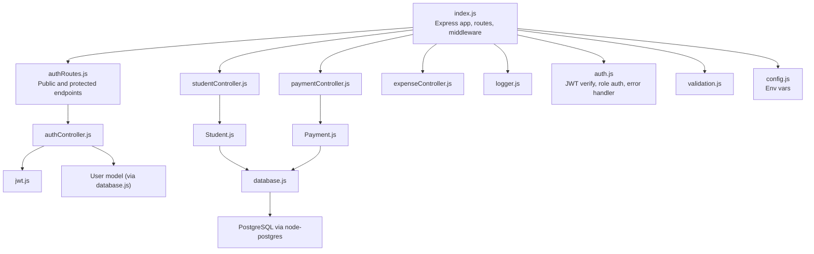
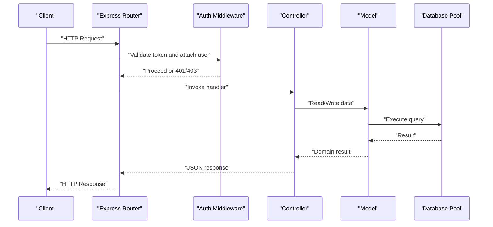
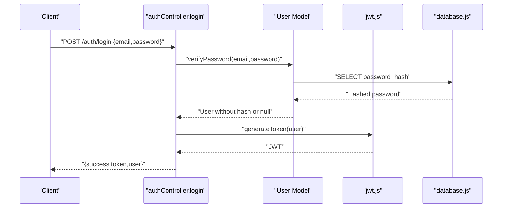
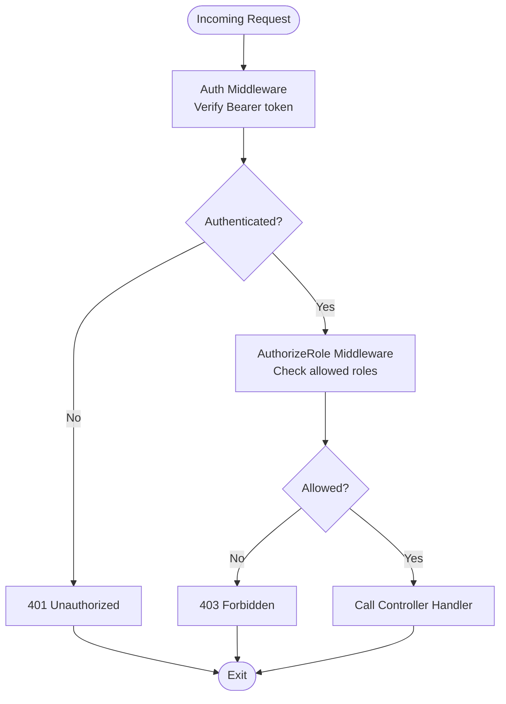
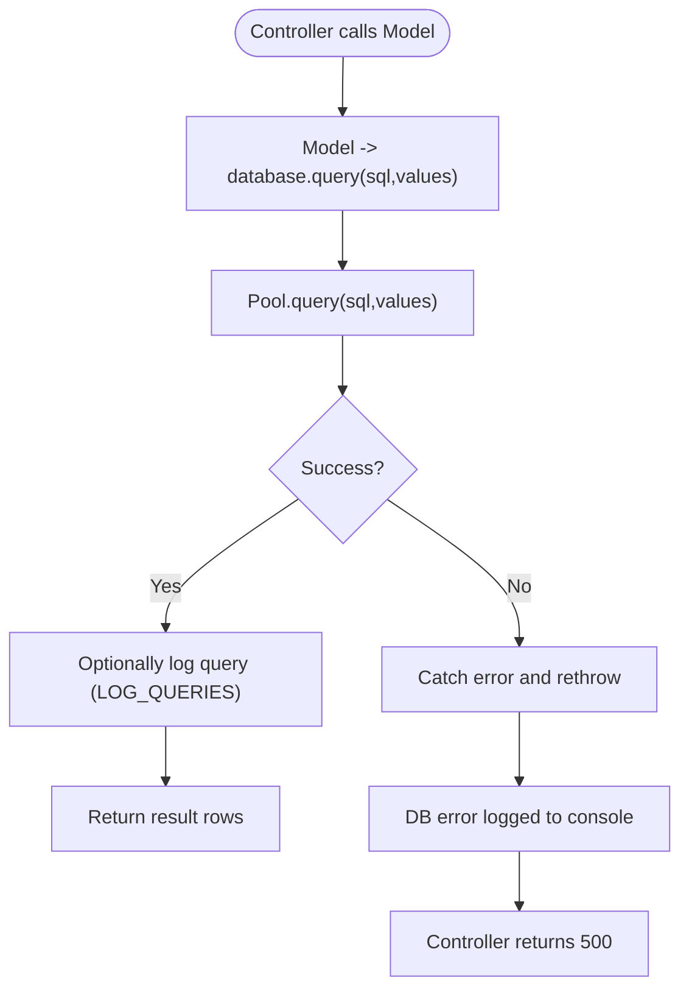
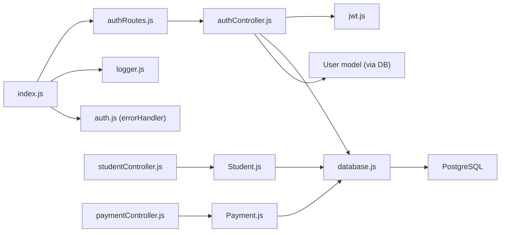

# Troubleshooting & FAQ

<cite>
**Referenced Files in This Document**
- [index.js](file://00990090/school-accounting-system/backend/src/index.js)
- [authController.js](file://00990090/school-accounting-system/backend/src/controllers/authController.js)
- [auth.js](file://00990090/school-accounting-system/backend/src/middleware/auth.js)
- [logger.js](file://00990090/school-accounting-system/backend/src/middleware/logger.js)
- [database.js](file://00990090/school-accounting-system/backend/src/config/database.js)
- [config.js](file://00990090/school-accounting-system/backend/src/config/config.js)
- [jwt.js](file://00990090/school-accounting-system/backend/src/utils/jwt.js)
- [password.js](file://00990090/school-accounting-system/backend/src/utils/password.js)
- [validation.js](file://00990090/school-accounting-system/backend/src/middleware/validation.js)
- [authRoutes.js](file://00990090/school-accounting-system/backend/src/routes/authRoutes.js)
- [studentController.js](file://00990090/school-accounting-system/backend/src/controllers/studentController.js)
- [paymentController.js](file://00990090/school-accounting-system/backend/src/controllers/paymentController.js)
- [expenseController.js](file://00990090/school-accounting-system/backend/src/controllers/expenseController.js)
- [Student.js](file://00990090/school-accounting-system/backend/src/models/Student.js)
- [Payment.js](file://00990090/school-accounting-system/backend/src/models/Payment.js)
- [TROUBLESHOOTING_FAQ.md](file://00990090/school-accounting-system/TROUBLESHOOTING_FAQ.md)
</cite>

## Table of Contents
1. [Introduction](#introduction)
2. [Project Structure](#project-structure)
3. [Core Components](#core-components)
4. [Architecture Overview](#architecture-overview)
5. [Detailed Component Analysis](#detailed-component-analysis)
6. [Dependency Analysis](#dependency-analysis)
7. [Performance Considerations](#performance-considerations)
8. [Troubleshooting Guide](#troubleshooting-guide)
9. [Conclusion](#conclusion)
10. [Appendices](#appendices)

## Introduction
This document provides a comprehensive troubleshooting and FAQ guide for the School Accounting Management System. It focuses on diagnosing and resolving common issues across authentication, database connectivity, API errors, and performance bottlenecks. It also outlines systematic approaches to log analysis, debugging procedures, and operational best practices for development and deployment.

## Project Structure
The backend follows a layered architecture:
- Entry point initializes Express, middleware, routes, and error handling.
- Controllers orchestrate business logic and coordinate with models and utilities.
- Models encapsulate database queries via a shared connection pool.
- Middleware handles authentication, authorization, logging, and validation.
- Utilities provide JWT token handling, password hashing, and helpers.

**Diagram sources**
- [index.js:1-77](file://00990090/school-accounting-system/backend/src/index.js#L1-L77)
- [authRoutes.js:1-15](file://00990090/school-accounting-system/backend/src/routes/authRoutes.js#L1-L15)
- [authController.js:1-141](file://00990090/school-accounting-system/backend/src/controllers/authController.js#L1-L141)
- [jwt.js:1-42](file://00990090/school-accounting-system/backend/src/utils/jwt.js#L1-L42)
- [Student.js:1-183](file://00990090/school-accounting-system/backend/src/models/Student.js#L1-L183)
- [Payment.js:1-176](file://00990090/school-accounting-system/backend/src/models/Payment.js#L1-L176)
- [database.js:1-77](file://00990090/school-accounting-system/backend/src/config/database.js#L1-L77)
- [logger.js:1-22](file://00990090/school-accounting-system/backend/src/middleware/logger.js#L1-L22)
- [auth.js:1-88](file://00990090/school-accounting-system/backend/src/middleware/auth.js#L1-L88)
- [validation.js:1-27](file://00990090/school-accounting-system/backend/src/middleware/validation.js#L1-L27)
- [config.js:1-39](file://00990090/school-accounting-system/backend/src/config/config.js#L1-L39)

**Section sources**
- [index.js:1-77](file://00990090/school-accounting-system/backend/src/index.js#L1-L77)
- [config.js:1-39](file://00990090/school-accounting-system/backend/src/config/config.js#L1-L39)

## Core Components
- Authentication and Authorization
  - JWT token generation and verification.
  - Middleware to validate tokens and enforce role-based access.
  - Protected routes for profile retrieval and password changes.
- Database Connectivity
  - Centralized connection pool with timeouts and event logging.
  - Query wrapper with optional query logging.
- Logging and Diagnostics
  - Request logging middleware with timing and status.
  - Centralized error handler with structured responses.
- Business Controllers
  - Student, Payment, and Expense controllers with robust error handling and pagination support.
- Validation
  - Validation middleware to normalize validation errors.

**Section sources**
- [authController.js:1-141](file://00990090/school-accounting-system/backend/src/controllers/authController.js#L1-L141)
- [auth.js:1-88](file://00990090/school-accounting-system/backend/src/middleware/auth.js#L1-L88)
- [jwt.js:1-42](file://00990090/school-accounting-system/backend/src/utils/jwt.js#L1-L42)
- [database.js:1-77](file://00990090/school-accounting-system/backend/src/config/database.js#L1-L77)
- [logger.js:1-22](file://00990090/school-accounting-system/backend/src/middleware/logger.js#L1-L22)
- [validation.js:1-27](file://00990090/school-accounting-system/backend/src/middleware/validation.js#L1-L27)
- [studentController.js:1-235](file://00990090/school-accounting-system/backend/src/controllers/studentController.js#L1-L235)
- [paymentController.js:1-305](file://00990090/school-accounting-system/backend/src/controllers/paymentController.js#L1-L305)
- [expenseController.js:1-259](file://00990090/school-accounting-system/backend/src/controllers/expenseController.js#L1-L259)

## Architecture Overview
The system uses a classic MVC-style separation with explicit middleware layers. Requests flow from Express routes through middleware to controllers, which interact with models backed by a shared database pool. Logging and error handling are centralized.

**Diagram sources**
- [index.js:1-77](file://00990090/school-accounting-system/backend/src/index.js#L1-L77)
- [authRoutes.js:1-15](file://00990090/school-accounting-system/backend/src/routes/authRoutes.js#L1-L15)
- [auth.js:1-88](file://00990090/school-accounting-system/backend/src/middleware/auth.js#L1-L88)
- [authController.js:1-141](file://00990090/school-accounting-system/backend/src/controllers/authController.js#L1-L141)
- [Student.js:1-183](file://00990090/school-accounting-system/backend/src/models/Student.js#L1-L183)
- [Payment.js:1-176](file://00990090/school-accounting-system/backend/src/models/Payment.js#L1-L176)
- [database.js:1-77](file://00990090/school-accounting-system/backend/src/config/database.js#L1-L77)

## Detailed Component Analysis

### Authentication Flow

**Diagram sources**
- [authController.js:11-60](file://00990090/school-accounting-system/backend/src/controllers/authController.js#L11-L60)
- [jwt.js:12-23](file://00990090/school-accounting-system/backend/src/utils/jwt.js#L12-L23)
- [Student.js:44-58](file://00990090/school-accounting-system/backend/src/models/Student.js#L44-L58)
- [database.js:35-50](file://00990090/school-accounting-system/backend/src/config/database.js#L35-L50)

**Section sources**
- [authController.js:11-60](file://00990090/school-accounting-system/backend/src/controllers/authController.js#L11-L60)
- [jwt.js:12-23](file://00990090/school-accounting-system/backend/src/utils/jwt.js#L12-L23)
- [Student.js:44-58](file://00990090/school-accounting-system/backend/src/models/Student.js#L44-L58)
- [database.js:35-50](file://00990090/school-accounting-system/backend/src/config/database.js#L35-L50)

### Authorization and Role Checks

**Diagram sources**
- [auth.js:10-64](file://00990090/school-accounting-system/backend/src/middleware/auth.js#L10-L64)

**Section sources**
- [auth.js:10-64](file://00990090/school-accounting-system/backend/src/middleware/auth.js#L10-L64)

### Database Query Execution and Error Handling

**Diagram sources**
- [database.js:35-50](file://00990090/school-accounting-system/backend/src/config/database.js#L35-L50)
- [Student.js:13-64](file://00990090/school-accounting-system/backend/src/models/Student.js#L13-L64)
- [Payment.js:14-76](file://00990090/school-accounting-system/backend/src/models/Payment.js#L14-L76)

**Section sources**
- [database.js:35-50](file://00990090/school-accounting-system/backend/src/config/database.js#L35-L50)
- [Student.js:13-64](file://00990090/school-accounting-system/backend/src/models/Student.js#L13-L64)
- [Payment.js:14-76](file://00990090/school-accounting-system/backend/src/models/Payment.js#L14-L76)

### Logging and Error Handling
- Request logging captures method, path, status, and duration.
- Centralized error handler responds with structured JSON and logs the error.
- Development-specific error details are included conditionally.

**Section sources**
- [logger.js:7-17](file://00990090/school-accounting-system/backend/src/middleware/logger.js#L7-L17)
- [auth.js:69-81](file://00990090/school-accounting-system/backend/src/middleware/auth.js#L69-L81)
- [index.js:52-53](file://00990090/school-accounting-system/backend/src/index.js#L52-L53)

## Dependency Analysis

**Diagram sources**
- [index.js:1-77](file://00990090/school-accounting-system/backend/src/index.js#L1-L77)
- [authRoutes.js:1-15](file://00990090/school-accounting-system/backend/src/routes/authRoutes.js#L1-L15)
- [authController.js:1-141](file://00990090/school-accounting-system/backend/src/controllers/authController.js#L1-L141)
- [jwt.js:1-42](file://00990090/school-accounting-system/backend/src/utils/jwt.js#L1-L42)
- [Student.js:1-183](file://00990090/school-accounting-system/backend/src/models/Student.js#L1-L183)
- [Payment.js:1-176](file://00990090/school-accounting-system/backend/src/models/Payment.js#L1-L176)
- [database.js:1-77](file://00990090/school-accounting-system/backend/src/config/database.js#L1-L77)

**Section sources**
- [index.js:1-77](file://00990090/school-accounting-system/backend/src/index.js#L1-L77)
- [authRoutes.js:1-15](file://00990090/school-accounting-system/backend/src/routes/authRoutes.js#L1-L15)
- [authController.js:1-141](file://00990090/school-accounting-system/backend/src/controllers/authController.js#L1-L141)
- [jwt.js:1-42](file://00990090/school-accounting-system/backend/src/utils/jwt.js#L1-L42)
- [Student.js:1-183](file://00990090/school-accounting-system/backend/src/models/Student.js#L1-L183)
- [Payment.js:1-176](file://00990090/school-accounting-system/backend/src/models/Payment.js#L1-L176)
- [database.js:1-77](file://00990090/school-accounting-system/backend/src/config/database.js#L1-L77)

## Performance Considerations
- Database pooling and timeouts are configured centrally.
- Optional query logging can help identify slow queries.
- Pagination is used across controllers to avoid large result sets.
- Recommendations include adding indexes on frequently filtered columns and archiving historical data.

[No sources needed since this section provides general guidance]

## Troubleshooting Guide

### Authentication Failures
Symptoms:
- Login returns 400/401/403.
- Token invalid or expired errors.
- Cannot access protected routes.

Systematic checks:
- Verify environment variables for JWT secret and expiration.
- Ensure the Authorization header is present and formatted correctly.
- Confirm the user account is active.
- Regenerate token after login and retry protected requests.

Resolution steps:
- Confirm JWT_SECRET and JWT_EXPIRE in environment configuration.
- Validate token lifecycle and regenerate if expired.
- Check user.is_active flag in the database.
- Use the health endpoint to confirm backend availability.

**Section sources**
- [authController.js:11-60](file://00990090/school-accounting-system/backend/src/controllers/authController.js#L11-L60)
- [auth.js:10-40](file://00990090/school-accounting-system/backend/src/middleware/auth.js#L10-L40)
- [jwt.js:12-23](file://00990090/school-accounting-system/backend/src/utils/jwt.js#L12-L23)
- [config.js:17-19](file://00990090/school-accounting-system/backend/src/config/config.js#L17-L19)
- [index.js:35-42](file://00990090/school-accounting-system/backend/src/index.js#L35-L42)

### Permission Denied (403) and Role-Based Access Issues
Symptoms:
- 403 “Insufficient permissions” responses.
- Users blocked from accessing resources despite being authenticated.

Systematic checks:
- Confirm the user’s role matches the allowed roles for the endpoint.
- Review authorization middleware usage on routes.

Resolution steps:
- Adjust user role in the database if needed.
- Verify route protection and allowed roles.

**Section sources**
- [auth.js:46-64](file://00990090/school-accounting-system/backend/src/middleware/auth.js#L46-L64)
- [authRoutes.js:10-12](file://00990090/school-accounting-system/backend/src/routes/authRoutes.js#L10-L12)

### Database Connectivity Issues
Symptoms:
- Connection refused or timeout errors.
- “relation does not exist” errors.
- Queries fail with unhandled exceptions.

Systematic checks:
- Confirm PostgreSQL is running and accepting connections.
- Validate DB_HOST, DB_PORT, DB_NAME, DB_USER, DB_PASSWORD.
- Ensure schema and sample data are imported.
- Check pool idle and connection timeouts.

Resolution steps:
- Start PostgreSQL service per OS-specific instructions.
- Recreate database and import schema and sample data.
- Increase pool timeouts if necessary.
- Enable query logging temporarily to capture failing statements.

**Section sources**
- [database.js:8-18](file://00990090/school-accounting-system/backend/src/config/database.js#L8-L18)
- [database.js:21-27](file://00990090/school-accounting-system/backend/src/config/database.js#L21-L27)
- [database.js:41-49](file://00990090/school-accounting-system/backend/src/config/database.js#L41-L49)
- [config.js:10-15](file://00990090/school-accounting-system/backend/src/config/config.js#L10-L15)
- [TROUBLESHOOTING_FAQ.md:9-74](file://00990090/school-accounting-system/TROUBLESHOOTING_FAQ.md#L9-L74)

### API Errors and 404 Not Found
Symptoms:
- 404 for routes like /api/students.
- CORS errors preventing frontend access.

Systematic checks:
- Confirm routes are registered in the Express app.
- Verify body parsers are enabled.
- Check CORS configuration and allowed origins.

Resolution steps:
- Ensure routes are mounted under the correct base path.
- Validate frontend API URL and backend CORS settings.
- Restart backend to clear stale state.

**Section sources**
- [index.js:28-50](file://00990090/school-accounting-system/backend/src/index.js#L28-L50)
- [TROUBLESHOOTING_FAQ.md:177-208](file://00990090/school-accounting-system/TROUBLESHOOTING_FAQ.md#L177-L208)

### Validation Errors
Symptoms:
- 400 responses with validation failure details.

Systematic checks:
- Confirm validation middleware is applied to endpoints.
- Inspect error array for field-level messages.

Resolution steps:
- Fix missing or invalid fields in the request payload.
- Ensure proper content-type and body formatting.

**Section sources**
- [validation.js:9-22](file://00990090/school-accounting-system/backend/src/middleware/validation.js#L9-L22)

### Data Access Issues
Symptoms:
- Empty lists or missing records.
- Pagination not working as expected.

Systematic checks:
- Verify filters and search parameters.
- Confirm soft-deleted records are excluded by design.
- Check pagination defaults and limits.

Resolution steps:
- Adjust query parameters (page, limit, search, filters).
- Confirm database records exist and are active.

**Section sources**
- [studentController.js:12-40](file://00990090/school-accounting-system/backend/src/controllers/studentController.js#L12-L40)
- [Student.js:13-64](file://00990090/school-accounting-system/backend/src/models/Student.js#L13-L64)
- [Payment.js:14-76](file://00990090/school-accounting-system/backend/src/models/Payment.js#L14-L76)

### Payment Processing Failures
Symptoms:
- Payments not recorded or receipts not sent.
- Invoice generation errors.

Systematic checks:
- Validate required fields for payment creation.
- Confirm student and fee records exist.
- Check email configuration for receipt delivery.

Resolution steps:
- Provide student_id, amount, and payment_method.
- Verify student exists and fee structure is defined.
- Ensure SMTP settings are configured for email sending.

**Section sources**
- [paymentController.js:79-130](file://00990090/school-accounting-system/backend/src/controllers/paymentController.js#L79-L130)
- [paymentController.js:220-294](file://00990090/school-accounting-system/backend/src/controllers/paymentController.js#L220-L294)
- [config.js:21-26](file://00990090/school-accounting-system/backend/src/config/config.js#L21-L26)

### Logging, Monitoring, and Proactive Detection
- Enable request logging to capture timing and status codes.
- Use centralized error handler for consistent error responses.
- Optionally enable query logging to surface slow or failing SQL.
- Monitor pool events for unexpected idle client errors.

**Section sources**
- [logger.js:7-17](file://00990090/school-accounting-system/backend/src/middleware/logger.js#L7-L17)
- [auth.js:69-81](file://00990090/school-accounting-system/backend/src/middleware/auth.js#L69-L81)
- [database.js:41-49](file://00990090/school-accounting-system/backend/src/config/database.js#L41-L49)

### Step-by-Step Guides

#### Authentication Problems
1. Confirm backend is running and reachable.
2. Attempt login and capture the returned token.
3. Use the token in the Authorization header for protected endpoints.
4. If token expires, re-authenticate to obtain a new token.

**Section sources**
- [authController.js:11-60](file://00990090/school-accounting-system/backend/src/controllers/authController.js#L11-L60)
- [auth.js:10-40](file://00990090/school-accounting-system/backend/src/middleware/auth.js#L10-L40)
- [index.js:35-42](file://00990090/school-accounting-system/backend/src/index.js#L35-L42)

#### Permission Denied Errors
1. Verify the user’s role in the database.
2. Confirm the route requires an allowed role.
3. Adjust user role or request access from an administrator.

**Section sources**
- [auth.js:46-64](file://00990090/school-accounting-system/backend/src/middleware/auth.js#L46-L64)

#### Data Access Issues
1. Check filters and pagination parameters.
2. Confirm records are not soft-deleted.
3. Validate database connectivity and schema.

**Section sources**
- [studentController.js:12-40](file://00990090/school-accounting-system/backend/src/controllers/studentController.js#L12-L40)
- [Student.js:13-64](file://00990090/school-accounting-system/backend/src/models/Student.js#L13-L64)

#### Integration Failures (CORS, Frontend-Backend)
1. Verify ALLOWED_ORIGINS in environment.
2. Confirm frontend API URL matches backend base path.
3. Clear browser cache and retry.

**Section sources**
- [index.js:22-26](file://00990090/school-accounting-system/backend/src/index.js#L22-L26)
- [TROUBLESHOOTING_FAQ.md:177-208](file://00990090/school-accounting-system/TROUBLESHOOTING_FAQ.md#L177-L208)

### Preventive Measures and Best Practices
- Change default secrets and passwords immediately.
- Use HTTPS in production and keep dependencies updated.
- Implement rate limiting and input validation.
- Back up the database regularly and monitor logs.

**Section sources**
- [TROUBLESHOOTING_FAQ.md:644-673](file://00990090/school-accounting-system/TROUBLESHOOTING_FAQ.md#L644-L673)

### Escalation Procedures for Critical Issues
- Capture full error messages and stack traces.
- Include environment details and reproduction steps.
- Provide backend logs, database logs, and browser console output.
- Use the repository’s issue channels with detailed context.

**Section sources**
- [TROUBLESHOOTING_FAQ.md:616-642](file://00990090/school-accounting-system/TROUBLESHOOTING_FAQ.md#L616-L642)

## Conclusion
This guide consolidates practical troubleshooting steps for the most common issues in the School Accounting Management System. By following the diagnostic flows, leveraging logging and error handling, and applying the recommended best practices, teams can quickly isolate and resolve problems while maintaining system reliability and performance.

## Appendices

### Quick Reference: Common Status Codes and Causes
- 400 Bad Request: Missing or invalid input; validation errors.
- 401 Unauthorized: Missing or invalid token; expired token.
- 403 Forbidden: Insufficient permissions for the requested resource.
- 404 Not Found: Route or resource not found.
- 500 Internal Server Error: Unhandled exceptions; database or server errors.

**Section sources**
- [authController.js:15-60](file://00990090/school-accounting-system/backend/src/controllers/authController.js#L15-L60)
- [auth.js:14-40](file://00990090/school-accounting-system/backend/src/middleware/auth.js#L14-L40)
- [studentController.js:49-102](file://00990090/school-accounting-system/backend/src/controllers/studentController.js#L49-L102)
- [paymentController.js:79-130](file://00990090/school-accounting-system/backend/src/controllers/paymentController.js#L79-L130)