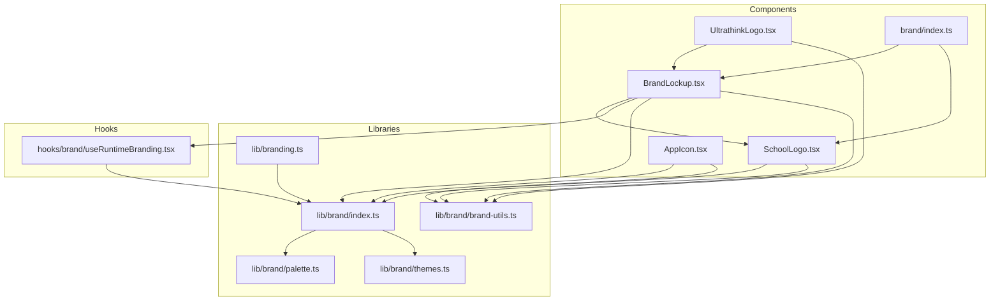
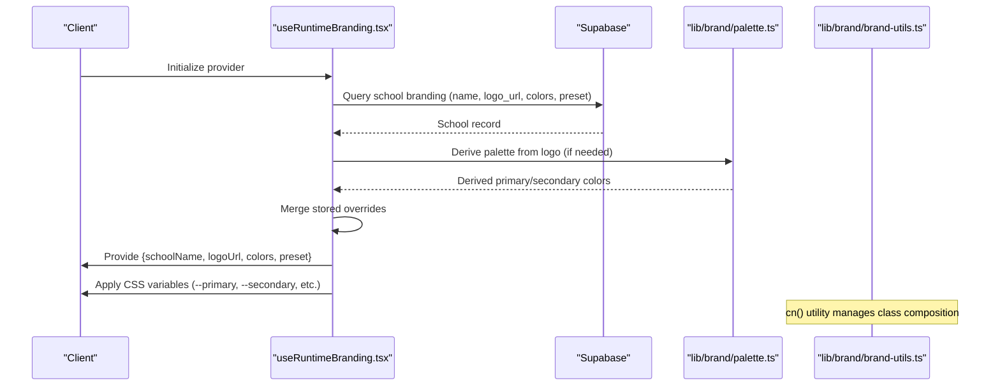
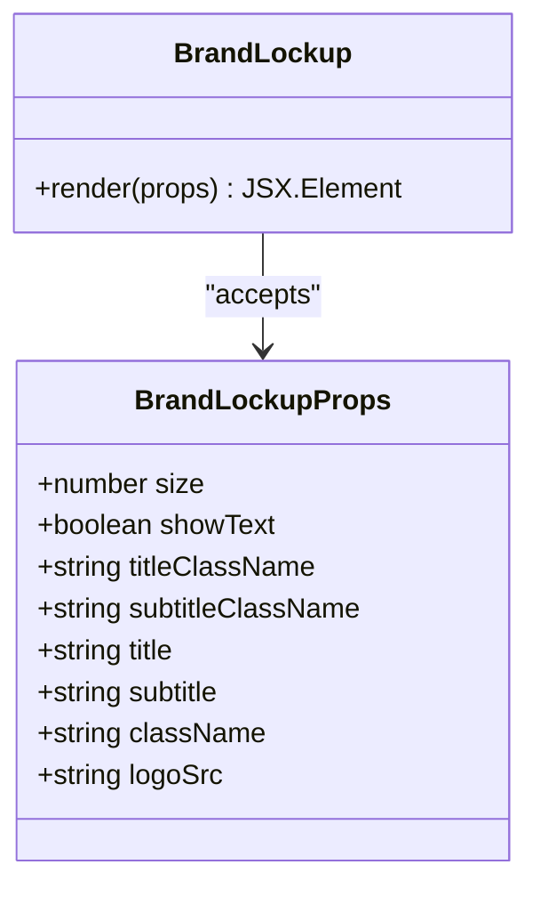
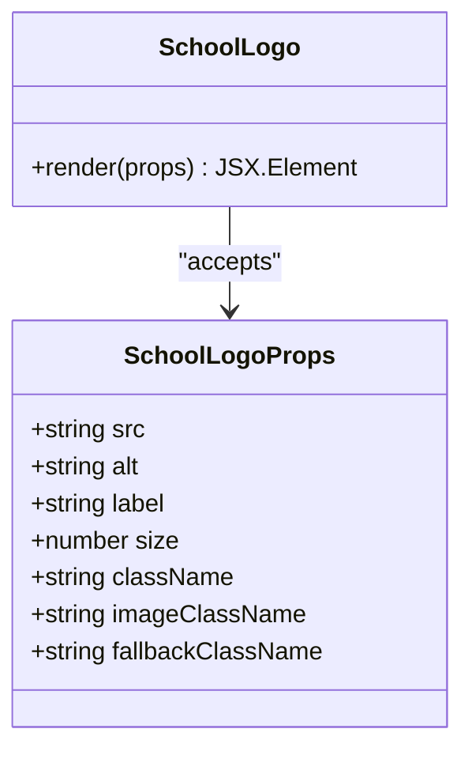
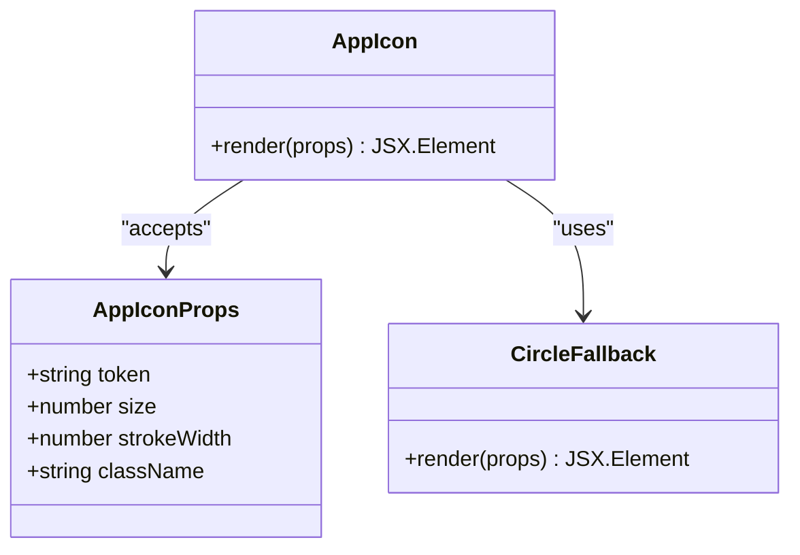
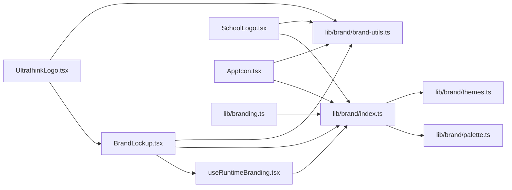

# Brand Components

<cite>
**Referenced Files in This Document**
- [BrandLockup.tsx](file://components/brand/BrandLockup.tsx)
- [SchoolLogo.tsx](file://components/brand/SchoolLogo.tsx)
- [UltrathinkLogo.tsx](file://components/UltrathinkLogo.tsx)
- [AppIcon.tsx](file://components/AppIcon.tsx)
- [index.ts (brand exports)](file://components/brand/index.ts)
- [index.ts (brand library)](file://lib/brand/index.ts)
- [brand-utils.ts](file://lib/brand/brand-utils.ts)
- [useRuntimeBranding.tsx](file://hooks/brand/useRuntimeBranding.tsx)
- [brand-palette.ts](file://lib/brand/palette.ts)
- [brand-themes.ts](file://lib/brand/themes.ts)
- [branding.ts](file://lib/branding.ts)
</cite>

## Update Summary
**Changes Made**
- Added documentation for new brand utilities system (brand-utils.ts) that centralizes class name management
- Updated component implementations to use the new cn() utility function for consistent styling
- Enhanced class composition patterns across brand components
- Added new section covering the centralized class name management system

## Table of Contents
1. [Introduction](#introduction)
2. [Project Structure](#project-structure)
3. [Core Components](#core-components)
4. [Architecture Overview](#architecture-overview)
5. [Brand Utilities System](#brand-utilities-system)
6. [Detailed Component Analysis](#detailed-component-analysis)
7. [Dependency Analysis](#dependency-analysis)
8. [Performance Considerations](#performance-considerations)
9. [Troubleshooting Guide](#troubleshooting-guide)
10. [Conclusion](#conclusion)
11. [Appendices](#appendices)

## Introduction
This document describes the brand identity components used for visual branding and corporate identity across the application. It focuses on:
- BrandLockup (alias UltrathinkLogo): logo combinations, typography, and brand positioning
- SchoolLogo: institutional branding and customization options
- UltrathinkLogo: company branding and identity
- AppIcon: application favicon and touch icons

The system now includes a centralized brand utilities framework that provides consistent class name management using clsx and tailwind-merge for reliable styling across all components.

It also covers usage examples, responsive behavior, brand guidelines compliance, color schemes, typography standards, accessibility considerations, and brand asset management.

## Project Structure
The brand system is organized around reusable components, a runtime branding provider, and a centralized utilities system that ensures consistent class name management across all brand-related components. Exports are centralized for easy consumption across the application.



**Diagram sources**
- [BrandLockup.tsx:1-73](file://components/brand/BrandLockup.tsx#L1-L73)
- [SchoolLogo.tsx:1-72](file://components/brand/SchoolLogo.tsx#L1-L72)
- [UltrathinkLogo.tsx:1-2](file://components/UltrathinkLogo.tsx#L1-L2)
- [AppIcon.tsx:1-29](file://components/AppIcon.tsx#L1-L29)
- [index.ts (brand exports):1-3](file://components/brand/index.ts#L1-L3)
- [index.ts (brand library):1-30](file://lib/brand/index.ts#L1-L30)
- [brand-utils.ts:1-7](file://lib/brand/brand-utils.ts#L1-L7)
- [useRuntimeBranding.tsx:1-274](file://hooks/brand/useRuntimeBranding.tsx#L1-L274)
- [brand-palette.ts:1-2](file://lib/brand/palette.ts#L1-L2)
- [brand-themes.ts:1-2](file://lib/brand/themes.ts#L1-L2)
- [branding.ts:1-2](file://lib/branding.ts#L1-L2)

**Section sources**
- [index.ts (brand exports):1-3](file://components/brand/index.ts#L1-L3)
- [index.ts (brand library):1-30](file://lib/brand/index.ts#L1-L30)

## Core Components
- BrandLockup (UltrathinkLogo): A composite brand element combining a circular badge with a SchoolLogo and optional text (title/subtitle). It respects runtime branding overrides and defaults, now utilizing the centralized cn() utility for class composition.
- SchoolLogo: A robust, accessible avatar component that renders either a sanitized image or a fallback initial-letter badge with configurable sizing and classes, enhanced with consistent class name management.
- UltrathinkLogo: Re-export of BrandLockup for convenience under a common alias, benefiting from the centralized utilities system.
- AppIcon: Renders a themed icon token mapped via a central icon registry, with a fallback circle indicator and improved class handling.

Key capabilities:
- Responsive sizing via numeric props
- Accessibility: screen-reader-friendly labels and aria attributes
- Runtime customization: dynamic logo, colors, and theme presets
- Fallbacks: image fallbacks and placeholder initials
- **Updated**: Centralized class name management using clsx and tailwind-merge for consistent styling

**Section sources**
- [BrandLockup.tsx:11-73](file://components/brand/BrandLockup.tsx#L11-L73)
- [SchoolLogo.tsx:17-72](file://components/brand/SchoolLogo.tsx#L17-L72)
- [UltrathinkLogo.tsx:1-2](file://components/UltrathinkLogo.tsx#L1-L2)
- [AppIcon.tsx:5-29](file://components/AppIcon.tsx#L5-L29)

## Architecture Overview
The runtime branding provider fetches school branding from Supabase, derives missing palette values from the logo when needed, stores them locally, and applies CSS variables for consistent theming across the app. The centralized brand utilities system ensures consistent class name composition across all components.



**Diagram sources**
- [useRuntimeBranding.tsx:84-237](file://hooks/brand/useRuntimeBranding.tsx#L84-L237)
- [brand-utils.ts:1-7](file://lib/brand/brand-utils.ts#L1-L7)

**Section sources**
- [useRuntimeBranding.tsx:84-237](file://hooks/brand/useRuntimeBranding.tsx#L84-L237)

## Brand Utilities System
The new brand utilities system provides centralized class name management using clsx and tailwind-merge to ensure consistent styling across all brand components.

### cn() Utility Function
The `cn()` function serves as a centralized utility for composing Tailwind CSS classes with intelligent merging:

```typescript
import { type ClassValue, clsx } from "clsx";
import { twMerge } from "tailwind-merge";

export function cn(...inputs: ClassValue[]) {
  return twMerge(clsx(inputs));
}
```

**Key Features:**
- **clsx Integration**: Combines conditional class names and arrays of classes
- **tailwind-merge Optimization**: Prevents conflicting Tailwind classes from stacking
- **Type Safety**: Full TypeScript support with ClassValue union type
- **Consistent Behavior**: Ensures predictable class composition across components

**Benefits:**
- Eliminates duplicate CSS classes automatically
- Handles conditional class logic cleanly
- Maintains Tailwind's utility-first approach
- Reduces bundle size by preventing redundant styles
- Improves maintainability across the codebase

**Section sources**
- [brand-utils.ts:1-7](file://lib/brand/brand-utils.ts#L1-L7)

## Detailed Component Analysis

### BrandLockup (UltrathinkLogo)
Purpose:
- Compose a brand lockup with a circular logo badge and optional title/subtitle copy.
- Respect runtime overrides while falling back to library defaults.
- **Updated**: Utilize centralized cn() utility for class composition instead of local cx() function.

Props and behavior:
- size: Badge and inner image size
- showText: Toggle visibility of textual elements
- title/subtitle: Override or provide brand text
- className/titleClassName/subtitleClassName: Tailwind-style customization using cn()
- logoSrc: Override logo URL

Resolution order:
- Title: explicit prop > runtime school name > library default
- Logo: explicit prop > runtime logo > library default
- Subtitle: explicit prop > specialized condition-based default

Accessibility:
- Uses alt and aria labels on nested image/fallback
- Hidden assistive text when text is hidden

Responsive behavior:
- Inline styles compute badge border radius and sizes based on size prop
- Inner SchoolLogo receives size and image classes for consistent scaling

**Updated**: Class composition now uses cn() utility for consistent merging of Tailwind classes.

Usage example (paths):
- [BrandLockup usage example:41-70](file://components/brand/BrandLockup.tsx#L41-L70)

**Section sources**
- [BrandLockup.tsx:11-73](file://components/brand/BrandLockup.tsx#L11-L73)

#### Class Diagram


**Diagram sources**
- [BrandLockup.tsx:11-20](file://components/brand/BrandLockup.tsx#L11-L20)

### SchoolLogo
Purpose:
- Render a school avatar with image or fallback initials.
- Sanitize image URLs and handle broken images gracefully.
- **Updated**: Enhanced with centralized cn() utility for consistent class composition.

Props and behavior:
- src: Optional logo URL
- alt: Image alt text
- label: Used to derive fallback initial
- size: Avatar size (width/height)
- className/imageClassName/fallbackClassName: Tailwind-style overrides using cn()

Fallback logic:
- If src is present and not broken, render img
- Otherwise, render a span with uppercase first letter of label/alt
- Reset broken state when src changes

Accessibility:
- Outer container marked aria-hidden
- Alt text provided on img

Responsive behavior:
- Computes border radius proportional to size
- Scales width/height with size prop

**Updated**: Class composition now uses cn() utility for consistent merging of Tailwind classes.

Usage example (paths):
- [SchoolLogo usage example:42-61](file://components/brand/SchoolLogo.tsx#L42-L61)

**Section sources**
- [SchoolLogo.tsx:17-72](file://components/brand/SchoolLogo.tsx#L17-L72)

#### Class Diagram


**Diagram sources**
- [SchoolLogo.tsx:17-33](file://components/brand/SchoolLogo.tsx#L17-L33)

### UltrathinkLogo
Purpose:
- Convenience re-export of BrandLockup under a common alias.
- **Updated**: Benefits from centralized utilities system improvements.

Usage example (paths):
- [UltrathinkLogo re-export:1-2](file://components/UltrathinkLogo.tsx#L1-L2)

**Section sources**
- [UltrathinkLogo.tsx:1-2](file://components/UltrathinkLogo.tsx#L1-L2)

### AppIcon
Purpose:
- Render a themed icon token from a central registry, with a fallback circle indicator.
- **Updated**: Enhanced with centralized cn() utility for consistent class composition.

Props and behavior:
- token: Icon identifier
- size: Icon size
- strokeWidth: Stroke width for vector-like icons
- className: Tailwind-style overrides using cn()

Fallback:
- If token not found, renders a small circle with currentColor tint

Accessibility:
- Marked aria-hidden to avoid redundant announcements

**Updated**: Class composition now uses cn() utility for consistent merging of Tailwind classes.

Usage example (paths):
- [AppIcon usage example:5-18](file://components/AppIcon.tsx#L5-L18)

**Section sources**
- [AppIcon.tsx:5-29](file://components/AppIcon.tsx#L5-L29)

#### Class Diagram


**Diagram sources**
- [AppIcon.tsx:5-29](file://components/AppIcon.tsx#L5-L29)

## Dependency Analysis
The brand components depend on:
- Runtime branding provider for dynamic overrides
- Library exports for defaults and color/theme utilities
- Centralized icon registry for AppIcon
- **Updated**: Brand utilities system for consistent class name management



**Diagram sources**
- [BrandLockup.tsx:3-5](file://components/brand/BrandLockup.tsx#L3-L5)
- [SchoolLogo.tsx](file://components/brand/SchoolLogo.tsx#L6)
- [UltrathinkLogo.tsx](file://components/UltrathinkLogo.tsx#L1)
- [AppIcon.tsx](file://components/AppIcon.tsx#L3)
- [index.ts (brand library):1-30](file://lib/brand/index.ts#L1-L30)
- [brand-utils.ts:1-7](file://lib/brand/brand-utils.ts#L1-L7)
- [useRuntimeBranding.tsx:1-22](file://hooks/brand/useRuntimeBranding.tsx#L1-L22)
- [brand-palette.ts](file://lib/brand/palette.ts#L1)
- [brand-themes.ts](file://lib/brand/themes.ts#L1)
- [branding.ts](file://lib/branding.ts#L1)

**Section sources**
- [BrandLockup.tsx:3-5](file://components/brand/BrandLockup.tsx#L3-L5)
- [SchoolLogo.tsx](file://components/brand/SchoolLogo.tsx#L6)
- [index.ts (brand library):1-30](file://lib/brand/index.ts#L1-L30)
- [brand-utils.ts:1-7](file://lib/brand/brand-utils.ts#L1-L7)
- [useRuntimeBranding.tsx:1-22](file://hooks/brand/useRuntimeBranding.tsx#L1-L22)

## Performance Considerations
- Prefer passing numeric size props to avoid layout thrashing; computed inline styles scale consistently.
- Minimize re-renders by relying on runtime branding context memoization.
- Use fallback initials in SchoolLogo to avoid long image load times.
- Cache derived palette values locally to reduce repeated derivations.
- **Updated**: Leverage centralized cn() utility for efficient class name composition and merging.

## Troubleshooting Guide
Common issues and resolutions:
- Broken logo images: SchoolLogo automatically falls back to initials; ensure alt or label is set for meaningful fallback text.
- Missing runtime branding: BrandLockup and SchoolLogo fall back to library defaults; verify that the runtime provider is mounted and school scope is resolved.
- Color mismatches: Ensure CSS variables are applied; check that the runtime provider updates variables after branding changes.
- Icon rendering: If a token is not found, AppIcon renders a subtle circle; confirm the token exists in the registry.
- **Updated**: Class name conflicts: The cn() utility automatically handles conflicts, but ensure you're using it consistently across components for optimal results.

**Section sources**
- [SchoolLogo.tsx:38-61](file://components/brand/SchoolLogo.tsx#L38-L61)
- [BrandLockup.tsx:32-40](file://components/brand/BrandLockup.tsx#L32-L40)
- [useRuntimeBranding.tsx:56-82](file://hooks/brand/useRuntimeBranding.tsx#L56-L82)
- [AppIcon.tsx:16-18](file://components/AppIcon.tsx#L16-L18)

## Conclusion
The brand components provide a cohesive, accessible, and customizable system for representing institutional and corporate identities. They integrate with a runtime branding provider to support dynamic customization per school while maintaining consistent visual standards and responsive behavior. The new centralized brand utilities system ensures consistent class name management across all components, improving maintainability and reducing styling conflicts.

## Appendices

### Usage Examples (by path)
- BrandLockup with runtime overrides and custom classes using cn()
  - [BrandLockup usage:41-70](file://components/brand/BrandLockup.tsx#L41-L70)
- SchoolLogo with size and fallback customization using cn()
  - [SchoolLogo usage:42-61](file://components/brand/SchoolLogo.tsx#L42-L61)
- AppIcon with token and stroke width using cn()
  - [AppIcon usage:5-18](file://components/AppIcon.tsx#L5-L18)

### Brand Guidelines Compliance
- Typography: Use semantic headings and concise labels; avoid decorative fonts.
- Color: Rely on CSS variables applied by the runtime provider for consistent primary/secondary/accent usage.
- Accessibility: Provide alt text for logos; ensure sufficient color contrast; hide decorative elements from assistive tech.
- Responsiveness: Use numeric size props; avoid fixed widths/heights; test on various viewport sizes.
- **Updated**: Class composition: Use the cn() utility for consistent class name management across all components.

### Brand Asset Management
- Centralize defaults in the brand library exports.
- Store derived palette values locally to persist across sessions.
- Sanitize asset URLs to prevent mixed-content and invalid resource errors.
- Keep icon tokens aligned with the central registry for consistent rendering.
- **Updated**: Implement centralized cn() utility across all components for consistent styling and conflict resolution.

### cn() Utility Implementation
The centralized class name management system provides a standardized approach to handling Tailwind CSS classes:

```typescript
// Usage examples in components
<div className={cn("base-class", isActive && "active-class", variant && `variant-${variant}`)}>
  Content
</div>

// Benefits
// - Automatically merges conflicting classes
// - Handles conditional class logic cleanly
// - Prevents duplicate CSS classes
// - Maintains type safety
```

**Section sources**
- [brand-utils.ts:1-7](file://lib/brand/brand-utils.ts#L1-L7)