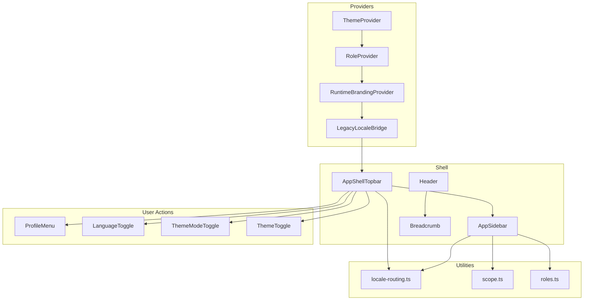
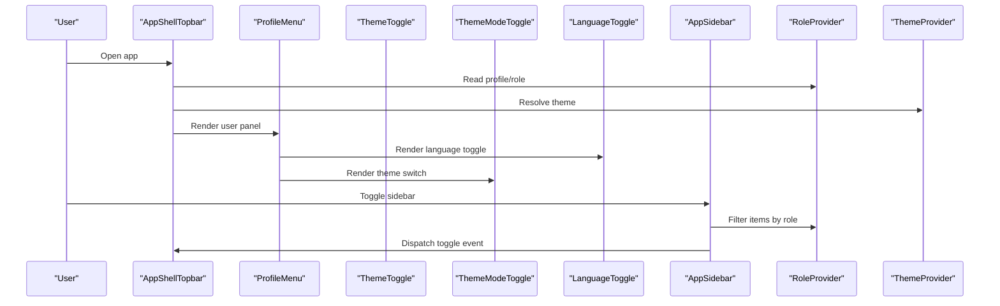
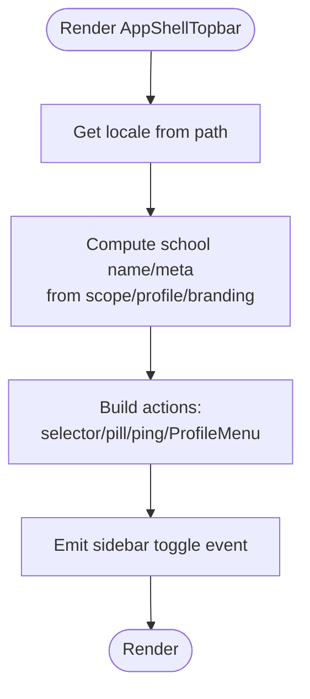
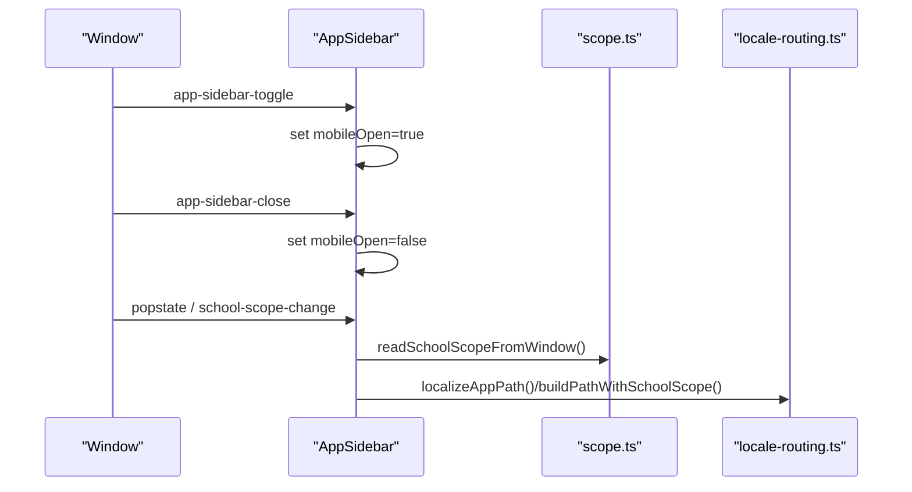
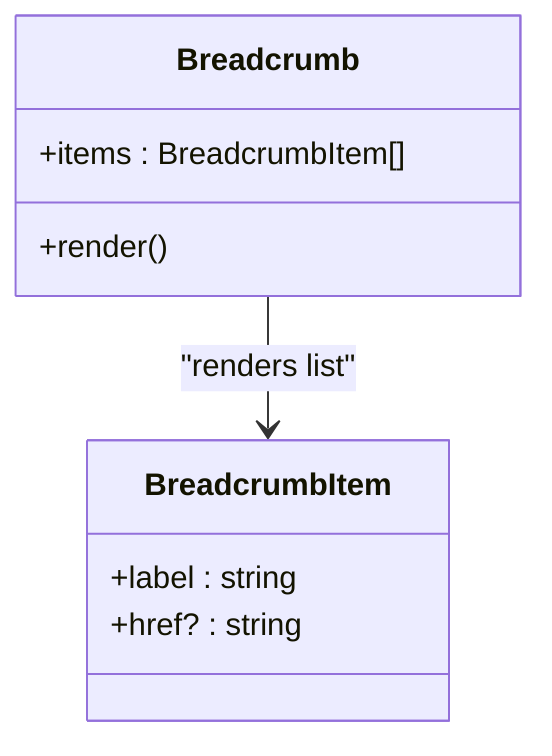
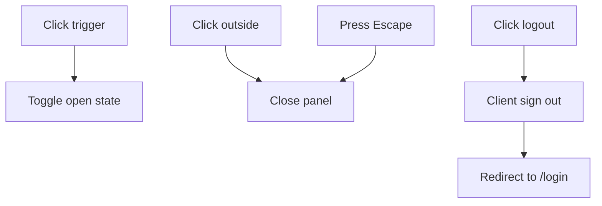
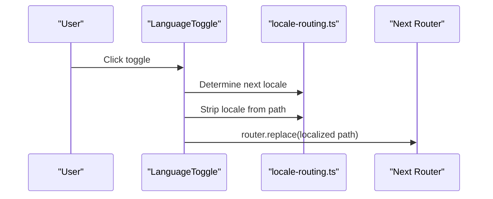
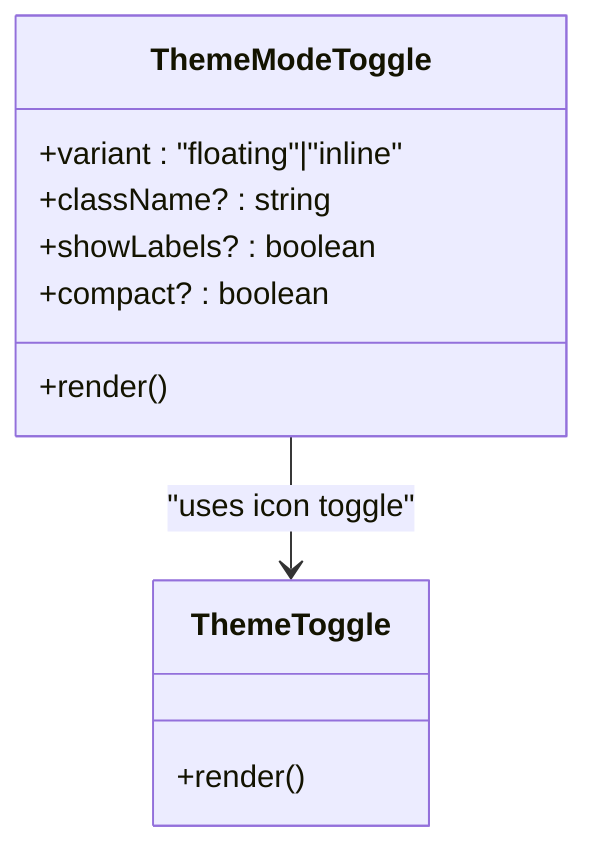
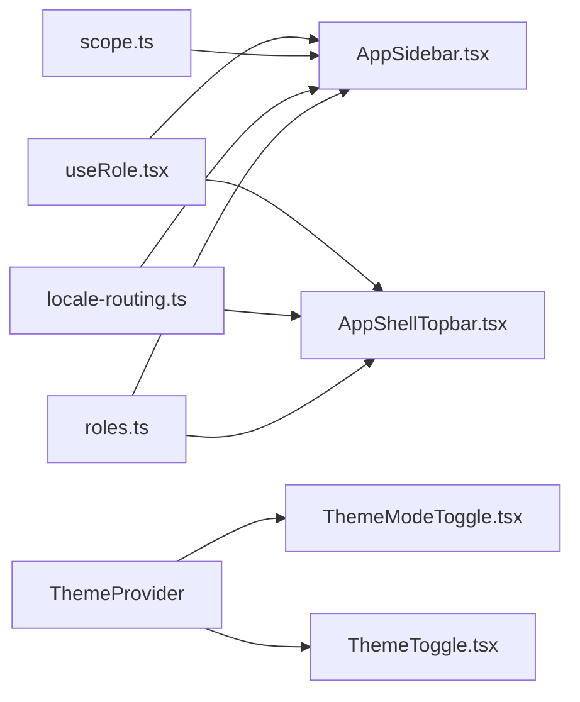

# Navigation Components

<cite>
**Referenced Files in This Document**
- [AppShellTopbar.tsx](file://components/AppShellTopbar.tsx)
- [AppSidebar.tsx](file://components/AppSidebar.tsx)
- [Header.tsx](file://components/Header.tsx)
- [ProfileMenu.tsx](file://components/ProfileMenu.tsx)
- [LanguageToggle.tsx](file://components/LanguageToggle.tsx)
- [ThemeToggle.tsx](file://components/ThemeToggle.tsx)
- [ThemeModeToggle.tsx](file://components/ThemeModeToggle.tsx)
- [useRole.tsx](file://hooks/useRole.tsx)
- [locale-routing.ts](file://lib/locale-routing.ts)
- [scope.ts](file://lib/school/scope.ts)
- [roles.ts](file://types/roles.ts)
- [SchoolModuleLayout.tsx](file://components/school/SchoolModuleLayout.tsx)
- [Breadcrumb.tsx](file://components/school/Breadcrumb.tsx)
- [layout.tsx](file://app/layout.tsx)
- [providers.tsx](file://app/[locale]/providers.tsx)
</cite>

## Table of Contents
1. [Introduction](#introduction)
2. [Project Structure](#project-structure)
3. [Core Components](#core-components)
4. [Architecture Overview](#architecture-overview)
5. [Detailed Component Analysis](#detailed-component-analysis)
6. [Dependency Analysis](#dependency-analysis)
7. [Performance Considerations](#performance-considerations)
8. [Accessibility and UX Guidelines](#accessibility-and-ux-guidelines)
9. [Usage Examples and Integration Patterns](#usage-examples-and-integration-patterns)
10. [Troubleshooting Guide](#troubleshooting-guide)
11. [Conclusion](#conclusion)

## Introduction
This document provides comprehensive documentation for the navigation and shell components that define the application’s layout and user navigation. It focuses on:
- AppShellTopbar: header layout, branding, and action buttons
- AppSidebar: menu structure, navigation items, and responsive behavior
- Header: page headers and breadcrumbs
- ProfileMenu: user avatar, dropdown functionality, and account actions
- LanguageToggle and ThemeModeToggle: internationalization switching and appearance preferences
It includes usage examples, state management patterns, responsive design approaches, accessibility considerations, and integration points with providers and routing utilities.

## Project Structure
The navigation components are organized under the components directory and integrated via providers and layouts. Key integration points:
- Providers wrap the app with theme, role, branding, and locale support
- Layouts compose AppSidebar and topbar areas with content regions
- Utility libraries manage locale routing, school scoping, and role-based navigation

**Diagram sources**
- [providers.tsx:1-23](file://app/[locale]/providers.tsx#L1-L23)
- [AppShellTopbar.tsx:1-134](file://components/AppShellTopbar.tsx#L1-L134)
- [AppSidebar.tsx:1-180](file://components/AppSidebar.tsx#L1-L180)
- [Header.tsx:1-12](file://components/Header.tsx#L1-L12)
- [Breadcrumb.tsx:1-22](file://components/school/Breadcrumb.tsx#L1-L22)
- [ProfileMenu.tsx:1-152](file://components/ProfileMenu.tsx#L1-L152)
- [LanguageToggle.tsx:1-48](file://components/LanguageToggle.tsx#L1-L48)
- [ThemeModeToggle.tsx:1-95](file://components/ThemeModeToggle.tsx#L1-L95)
- [ThemeToggle.tsx:1-33](file://components/ThemeToggle.tsx#L1-L33)
- [locale-routing.ts:1-50](file://lib/locale-routing.ts#L1-L50)
- [scope.ts:1-50](file://lib/school/scope.ts#L1-L50)
- [roles.ts:1-432](file://types/roles.ts#L1-L432)

**Section sources**
- [layout.tsx:14-32](file://app/layout.tsx#L14-L32)
- [providers.tsx:7-22](file://app/[locale]/providers.tsx#L7-L22)

## Core Components
This section introduces each component’s purpose, props, and behavior.

- AppShellTopbar
  - Purpose: Renders the top shell bar with branding, school context, academic year pill, optional school selector for super admins, action slots, ping indicator, and user profile menu.
  - Key props: title, subtitle, scope, className, fixed, showAcademicYear, actions
  - Behavior: Computes dynamic labels and states based on locale, selected school, and role; dispatches sidebar toggle events; integrates ProfileMenu and PingIndicator.

- AppSidebar
  - Purpose: Provides a responsive sidebar with navigation links, floating toggle, and footer branding.
  - Key props: currentPath, containerClassName, navClassName, separatorClassName, showFloatingToggle
  - Behavior: Builds role-specific items, localizes labels, handles mobile open/close, syncs school scope from window, and applies active state per current path.

- Header
  - Purpose: Minimal page header displaying branding.
  - Behavior: Renders Ultrathink logo with title and subtitle.

- ProfileMenu
  - Purpose: Displays user avatar/initials, role, and a dropdown panel with language toggle, theme mode switch, and logout.
  - Key props: className
  - Behavior: Manages open state, handles click-outside and Escape, computes initials, and performs client-side sign out.

- LanguageToggle
  - Purpose: Switches between supported locales and navigates to the localized path.
  - Key props: className, compact
  - Behavior: Determines next locale, preserves query/hash, and triggers navigation.

- ThemeModeToggle
  - Purpose: Allows selecting system/light/dark theme modes inline or as a floating switch.
  - Key props: variant, className, showLabels, compact
  - Behavior: Hides on specific paths, reflects current theme, and updates via next-themes.

- ThemeToggle
  - Purpose: Quick toggle for light/dark mode with icon.
  - Behavior: Hydrates after mount to prevent mismatches, toggles theme on click.

**Section sources**
- [AppShellTopbar.tsx:19-134](file://components/AppShellTopbar.tsx#L19-L134)
- [AppSidebar.tsx:27-180](file://components/AppSidebar.tsx#L27-L180)
- [Header.tsx:5-12](file://components/Header.tsx#L5-L12)
- [ProfileMenu.tsx:30-152](file://components/ProfileMenu.tsx#L30-L152)
- [LanguageToggle.tsx:12-48](file://components/LanguageToggle.tsx#L12-L48)
- [ThemeModeToggle.tsx:23-95](file://components/ThemeModeToggle.tsx#L23-L95)
- [ThemeToggle.tsx:6-33](file://components/ThemeToggle.tsx#L6-L33)

## Architecture Overview
The navigation architecture centers around providers and routing utilities:
- Providers supply theme, role, branding, and locale contexts
- Topbar and sidebar consume these contexts to render localized content and role-aware navigation
- Utilities handle locale normalization, path localization, and school scoping for super admin views

**Diagram sources**
- [AppShellTopbar.tsx:36-134](file://components/AppShellTopbar.tsx#L36-L134)
- [AppSidebar.tsx:34-180](file://components/AppSidebar.tsx#L34-L180)
- [ProfileMenu.tsx:30-152](file://components/ProfileMenu.tsx#L30-L152)
- [ThemeToggle.tsx:6-33](file://components/ThemeToggle.tsx#L6-L33)
- [ThemeModeToggle.tsx:23-95](file://components/ThemeModeToggle.tsx#L23-L95)
- [LanguageToggle.tsx:12-48](file://components/LanguageToggle.tsx#L12-L48)
- [useRole.tsx:41-168](file://hooks/useRole.tsx#L41-L168)
- [providers.tsx:7-22](file://app/[locale]/providers.tsx#L7-L22)

## Detailed Component Analysis

### AppShellTopbar
- Responsibilities
  - Build contextual header with school branding and metadata
  - Provide action area for super admin school selector, academic year pill, ping indicator, and user profile menu
  - Dispatch sidebar toggle events
- State and effects
  - Reads locale from path and computes labels
  - Uses runtime branding and role profile to derive school context
  - Emits custom events to control AppSidebar visibility
- Accessibility
  - Proper aria-labels for buttons
  - Semantic header element
- Responsive behavior
  - Fixed positioning controlled by prop
  - Action area adapts to available space

**Diagram sources**
- [AppShellTopbar.tsx:36-134](file://components/AppShellTopbar.tsx#L36-L134)

**Section sources**
- [AppShellTopbar.tsx:19-134](file://components/AppShellTopbar.tsx#L19-L134)

### AppSidebar
- Responsibilities
  - Render role-aware navigation items
  - Localize labels and build scoped paths for super admin
  - Manage mobile open/close state and backdrop
- State and effects
  - Syncs school scope from window on popstate and custom events
  - Subscribes to global toggle/close events
  - Resets mobile state on pathname change
- Accessibility
  - Close button and menu button have aria-labels
  - Active link highlighting via path matching
- Responsive behavior
  - Floating toggle appears when closed
  - Backdrop covers content on open

**Diagram sources**
- [AppSidebar.tsx:60-96](file://components/AppSidebar.tsx#L60-L96)
- [scope.ts:44-50](file://lib/school/scope.ts#L44-L50)
- [locale-routing.ts:39-43](file://lib/locale-routing.ts#L39-L43)

**Section sources**
- [AppSidebar.tsx:27-180](file://components/AppSidebar.tsx#L27-L180)
- [roles.ts:428-432](file://types/roles.ts#L428-L432)

### Header and Breadcrumbs
- Header
  - Minimal branding header suitable for standalone pages
- Breadcrumb
  - Renders accessible breadcrumb navigation with separators and current page indication

**Diagram sources**
- [Breadcrumb.tsx:3-22](file://components/school/Breadcrumb.tsx#L3-L22)

**Section sources**
- [Header.tsx:5-12](file://components/Header.tsx#L5-L12)
- [Breadcrumb.tsx:5-22](file://components/school/Breadcrumb.tsx#L5-L22)

### ProfileMenu
- Responsibilities
  - Display user identity and actions
  - Provide language toggle and theme mode switch
  - Handle logout with client-side sign-out and redirect
- State and effects
  - Tracks open/closed state and avatar fallback
  - Adds document listeners for outside clicks and Escape
  - Computes initials from full name or email
- Accessibility
  - Proper aria-haspopup and aria-expanded
  - Keyboard navigation support via Escape
  - Panel role and menuitem semantics

**Diagram sources**
- [ProfileMenu.tsx:44-72](file://components/ProfileMenu.tsx#L44-L72)

**Section sources**
- [ProfileMenu.tsx:30-152](file://components/ProfileMenu.tsx#L30-L152)

### LanguageToggle
- Responsibilities
  - Switch between Arabic and English locales
  - Preserve query and hash during navigation
- Implementation
  - Computes next locale deterministically
  - Uses router.replace with scroll disabled for smooth transitions

**Diagram sources**
- [LanguageToggle.tsx:18-46](file://components/LanguageToggle.tsx#L18-L46)
- [locale-routing.ts:18-43](file://lib/locale-routing.ts#L18-L43)

**Section sources**
- [LanguageToggle.tsx:12-48](file://components/LanguageToggle.tsx#L12-L48)
- [locale-routing.ts:18-43](file://lib/locale-routing.ts#L18-L43)

### ThemeModeToggle and ThemeToggle
- ThemeModeToggle
  - Inline or floating theme selector with system/light/dark options
  - Hides on specific paths and respects locale labels
- ThemeToggle
  - Compact icon-based toggle with hydration guard

**Diagram sources**
- [ThemeModeToggle.tsx:23-95](file://components/ThemeModeToggle.tsx#L23-L95)
- [ThemeToggle.tsx:6-33](file://components/ThemeToggle.tsx#L6-L33)

**Section sources**
- [ThemeModeToggle.tsx:23-95](file://components/ThemeModeToggle.tsx#L23-L95)
- [ThemeToggle.tsx:6-33](file://components/ThemeToggle.tsx#L6-L33)

## Dependency Analysis
- Role-based navigation
  - Sidebar items and path access decisions rely on role definitions and route rules
- Locale routing
  - Path localization and locale extraction drive UI labels and navigation
- School scoping
  - Super admin scoped paths incorporate school query parameter and window state
- Providers
  - Theme, role, branding, and locale bridges are wired in the provider stack

**Diagram sources**
- [roles.ts:428-432](file://types/roles.ts#L428-L432)
- [AppSidebar.tsx:34-40](file://components/AppSidebar.tsx#L34-L40)
- [AppShellTopbar.tsx:36-39](file://components/AppShellTopbar.tsx#L36-L39)
- [locale-routing.ts:18-43](file://lib/locale-routing.ts#L18-L43)
- [scope.ts:23-42](file://lib/school/scope.ts#L23-L42)
- [useRole.tsx:41-168](file://hooks/useRole.tsx#L41-L168)
- [ThemeModeToggle.tsx:29-31](file://components/ThemeModeToggle.tsx#L29-L31)
- [ThemeToggle.tsx:7-8](file://components/ThemeToggle.tsx#L7-L8)

**Section sources**
- [roles.ts:428-432](file://types/roles.ts#L428-L432)
- [locale-routing.ts:18-43](file://lib/locale-routing.ts#L18-L43)
- [scope.ts:23-42](file://lib/school/scope.ts#L23-L42)
- [useRole.tsx:41-168](file://hooks/useRole.tsx#L41-L168)

## Performance Considerations
- Memoization
  - Sidebar items are computed via useMemo based on role to avoid re-renders
- Hydration guards
  - Theme toggles defer rendering until mounted to prevent SSR/client mismatches
- Event listeners
  - Sidebar listens to global events and cleans up handlers to avoid leaks
- Locale and path computations
  - Use localized path helpers to minimize redundant parsing

[No sources needed since this section provides general guidance]

## Accessibility and UX Guidelines
- Keyboard navigation
  - ProfileMenu supports Escape to close; ensure focus management aligns with dropdown semantics
  - Buttons use aria-labels and aria-haspopup/aria-expanded appropriately
- Screen reader support
  - Breadcrumb uses nav landmark and aria-current for current page
  - Theme controls use aria-pressed and group labels
- Mobile-first design
  - AppSidebar includes floating toggle and backdrop for touch-friendly navigation
  - LanguageToggle and ThemeModeToggle adapt labels and hide on specific paths
- Internationalization
  - All labels are locale-aware; ensure RTL layout compatibility for Arabic

[No sources needed since this section provides general guidance]

## Usage Examples and Integration Patterns
Below are practical integration patterns with code snippet paths. Replace the paths with actual file locations in your project.

- Compose AppShellTopbar inside a layout
  - Example path: [SchoolModuleLayout.tsx:28-37](file://components/school/SchoolModuleLayout.tsx#L28-L37)
  - Pattern: Pass title/subtitle/breadcrumbs/topbarExtra to topbar and breadcrumbs to header area

- Integrate AppSidebar with role-aware items
  - Example path: [AppSidebar.tsx:146-167](file://components/AppSidebar.tsx#L146-L167)
  - Pattern: Use getSidebarItemsForRole(role) and localize each item’s href

- Add ProfileMenu in topbar actions slot
  - Example path: [AppShellTopbar.tsx:128](file://components/AppShellTopbar.tsx#L128)
  - Pattern: Place ProfileMenu alongside LanguageToggle/ThemeModeToggle in actions area

- Switch languages without losing query/hash
  - Example path: [LanguageToggle.tsx:23-26](file://components/LanguageToggle.tsx#L23-L26)
  - Pattern: Compute targetHref with localized path and preserve window location segments

- Toggle theme modes inline or floating
  - Example path: [ProfileMenu.tsx:133](file://components/ProfileMenu.tsx#L133)
  - Pattern: Use ThemeModeToggle(variant="inline") inside dropdown for compact layout

- Apply school scoping for super admin
  - Example path: [AppSidebar.tsx:149-153](file://components/AppSidebar.tsx#L149-L153)
  - Pattern: Detect super admin scoped paths and inject school query param

**Section sources**
- [SchoolModuleLayout.tsx:7-43](file://components/school/SchoolModuleLayout.tsx#L7-L43)
- [AppSidebar.tsx:146-167](file://components/AppSidebar.tsx#L146-L167)
- [AppShellTopbar.tsx:128](file://components/AppShellTopbar.tsx#L128)
- [LanguageToggle.tsx:23-26](file://components/LanguageToggle.tsx#L23-L26)
- [ProfileMenu.tsx:133](file://components/ProfileMenu.tsx#L133)
- [AppSidebar.tsx:149-153](file://components/AppSidebar.tsx#L149-L153)

## Troubleshooting Guide
- Sidebar does not open on mobile
  - Verify floating toggle and backdrop wiring and that global events are dispatched
  - Reference: [AppSidebar.tsx:99-109](file://components/AppSidebar.tsx#L99-L109), [AppSidebar.tsx:84-91](file://components/AppSidebar.tsx#L84-L91)

- School selector not updating in topbar
  - Ensure window school scope is synchronized and events are handled
  - Reference: [AppSidebar.tsx:60-73](file://components/AppSidebar.tsx#L60-L73), [scope.ts:44-50](file://lib/school/scope.ts#L44-L50)

- Theme toggle not visible
  - ThemeModeToggle hides on specific paths; confirm current path and variant
  - Reference: [ThemeModeToggle.tsx:54-58](file://components/ThemeModeToggle.tsx#L54-L58)

- Language toggle does not persist query/hash
  - Confirm preservation of window.location.search/hash before replace
  - Reference: [LanguageToggle.tsx:24-26](file://components/LanguageToggle.tsx#L24-L26)

- ProfileMenu dropdown does not close on outside click
  - Ensure document listeners are attached and cleaned up
  - Reference: [ProfileMenu.tsx:48-67](file://components/ProfileMenu.tsx#L48-L67)

**Section sources**
- [AppSidebar.tsx:60-73](file://components/AppSidebar.tsx#L60-L73)
- [scope.ts:44-50](file://lib/school/scope.ts#L44-L50)
- [ThemeModeToggle.tsx:54-58](file://components/ThemeModeToggle.tsx#L54-L58)
- [LanguageToggle.tsx:24-26](file://components/LanguageToggle.tsx#L24-L26)
- [ProfileMenu.tsx:48-67](file://components/ProfileMenu.tsx#L48-L67)

## Conclusion
The navigation and shell components form a cohesive, role-aware, and internationally adaptable navigation system. They leverage providers for theme, role, branding, and locale, and integrate with routing utilities for scoping and localization. Following the usage patterns and accessibility guidelines ensures a robust, responsive, and inclusive user experience across desktop and mobile devices.