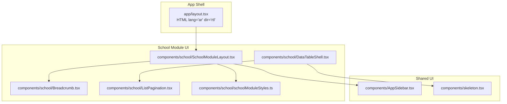
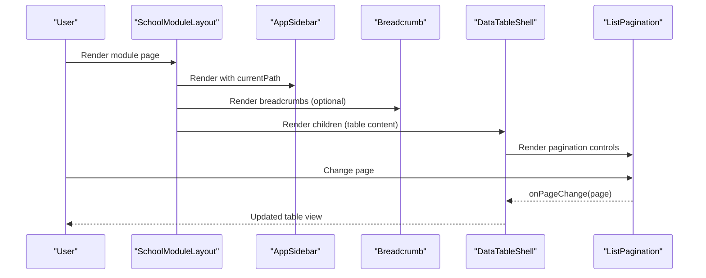
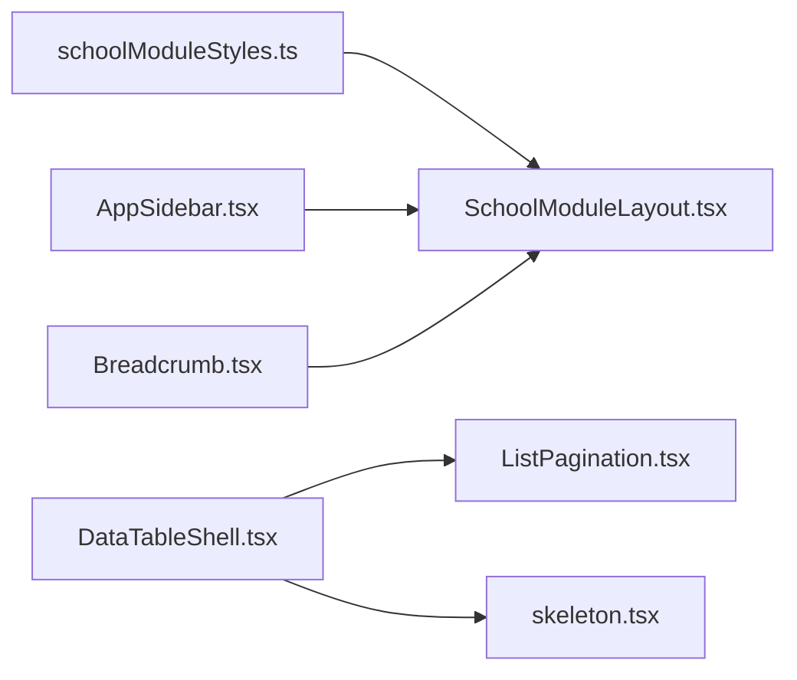

# School Module Components

<cite>
**Referenced Files in This Document**
- [Breadcrumb.tsx](file://components/school/Breadcrumb.tsx)
- [DataTableShell.tsx](file://components/school/DataTableShell.tsx)
- [ListPagination.tsx](file://components/school/ListPagination.tsx)
- [SchoolModuleLayout.tsx](file://components/school/SchoolModuleLayout.tsx)
- [schoolModuleStyles.ts](file://components/school/schoolModuleStyles.ts)
- [AppSidebar.tsx](file://components/AppSidebar.tsx)
- [skeleton.tsx](file://components/skeleton.tsx)
- [layout.tsx](file://app/layout.tsx)
</cite>

## Table of Contents
1. [Introduction](#introduction)
2. [Project Structure](#project-structure)
3. [Core Components](#core-components)
4. [Architecture Overview](#architecture-overview)
5. [Detailed Component Analysis](#detailed-component-analysis)
6. [Dependency Analysis](#dependency-analysis)
7. [Performance Considerations](#performance-considerations)
8. [Accessibility and Internationalization](#accessibility-and-internationalization)
9. [Troubleshooting Guide](#troubleshooting-guide)
10. [Conclusion](#conclusion)

## Introduction
This document provides comprehensive documentation for the school-specific module components that power educational institution management interfaces. It focuses on:
- Breadcrumb for navigation hierarchy and location awareness
- DataTableShell for table scaffolding, state handling, and pagination integration
- ListPagination for robust pagination controls
- SchoolModuleLayout for module-specific layouts, sidebar integration, and content organization
- schoolModuleStyles for consistent, RTL-aware styling across school modules

It also includes usage guidance, accessibility considerations, internationalization support, and mobile optimization tailored for educational environments.

## Project Structure
The school module components are located under components/school and integrate with shared UI components and global providers. The Next.js app layout sets the base HTML direction and language attributes for RTL support.

**Diagram sources**
- [layout.tsx:14-31](file://app/layout.tsx#L14-L31)
- [SchoolModuleLayout.tsx:1-44](file://components/school/SchoolModuleLayout.tsx#L1-L44)
- [Breadcrumb.tsx:1-22](file://components/school/Breadcrumb.tsx#L1-L22)
- [DataTableShell.tsx:1-98](file://components/school/DataTableShell.tsx#L1-L98)
- [ListPagination.tsx:1-103](file://components/school/ListPagination.tsx#L1-L103)
- [schoolModuleStyles.ts:1-101](file://components/school/schoolModuleStyles.ts#L1-L101)
- [AppSidebar.tsx:1-180](file://components/AppSidebar.tsx#L1-L180)
- [skeleton.tsx:1-222](file://components/skeleton.tsx#L1-L222)

**Section sources**
- [layout.tsx:14-31](file://app/layout.tsx#L14-L31)
- [SchoolModuleLayout.tsx:1-44](file://components/school/SchoolModuleLayout.tsx#L1-L44)
- [Breadcrumb.tsx:1-22](file://components/school/Breadcrumb.tsx#L1-L22)
- [DataTableShell.tsx:1-98](file://components/school/DataTableShell.tsx#L1-L98)
- [ListPagination.tsx:1-103](file://components/school/ListPagination.tsx#L1-L103)
- [schoolModuleStyles.ts:1-101](file://components/school/schoolModuleStyles.ts#L1-L101)
- [AppSidebar.tsx:1-180](file://components/AppSidebar.tsx#L1-L180)
- [skeleton.tsx:1-222](file://components/skeleton.tsx#L1-L222)

## Core Components
This section introduces the four primary components and their responsibilities.

- Breadcrumb: Renders navigational breadcrumbs with optional separators and current-page emphasis.
- DataTableShell: Wraps tabular content with loading, error, and empty states, and integrates pagination.
- ListPagination: Provides pagination controls with intelligent page windowing and accessibility attributes.
- SchoolModuleLayout: Provides a module-scoped layout with sidebar, topbar, breadcrumbs, and content area, applying scoped styles.
- schoolModuleStyles: Supplies RTL-first, dark-mode-aware CSS variables and component styles for school modules.

**Section sources**
- [Breadcrumb.tsx:3-21](file://components/school/Breadcrumb.tsx#L3-L21)
- [DataTableShell.tsx:6-34](file://components/school/DataTableShell.tsx#L6-L34)
- [ListPagination.tsx:17-29](file://components/school/ListPagination.tsx#L17-L29)
- [SchoolModuleLayout.tsx:7-21](file://components/school/SchoolModuleLayout.tsx#L7-L21)
- [schoolModuleStyles.ts:1-101](file://components/school/schoolModuleStyles.ts#L1-L101)

## Architecture Overview
The school module components form a cohesive UI layer that:
- Uses Breadcrumb to reflect hierarchical navigation
- Wraps data tables with DataTableShell to handle loading, errors, emptiness, and pagination
- Integrates ListPagination for robust paging controls
- Applies SchoolModuleLayout to organize content with a sidebar and topbar
- Leverages schoolModuleStyles for consistent, RTL-friendly styling

**Diagram sources**
- [SchoolModuleLayout.tsx:22-41](file://components/school/SchoolModuleLayout.tsx#L22-L41)
- [AppSidebar.tsx:27-40](file://components/AppSidebar.tsx#L27-L40)
- [Breadcrumb.tsx:5-21](file://components/school/Breadcrumb.tsx#L5-L21)
- [DataTableShell.tsx:86-96](file://components/school/DataTableShell.tsx#L86-L96)
- [ListPagination.tsx:17-29](file://components/school/ListPagination.tsx#L17-L29)

## Detailed Component Analysis

### Breadcrumb Component
Purpose:
- Display hierarchical navigation with separators and current page emphasis.
- Support both linked items and the current page as non-clickable.

Key behaviors:
- Accepts an array of items with label and optional href.
- Renders separators between items.
- Marks the current page with an aria-current attribute.
- Uses semantic nav element with aria-label for accessibility.

Usage pattern:
- Pass breadcrumbs to SchoolModuleLayout to render within the topbar.

Accessibility:
- Uses nav element with aria-label.
- Current page marked with aria-current="page".
- Separators marked aria-hidden.

Internationalization:
- Textual labels and separators are static; breadcrumb labels come from upstream routing and localization.

Responsive behavior:
- Minimal styling; relies on parent layout for wrapping.

**Section sources**
- [Breadcrumb.tsx:3-21](file://components/school/Breadcrumb.tsx#L3-L21)

### DataTableShell Component
Purpose:
- Provide a reusable shell for data tables with consistent state handling and pagination integration.

States handled:
- Error state: displays error message and optional retry button.
- Loading state: renders a table skeleton.
- Empty state: shows icon, message, optional detail, and action.

Pagination integration:
- Renders ListPagination with page, pageSize, totalCount, and onPageChange callback.

Structure:
- Children receive a wrapper div (.tbl-wrap) for consistent styling.
- Pagination rendered below the table content.

Accessibility:
- Retry button uses appropriate semantics and styling.
- Empty state content is centered and readable.

Internationalization:
- Empty message defaults to Arabic text; can be overridden externally.

Responsive behavior:
- Uses a wrapper div to constrain table rendering within bordered card-like container.

**Section sources**
- [DataTableShell.tsx:6-34](file://components/school/DataTableShell.tsx#L6-L34)
- [DataTableShell.tsx:35-64](file://components/school/DataTableShell.tsx#L35-L64)
- [DataTableShell.tsx:66-68](file://components/school/DataTableShell.tsx#L66-L68)
- [DataTableShell.tsx:69-84](file://components/school/DataTableShell.tsx#L69-L84)
- [DataTableShell.tsx:86-96](file://components/school/DataTableShell.tsx#L86-L96)
- [skeleton.tsx:59-80](file://components/skeleton.tsx#L59-L80)

### ListPagination Component
Purpose:
- Provide intuitive pagination controls with intelligent page windowing and accessibility.

Algorithm highlights:
- Calculates total pages and safe current page.
- Computes visible range around current page (always shows first, last, and neighbors).
- Inserts ellipsis markers ("…") to indicate skipped ranges.

Controls:
- First, Previous, Next, Last buttons.
- Numeric page buttons with aria-label and aria-current for the active page.
- Disabled states for boundary conditions.

Accessibility:
- All buttons include aria-labels and aria-current for the active page.
- Disabled buttons prevent interaction.

Internationalization:
- All labels and messages are in Arabic.

Responsive behavior:
- Centered layout with wrap support for narrow screens.

**Section sources**
- [ListPagination.tsx:3-15](file://components/school/ListPagination.tsx#L3-L15)
- [ListPagination.tsx:17-29](file://components/school/ListPagination.tsx#L17-L29)
- [ListPagination.tsx:30-34](file://components/school/ListPagination.tsx#L30-L34)
- [ListPagination.tsx:36-101](file://components/school/ListPagination.tsx#L36-L101)

### SchoolModuleLayout Component
Purpose:
- Provide a module-scoped layout with sidebar, topbar, breadcrumbs, and content area.

Structure:
- Injects scoped CSS via schoolModuleStyles.
- Renders AppSidebar with currentPath.
- Renders Breadcrumb when provided.
- Renders title and optional subtitle.
- Renders topbarExtra content (e.g., actions).
- Renders children in the main content area.

Integration points:
- Breadcrumb receives items from upstream routing.
- Sidebar uses role-based navigation and locale-aware paths.

Responsive behavior:
- Flexbox layout adapts to viewport.
- Topbar and content areas wrap and scroll appropriately.

**Section sources**
- [SchoolModuleLayout.tsx:7-21](file://components/school/SchoolModuleLayout.tsx#L7-L21)
- [SchoolModuleLayout.tsx:22-41](file://components/school/SchoolModuleLayout.tsx#L22-L41)
- [AppSidebar.tsx:27-40](file://components/AppSidebar.tsx#L27-L40)
- [Breadcrumb.tsx:5-21](file://components/school/Breadcrumb.tsx#L5-L21)

### schoolModuleStyles Utility
Purpose:
- Provide RTL-first, dark-mode-aware CSS variables and component styles for school modules.

Highlights:
- Defines color tokens and typography variables.
- Styles layout, sidebar, topbar, content, toolbar, search, filters, buttons, tables, modals, pagination, cards, tabs, and breadcrumbs.
- Includes dark mode overrides for surfaces, borders, text, and interactive elements.
- Ensures RTL alignment and directionality.

Integration:
- Imported and injected inline by SchoolModuleLayout.

Responsive behavior:
- Uses flexbox and grid for adaptive layouts.
- Includes media-friendly spacing and typography scales.

**Section sources**
- [schoolModuleStyles.ts:1-101](file://components/school/schoolModuleStyles.ts#L1-L101)

## Dependency Analysis
The components exhibit clear, layered dependencies:

**Diagram sources**
- [schoolModuleStyles.ts:1-101](file://components/school/schoolModuleStyles.ts#L1-L101)
- [SchoolModuleLayout.tsx:1-44](file://components/school/SchoolModuleLayout.tsx#L1-L44)
- [AppSidebar.tsx:1-180](file://components/AppSidebar.tsx#L1-L180)
- [Breadcrumb.tsx:1-22](file://components/school/Breadcrumb.tsx#L1-L22)
- [DataTableShell.tsx:1-98](file://components/school/DataTableShell.tsx#L1-L98)
- [ListPagination.tsx:1-103](file://components/school/ListPagination.tsx#L1-L103)
- [skeleton.tsx:1-222](file://components/skeleton.tsx#L1-L222)

**Section sources**
- [SchoolModuleLayout.tsx:3-5](file://components/school/SchoolModuleLayout.tsx#L3-L5)
- [DataTableShell.tsx:3-4](file://components/school/DataTableShell.tsx#L3-L4)

## Performance Considerations
- DataTableShell leverages a skeleton loader to reduce perceived latency during data fetches.
- ListPagination computes page windows efficiently and avoids unnecessary re-renders by relying on stable props.
- Inline injection of scoped CSS reduces external dependencies and ensures minimal FOUC risk.
- SchoolModuleLayout uses a single style injection per module, minimizing CSS overhead.

[No sources needed since this section provides general guidance]

## Accessibility and Internationalization
Accessibility:
- Breadcrumb uses nav with aria-label and marks current page with aria-current.
- ListPagination uses aria-labels for all buttons and aria-current for the active page.
- DataTableShell’s error and empty states are structured for screen readers.
- AppSidebar includes aria-labels for toggle and close actions.

Internationalization:
- The app layout sets HTML lang="ar" and dir="rtl" globally.
- Components use Arabic labels and messages (e.g., pagination, empty states).
- AppSidebar localizes menu labels based on locale.

Mobile optimization:
- AppSidebar supports floating toggle and backdrop for mobile navigation.
- SchoolModuleLayout uses flexible flexbox and wrap for topbar and content.
- Pagination controls are touch-friendly with adequate spacing.

**Section sources**
- [layout.tsx:21-21](file://app/layout.tsx#L21-L21)
- [Breadcrumb.tsx:8-16](file://components/school/Breadcrumb.tsx#L8-L16)
- [ListPagination.tsx:42-99](file://components/school/ListPagination.tsx#L42-L99)
- [DataTableShell.tsx:35-64](file://components/school/DataTableShell.tsx#L35-L64)
- [DataTableShell.tsx:69-84](file://components/school/DataTableShell.tsx#L69-L84)
- [AppSidebar.tsx:99-108](file://components/AppSidebar.tsx#L99-L108)
- [AppSidebar.tsx:135-142](file://components/AppSidebar.tsx#L135-L142)

## Troubleshooting Guide
Common issues and resolutions:
- Breadcrumb not visible: Ensure breadcrumbs prop is provided and non-empty; verify parent layout passes items.
- Pagination not updating: Confirm page, pageSize, and totalCount are correct; ensure onPageChange updates state.
- Empty state not showing: Verify empty flag is true and that error/loading states are false.
- Loading skeleton not appearing: Ensure loading prop is true and that TableSkeleton is imported.
- Styles not applied: Confirm SchoolModuleLayout injects schoolModuleStyles and that RTL direction is set at the HTML level.

**Section sources**
- [SchoolModuleLayout.tsx:24-24](file://components/school/SchoolModuleLayout.tsx#L24-L24)
- [layout.tsx:21-21](file://app/layout.tsx#L21-L21)
- [DataTableShell.tsx:66-68](file://components/school/DataTableShell.tsx#L66-L68)
- [DataTableShell.tsx:69-84](file://components/school/DataTableShell.tsx#L69-L84)

## Conclusion
The school module components deliver a cohesive, accessible, and internationally aware interface for educational institutions. They emphasize:
- Clear navigation with Breadcrumb
- Robust data presentation with DataTableShell and ListPagination
- Consistent, RTL-friendly styling via schoolModuleStyles
- Modular layout with SchoolModuleLayout and AppSidebar

These components are designed to scale across modules while maintaining responsiveness, accessibility, and internationalization standards.