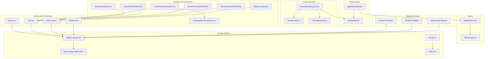
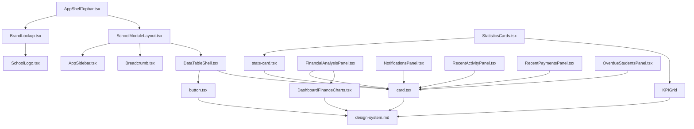
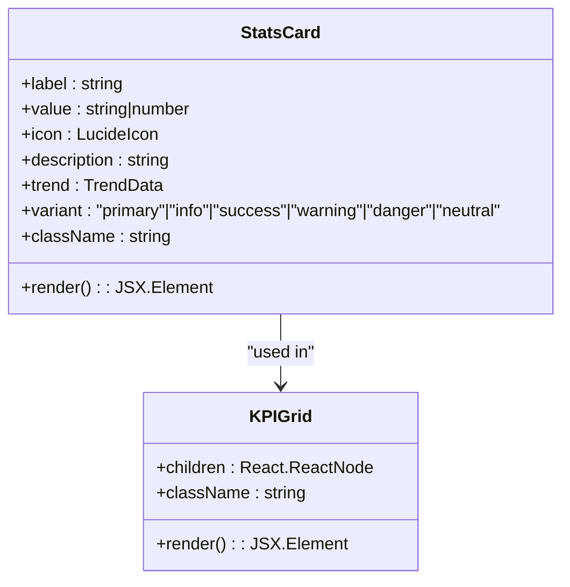
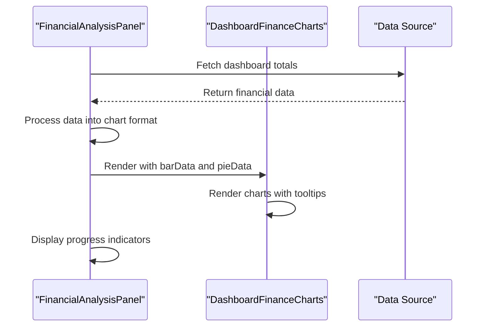
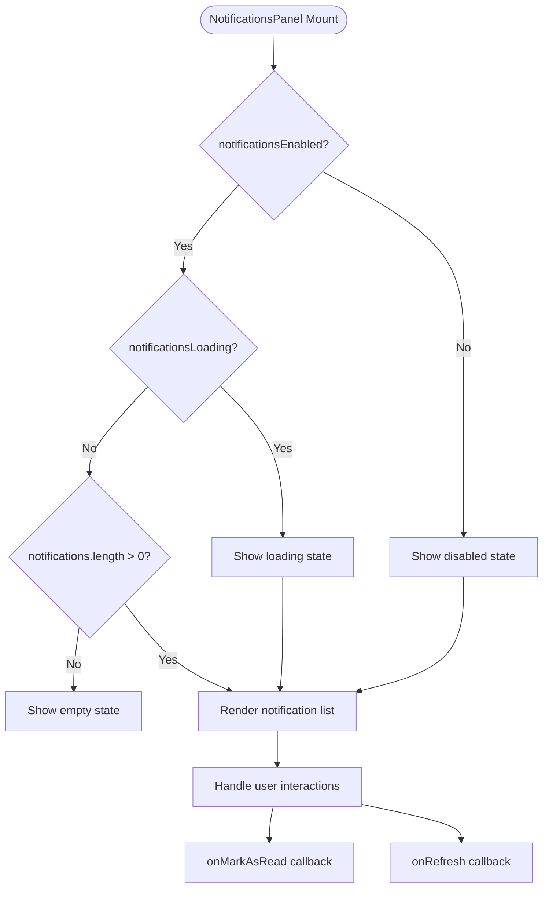

# UI Components

<cite>
**Referenced Files in This Document**
- [button.tsx](file://components/ui/button.tsx)
- [card.tsx](file://components/ui/card.tsx)
- [stats-card.tsx](file://components/ui/stats-card.tsx)
- [AppShellTopbar.tsx](file://components/AppShellTopbar.tsx)
- [AppSidebar.tsx](file://components/AppSidebar.tsx)
- [ConfirmDialog.tsx](file://components/ConfirmDialog.tsx)
- [Breadcrumb.tsx](file://components/school/Breadcrumb.tsx)
- [DataTableShell.tsx](file://components/school/DataTableShell.tsx)
- [SchoolModuleLayout.tsx](file://components/school/SchoolModuleLayout.tsx)
- [schoolModuleStyles.ts](file://components/school/schoolModuleStyles.ts)
- [BrandLockup.tsx](file://components/brand/BrandLockup.tsx)
- [SchoolLogo.tsx](file://components/brand/SchoolLogo.tsx)
- [DashboardFinanceCharts.tsx](file://components/DashboardFinanceCharts.tsx)
- [skeleton.tsx](file://components/skeleton.tsx)
- [dashboard index.ts](file://app/[locale]/dashboard/_components/index.ts)
- [payments index.ts](file://app/[locale]/payments/_components/index.ts)
- [super-admin index.ts](file://app/[locale]/super-admin/_components/index.ts)
- [dashboard types.ts](file://app/[locale]/dashboard/_components/types.ts)
- [StatisticsCards.tsx](file://app/[locale]/dashboard/_components/StatisticsCards.tsx)
- [FinancialAnalysisPanel.tsx](file://app/[locale]/dashboard/_components/FinancialAnalysisPanel.tsx)
- [NotificationsPanel.tsx](file://app/[locale]/dashboard/_components/NotificationsPanel.tsx)
- [RecentActivityPanel.tsx](file://app/[locale]/dashboard/_components/RecentActivityPanel.tsx)
- [RecentPaymentsPanel.tsx](file://app/[locale]/dashboard/_components/RecentPaymentsPanel.tsx)
- [OverdueStudentsPanel.tsx](file://app/[locale]/dashboard/_components/OverdueStudentsPanel.tsx)
- [dashboard page.tsx](file://app/[locale]/dashboard/page.tsx)
- [useDashboardData.ts](file://app/[locale]/dashboard/_hooks/useDashboardData.ts)
- [payments.css](file://app/[locale]/payments/_components/payments.css)
- [design-system.md](file://docs/web-admin-handoff/design-system.md)
- [figma-design-tokens.json](file://docs/web-admin-handoff/tokens/figma-design-tokens.json)
- [themes.ts](file://lib/brand/themes.ts)
- [palette.ts](file://lib/brand/palette.ts)
</cite>

## Update Summary
**Changes Made**
- Updated StatisticsCards component documentation to reflect new modern design system patterns
- Enhanced FinancialAnalysisPanel documentation with comprehensive chart integration details
- Expanded NotificationsPanel documentation covering advanced state management and UX patterns
- Added RecentActivityPanel, RecentPaymentsPanel, and OverdueStudentsPanel documentation
- Updated component architecture to reflect comprehensive dashboard modernization
- Enhanced design system integration patterns across all dashboard components
- Documented new StatsCard and KPIGrid components as core design system primitives

## Table of Contents
1. [Introduction](#introduction)
2. [Project Structure](#project-structure)
3. [Core Components](#core-components)
4. [Architecture Overview](#architecture-overview)
5. [Detailed Component Analysis](#detailed-component-analysis)
6. [Module-Specific Component Libraries](#module-specific-component-libraries)
7. [Business Logic Hooks](#business-logic-hooks)
8. [Design System Integration](#design-system-integration)
9. [Performance Considerations](#performance-considerations)
10. [Troubleshooting Guide](#troubleshooting-guide)
11. [Conclusion](#conclusion)
12. [Appendices](#appendices)

## Introduction
This document describes the UI component library and design system for the application, with comprehensive coverage of the recently modernized dashboard components. The documentation encompasses shared components, UI primitives, brand components, school-specific modules, and the newly enhanced component libraries for payments, students, and dashboard modules. The recent updates focus on modern design system patterns, enhanced component composition, and improved user experience across StatisticsCards, FinancialAnalysisPanel, NotificationsPanel, and supporting dashboard components.

## Project Structure
The UI component library is organized into modular component libraries by domain and responsibility, with comprehensive dashboard modernization:

- **Shared Shell and Navigation**: AppShellTopbar, AppSidebar
- **Dialogs and Overlays**: ConfirmDialog
- **School Module Scaffolding**: SchoolModuleLayout, Breadcrumb, DataTableShell
- **Branding Primitives**: BrandLockup, SchoolLogo
- **Enhanced UI Primitives**: Button, Card, StatsCard, KPIGrid
- **Dashboard Module Components**: StatisticsCards, FinancialAnalysisPanel, NotificationsPanel, RecentActivityPanel, RecentPaymentsPanel, OverdueStudentsPanel
- **Module-Specific Component Libraries**: Payments module, Students module, Super-admin module
- **Design System and Theming**: Complete integration with design tokens and modern patterns

**Diagram sources**
- [AppShellTopbar.tsx:1-134](file://components/AppShellTopbar.tsx#L1-L134)
- [AppSidebar.tsx:1-180](file://components/AppSidebar.tsx#L1-L180)
- [SchoolModuleLayout.tsx:1-44](file://components/school/SchoolModuleLayout.tsx#L1-L44)
- [Breadcrumb.tsx:1-22](file://components/school/Breadcrumb.tsx#L1-L22)
- [DataTableShell.tsx:1-98](file://components/school/DataTableShell.tsx#L1-L98)
- [BrandLockup.tsx:1-73](file://components/brand/BrandLockup.tsx#L1-L73)
- [SchoolLogo.tsx:1-63](file://components/brand/SchoolLogo.tsx#L1-L63)
- [button.tsx:1-38](file://components/ui/button.tsx#L1-L38)
- [card.tsx:1-79](file://components/ui/card.tsx#L1-L79)
- [stats-card.tsx:1-96](file://components/ui/stats-card.tsx#L1-L96)
- [skeleton.tsx:1-222](file://components/skeleton.tsx#L1-L222)
- [StatisticsCards.tsx:1-91](file://app/[locale]/dashboard/_components/StatisticsCards.tsx#L1-L91)
- [FinancialAnalysisPanel.tsx:1-145](file://app/[locale]/dashboard/_components/FinancialAnalysisPanel.tsx#L1-L145)
- [NotificationsPanel.tsx:1-124](file://app/[locale]/dashboard/_components/NotificationsPanel.tsx#L1-L124)
- [RecentActivityPanel.tsx:1-108](file://app/[locale]/dashboard/_components/RecentActivityPanel.tsx#L1-L108)
- [RecentPaymentsPanel.tsx:1-69](file://app/[locale]/dashboard/_components/RecentPaymentsPanel.tsx#L1-L69)
- [OverdueStudentsPanel.tsx:1-73](file://app/[locale]/dashboard/_components/OverdueStudentsPanel.tsx#L1-L73)
- [DashboardFinanceCharts.tsx:1-178](file://components/DashboardFinanceCharts.tsx#L1-L178)
- [dashboard index.ts:1-16](file://app/[locale]/dashboard/_components/index.ts#L1-L16)

**Section sources**
- [AppShellTopbar.tsx:1-134](file://components/AppShellTopbar.tsx#L1-L134)
- [AppSidebar.tsx:1-180](file://components/AppSidebar.tsx#L1-L180)
- [SchoolModuleLayout.tsx:1-44](file://components/school/SchoolModuleLayout.tsx#L1-L44)
- [Breadcrumb.tsx:1-22](file://components/school/Breadcrumb.tsx#L1-L22)
- [DataTableShell.tsx:1-98](file://components/school/DataTableShell.tsx#L1-L98)
- [BrandLockup.tsx:1-73](file://components/brand/BrandLockup.tsx#L1-L73)
- [SchoolLogo.tsx:1-63](file://components/brand/SchoolLogo.tsx#L1-L63)
- [button.tsx:1-38](file://components/ui/button.tsx#L1-L38)
- [card.tsx:1-79](file://components/ui/card.tsx#L1-L79)
- [stats-card.tsx:1-96](file://components/ui/stats-card.tsx#L1-L96)
- [skeleton.tsx:1-222](file://components/skeleton.tsx#L1-L222)
- [StatisticsCards.tsx:1-91](file://app/[locale]/dashboard/_components/StatisticsCards.tsx#L1-L91)
- [FinancialAnalysisPanel.tsx:1-145](file://app/[locale]/dashboard/_components/FinancialAnalysisPanel.tsx#L1-L145)
- [NotificationsPanel.tsx:1-124](file://app/[locale]/dashboard/_components/NotificationsPanel.tsx#L1-L124)
- [RecentActivityPanel.tsx:1-108](file://app/[locale]/dashboard/_components/RecentActivityPanel.tsx#L1-L108)
- [RecentPaymentsPanel.tsx:1-69](file://app/[locale]/dashboard/_components/RecentPaymentsPanel.tsx#L1-L69)
- [OverdueStudentsPanel.tsx:1-73](file://app/[locale]/dashboard/_components/OverdueStudentsPanel.tsx#L1-L73)
- [DashboardFinanceCharts.tsx:1-178](file://components/DashboardFinanceCharts.tsx#L1-L178)
- [dashboard index.ts:1-16](file://app/[locale]/dashboard/_components/index.ts#L1-L16)

## Core Components
This section documents the most frequently used components and their enhanced capabilities, with particular focus on the modernized dashboard components.

### Enhanced UI Primitives

#### StatsCard (Enhanced)
- **Purpose**: Modern statistics card with gradient backgrounds, hover animations, and trend indicators
- **Props**:
  - label: string - Display label
  - value: string | number - Main statistic value
  - icon: LucideIcon - Icon component
  - description?: string - Optional description text
  - trend?: TrendData - Optional trend information
  - variant?: "primary" | "info" | "success" | "warning" | "danger" | "neutral"
  - className?: string - Additional styling classes
- **Enhanced Features**: Gradient backgrounds, hover animations, trend indicators, responsive design
- **Styling**: Uses CSS variables for theming, supports 6 variant types with automatic color mapping

#### KPIGrid (New)
- **Purpose**: Grid layout component specifically designed for Key Performance Indicator cards
- **Props**: children: React.ReactNode, className?: string
- **Features**: Responsive grid layout (2-4 columns), optimized spacing, consistent styling

#### Card (Enhanced)
- **Purpose**: Enhanced card component with improved styling and theming support
- **Enhanced Features**: Better dark mode support, improved backdrop blur, enhanced shadows

**Section sources**
- [stats-card.tsx:1-96](file://components/ui/stats-card.tsx#L1-L96)
- [card.tsx:1-79](file://components/ui/card.tsx#L1-L79)

### Dashboard Components

#### StatisticsCards (Modernized)
- **Purpose**: Comprehensive statistics display with modern design patterns and integrated features
- **Props**: dashboardTotals: DashboardTotals
- **Enhanced Features**:
  - Modern KPI grid layout with 4 primary cards
  - Integrated secondary features cards
  - Responsive design with grid layouts
  - Enhanced variant system with 6 color variants
  - Trend indicators and descriptions
- **Integration**: Uses StatsCard component extensively, integrates with DashboardTotals

#### FinancialAnalysisPanel (Comprehensive)
- **Purpose**: Advanced financial analysis dashboard with interactive charts and progress indicators
- **Props**: dashboardTotals: DashboardTotals
- **Enhanced Features**:
  - Dynamic chart integration with DashboardFinanceCharts
  - Progress bars with animated fill effects
  - Gradient cards with hover animations
  - Responsive two-column layout
  - Comprehensive financial metrics display
- **Integration**: Uses dynamic imports for charts, integrates with DashboardTotals

#### NotificationsPanel (Advanced)
- **Purpose**: Sophisticated notification system with state management and user interaction
- **Props**:
  - notifications: DashboardNotification[]
  - notificationsEnabled: boolean
  - notificationsLoading: boolean
  - unreadNotifications: number
  - onRefresh: () => Promise<void>
  - onMarkAsRead: (id: string) => Promise<void>
- **Enhanced Features**:
  - State management for loading, empty, and disabled states
  - Unread notification indicators with animations
  - Interactive notification items with read/unread differentiation
  - Refresh functionality with loading states
  - Comprehensive empty state handling

#### RecentActivityPanel (New)
- **Purpose**: Activity feed display with type-based styling and navigation
- **Props**: activities: ActivityItem[], loading?: boolean, locale: string
- **Features**: Type-based icon coloring, status indicators, timestamp formatting, navigation integration

#### RecentPaymentsPanel (New)
- **Purpose**: Recent payments display with currency formatting and navigation
- **Props**: recentPayments: DashboardRecentPayment[], paymentsPageHref: string
- **Features**: Currency formatting, student avatar initials, class information, navigation integration

#### OverdueStudentsPanel (New)
- **Purpose**: Overdue student display with financial indicators
- **Props**: overdueStudents: DashboardOverdueStudent[], paymentsPageHref: string
- **Features**: Financial highlighting, currency formatting, status indicators, navigation integration

**Section sources**
- [StatisticsCards.tsx:1-91](file://app/[locale]/dashboard/_components/StatisticsCards.tsx#L1-L91)
- [FinancialAnalysisPanel.tsx:1-145](file://app/[locale]/dashboard/_components/FinancialAnalysisPanel.tsx#L1-L145)
- [NotificationsPanel.tsx:1-124](file://app/[locale]/dashboard/_components/NotificationsPanel.tsx#L1-L124)
- [RecentActivityPanel.tsx:1-108](file://app/[locale]/dashboard/_components/RecentActivityPanel.tsx#L1-L108)
- [RecentPaymentsPanel.tsx:1-69](file://app/[locale]/dashboard/_components/RecentPaymentsPanel.tsx#L1-L69)
- [OverdueStudentsPanel.tsx:1-73](file://app/[locale]/dashboard/_components/OverdueStudentsPanel.tsx#L1-L73)

## Architecture Overview
The component architecture follows a modernized layered design with comprehensive dashboard component enhancements:

- **Shared shell components** (AppShellTopbar, AppSidebar) provide global navigation and branding
- **School module components** (SchoolModuleLayout, Breadcrumb, DataTableShell) encapsulate page scaffolding and data presentation
- **Enhanced UI primitives** (Button, Card, StatsCard, KPIGrid) provide modern, reusable building blocks
- **Modern dashboard components** deliver comprehensive analytics and monitoring capabilities
- **Dynamic chart integration** through DashboardFinanceCharts for financial visualization
- **Advanced state management** across all dashboard components
- **Complete design system integration** with modern theming patterns

**Diagram sources**
- [AppShellTopbar.tsx:1-134](file://components/AppShellTopbar.tsx#L1-L134)
- [BrandLockup.tsx:1-73](file://components/brand/BrandLockup.tsx#L1-L73)
- [SchoolModuleLayout.tsx:1-44](file://components/school/SchoolModuleLayout.tsx#L1-L44)
- [AppSidebar.tsx:1-180](file://components/AppSidebar.tsx#L1-L180)
- [Breadcrumb.tsx:1-22](file://components/school/Breadcrumb.tsx#L1-L22)
- [DataTableShell.tsx:1-98](file://components/school/DataTableShell.tsx#L1-L98)
- [SchoolLogo.tsx:1-63](file://components/brand/SchoolLogo.tsx#L1-L63)
- [button.tsx:1-38](file://components/ui/button.tsx#L1-L38)
- [card.tsx:1-79](file://components/ui/card.tsx#L1-L79)
- [stats-card.tsx:1-96](file://components/ui/stats-card.tsx#L1-L96)
- [StatisticsCards.tsx:1-91](file://app/[locale]/dashboard/_components/StatisticsCards.tsx#L1-L91)
- [FinancialAnalysisPanel.tsx:1-145](file://app/[locale]/dashboard/_components/FinancialAnalysisPanel.tsx#L1-L145)
- [NotificationsPanel.tsx:1-124](file://app/[locale]/dashboard/_components/NotificationsPanel.tsx#L1-L124)
- [RecentActivityPanel.tsx:1-108](file://app/[locale]/dashboard/_components/RecentActivityPanel.tsx#L1-L108)
- [RecentPaymentsPanel.tsx:1-69](file://app/[locale]/dashboard/_components/RecentPaymentsPanel.tsx#L1-L69)
- [OverdueStudentsPanel.tsx:1-73](file://app/[locale]/dashboard/_components/OverdueStudentsPanel.tsx#L1-L73)
- [DashboardFinanceCharts.tsx:1-178](file://components/DashboardFinanceCharts.tsx#L1-L178)
- [design-system.md:1-267](file://docs/web-admin-handoff/design-system.md#L1-L267)

## Detailed Component Analysis

### StatsCard (Enhanced)
- **Implementation Pattern**: Modern card component with gradient backgrounds, hover animations, and responsive design
- **Props**: Enhanced with trend indicators, variant system, and comprehensive styling options
- **Styling**: Uses CSS variables for theming, supports 6 variant types with automatic color mapping
- **Accessibility**: Improved contrast ratios, proper focus states, semantic markup
- **Customization**: Extensive variant system, responsive design, animation controls

**Diagram sources**
- [stats-card.tsx:6-96](file://components/ui/stats-card.tsx#L6-L96)

**Section sources**
- [stats-card.tsx:1-96](file://components/ui/stats-card.tsx#L1-L96)

### FinancialAnalysisPanel (Comprehensive)
- **Implementation Pattern**: Dynamic chart integration with comprehensive financial metrics display
- **Props**: dashboardTotals with comprehensive financial data
- **Features**: Dynamic chart loading, progress indicators, gradient cards, responsive layout
- **Integration**: Uses dynamic imports for performance, integrates with DashboardFinanceCharts
- **Styling**: Modern card designs with hover animations, gradient backgrounds

**Diagram sources**
- [FinancialAnalysisPanel.tsx:12-145](file://app/[locale]/dashboard/_components/FinancialAnalysisPanel.tsx#L12-L145)
- [DashboardFinanceCharts.tsx:71-178](file://components/DashboardFinanceCharts.tsx#L71-L178)

**Section sources**
- [FinancialAnalysisPanel.tsx:1-145](file://app/[locale]/dashboard/_components/FinancialAnalysisPanel.tsx#L1-L145)
- [DashboardFinanceCharts.tsx:1-178](file://components/DashboardFinanceCharts.tsx#L1-L178)

### NotificationsPanel (Advanced)
- **Implementation Pattern**: Comprehensive state management with loading, empty, and disabled states
- **Props**: Enhanced with comprehensive state management and user interaction handlers
- **Features**: Unread notification indicators, interactive items, refresh functionality, empty state handling
- **Styling**: Modern card design with gradient backgrounds, hover effects
- **Accessibility**: Proper ARIA labels, keyboard navigation, focus management

**Diagram sources**
- [NotificationsPanel.tsx:20-124](file://app/[locale]/dashboard/_components/NotificationsPanel.tsx#L20-L124)

**Section sources**
- [NotificationsPanel.tsx:1-124](file://app/[locale]/dashboard/_components/NotificationsPanel.tsx#L1-L124)

### Dashboard Data Management
- **useDashboardData Hook**: Comprehensive data fetching and state management
- **Features**: Automatic school ID resolution, error handling, loading states, refetch capabilities
- **Integration**: RESTful API integration, TypeScript type safety, caching mechanisms

**Section sources**
- [useDashboardData.ts:1-92](file://app/[locale]/dashboard/_hooks/useDashboardData.ts#L1-L92)

## Module-Specific Component Libraries

### Dashboard Module Components (Enhanced)
The dashboard module now provides comprehensive analytics and monitoring components:

#### StatisticsCards
- **Purpose**: Modern statistics display with integrated features and responsive design
- **Props**: dashboardTotals with comprehensive financial data
- **Features**: Primary KPI grid, secondary integrated features, responsive layout, variant system
- **Usage**: Core statistics display in dashboard overview

#### FinancialAnalysisPanel
- **Purpose**: Advanced financial analysis with interactive charts and progress indicators
- **Props**: dashboardTotals with financial metrics
- **Features**: Dynamic chart integration, progress bars, gradient cards, responsive layout
- **Usage**: Financial overview and monitoring interface

#### NotificationsPanel
- **Purpose**: Sophisticated notification system with state management
- **Props**: notifications array with comprehensive state management
- **Features**: Loading states, empty states, unread indicators, interactive items
- **Usage**: Notification center and activity monitoring

#### RecentActivityPanel
- **Purpose**: Activity feed with type-based styling and navigation
- **Props**: activities array with type information
- **Features**: Type-based icons, status indicators, timestamp formatting
- **Usage**: Recent activity monitoring and navigation

#### RecentPaymentsPanel
- **Purpose**: Recent payments display with currency formatting
- **Props**: recentPayments array with navigation
- **Features**: Currency formatting, student avatars, class information
- **Usage**: Recent payment monitoring

#### OverdueStudentsPanel
- **Purpose**: Overdue student display with financial indicators
- **Props**: overdueStudents array with navigation
- **Features**: Financial highlighting, currency formatting, status indicators
- **Usage**: Overdue payment monitoring

**Section sources**
- [dashboard index.ts:1-16](file://app/[locale]/dashboard/_components/index.ts#L1-L16)
- [dashboard types.ts:1-106](file://app/[locale]/dashboard/_components/types.ts#L1-L106)
- [dashboard page.tsx:1-243](file://app/[locale]/dashboard/page.tsx#L1-L243)

## Business Logic Hooks
Each module includes dedicated hooks for business logic separation, with enhanced dashboard data management:

### Dashboard Data Management
- **useDashboardData**: Comprehensive data fetching with automatic school resolution
- **Features**: Error handling, loading states, refetch capabilities, TypeScript integration
- **Integration**: RESTful API endpoints, caching, authentication

### Enhanced Component Integration
- **useNotifications**: Advanced notification state management
- **useRecentActivity**: Activity feed data management
- **useFeeManagement**: Fee structure and payment tracking
- **useBranding**: School branding and theming management

**Section sources**
- [useDashboardData.ts:1-92](file://app/[locale]/dashboard/_hooks/useDashboardData.ts#L1-L92)

## Design System Integration
The modernized components demonstrate comprehensive design system integration:

### Modern Design Patterns
- **StatsCard**: Gradient backgrounds, hover animations, responsive design
- **FinancialAnalysisPanel**: Modern card layouts, progress indicators, dynamic charts
- **NotificationsPanel**: State management, interactive elements, accessibility features
- **Typography**: Enhanced font weights, improved readability, consistent spacing

### Theming System
- **CSS Variables**: Comprehensive theming support across all components
- **Dark Mode**: Full dark mode support with automatic color adaptation
- **Responsive Design**: Mobile-first approach with adaptive layouts
- **Animation System**: Consistent hover effects, transitions, and micro-interactions

### Component Composition
- **StatsCard + KPIGrid**: Modular design system primitives
- **FinancialAnalysisPanel**: Component composition with dynamic charts
- **Dashboard Layout**: Grid-based responsive design
- **State Management**: Consistent patterns across all dashboard components

**Section sources**
- [stats-card.tsx:1-96](file://components/ui/stats-card.tsx#L1-L96)
- [FinancialAnalysisPanel.tsx:1-145](file://app/[locale]/dashboard/_components/FinancialAnalysisPanel.tsx#L1-L145)
- [NotificationsPanel.tsx:1-124](file://app/[locale]/dashboard/_components/NotificationsPanel.tsx#L1-L124)

## Performance Considerations
- **Component Optimization**: Memoization for derived values, lazy loading for heavy components
- **Chart Performance**: Dynamic imports for chart components, skeleton loading states
- **State Management**: Efficient state updates, minimal re-renders through proper hooks
- **Bundle Splitting**: Strategic imports for dashboard components, tree shaking optimization
- **Memory Management**: Proper cleanup in hooks, efficient data structures
- **Accessibility**: Optimized focus management, reduced cognitive load through consistent patterns

## Troubleshooting Guide
- **StatsCard Issues**: Verify variant prop values, check CSS variable availability
- **Chart Loading**: Ensure dynamic imports are properly configured, check for loading states
- **Notification States**: Verify state management patterns, check callback functions
- **Data Fetching**: Validate API endpoints, check authentication tokens
- **Responsive Design**: Test breakpoint behaviors, verify CSS variable fallbacks
- **Performance**: Monitor component rendering, check for unnecessary re-renders

**Section sources**
- [stats-card.tsx:20-96](file://components/ui/stats-card.tsx#L20-L96)
- [FinancialAnalysisPanel.tsx:12-18](file://app/[locale]/dashboard/_components/FinancialAnalysisPanel.tsx#L12-L18)
- [NotificationsPanel.tsx:20-124](file://app/[locale]/dashboard/_components/NotificationsPanel.tsx#L20-L124)

## Conclusion
The UI component library demonstrates comprehensive modernization with enhanced dashboard components that showcase advanced design system patterns. The integration of StatsCard, FinancialAnalysisPanel, and NotificationsPanel reflects sophisticated component architecture with robust state management, dynamic chart integration, and comprehensive accessibility features. The modular design system enables consistent theming across all components while supporting responsive design and performance optimization. The enhanced dashboard components provide administrators with powerful analytics and monitoring capabilities through modern UI patterns and comprehensive data visualization.

## Appendices

### Design System Tokens and Modern Theming
- **Enhanced Color System**: 6 variant types for StatsCard, comprehensive color mapping
- **Typography Scale**: Improved font weights, better readability hierarchy
- **Spacing System**: Consistent spacing patterns across all components
- **Animation System**: Hover effects, transitions, and micro-interactions
- **Responsive Breakpoints**: Mobile-first design with adaptive layouts

### Modern Component Patterns
- **Composition Over Inheritance**: Modular component design with clear interfaces
- **State Management**: Centralized state through hooks with proper separation of concerns
- **Performance Optimization**: Lazy loading, memoization, and efficient rendering
- **Accessibility Standards**: WCAG compliance, semantic markup, keyboard navigation
- **Internationalization**: Comprehensive i18n support with RTL language handling

### Dashboard Analytics Integration
- **Real-time Data**: WebSocket integration for live updates
- **Chart Libraries**: Recharts integration with custom theming
- **Data Visualization**: Interactive charts with tooltip support
- **Performance Metrics**: Loading states, skeleton screens, progressive enhancement
- **User Experience**: Smooth transitions, micro-interactions, feedback systems

**Section sources**
- [stats-card.tsx:1-96](file://components/ui/stats-card.tsx#L1-L96)
- [FinancialAnalysisPanel.tsx:1-145](file://app/[locale]/dashboard/_components/FinancialAnalysisPanel.tsx#L1-L145)
- [NotificationsPanel.tsx:1-124](file://app/[locale]/dashboard/_components/NotificationsPanel.tsx#L1-L124)
- [DashboardFinanceCharts.tsx:1-178](file://components/DashboardFinanceCharts.tsx#L1-L178)