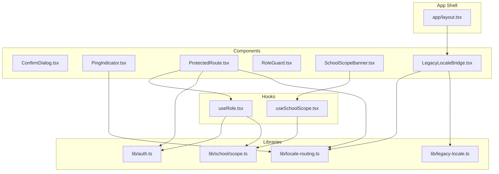
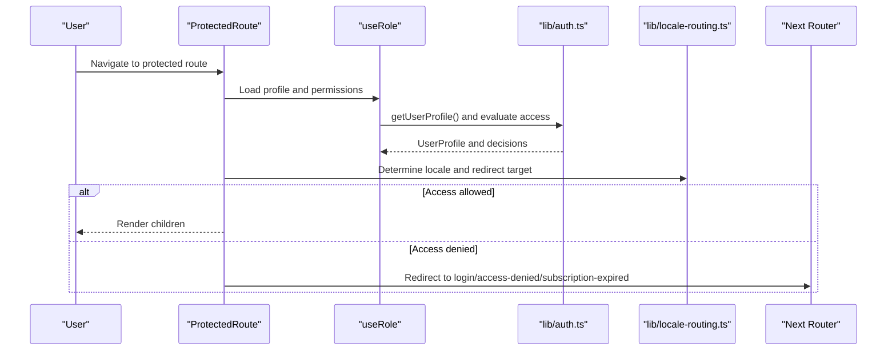
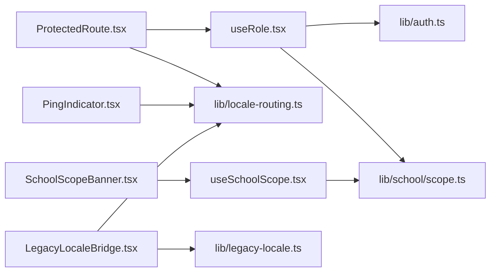

# Utility Components

<cite>
**Referenced Files in This Document**
- [ConfirmDialog.tsx](file://components/ConfirmDialog.tsx)
- [PingIndicator.tsx](file://components/PingIndicator.tsx)
- [ProtectedRoute.tsx](file://components/ProtectedRoute.tsx)
- [RoleGuard.tsx](file://components/RoleGuard.tsx)
- [SchoolScopeBanner.tsx](file://components/SchoolScopeBanner.tsx)
- [LegacyLocaleBridge.tsx](file://components/LegacyLocaleBridge.tsx)
- [useRole.tsx](file://hooks/useRole.tsx)
- [useSchoolScope.tsx](file://hooks/useSchoolScope.tsx)
- [auth.ts](file://lib/auth.ts)
- [locale-routing.ts](file://lib/locale-routing.ts)
- [legacy-locale.ts](file://lib/legacy-locale.ts)
- [scope.ts](file://lib/school/scope.ts)
- [layout.tsx](file://app/layout.tsx)
</cite>

## Table of Contents
1. [Introduction](#introduction)
2. [Project Structure](#project-structure)
3. [Core Components](#core-components)
4. [Architecture Overview](#architecture-overview)
5. [Detailed Component Analysis](#detailed-component-analysis)
6. [Dependency Analysis](#dependency-analysis)
7. [Performance Considerations](#performance-considerations)
8. [Troubleshooting Guide](#troubleshooting-guide)
9. [Conclusion](#conclusion)
10. [Appendices](#appendices)

## Introduction
This document focuses on utility and helper components that enhance application functionality and user experience. It covers:
- Modal dialogs and confirmation workflows
- Connectivity status and network health visualization
- Authentication-based routing and access control
- Permission-based UI rendering and feature gating
- School context display and scope indication
- Internationalization compatibility for legacy content

It provides usage guidance, accessibility considerations, UX best practices, and integration patterns with the broader application architecture.

## Project Structure
These components are organized under the components directory and integrate with hooks, libraries, and Next.js app routing. They rely on Supabase for authentication, RBAC session synchronization, and localized routing.

**Diagram sources**
- [ConfirmDialog.tsx:1-171](file://components/ConfirmDialog.tsx#L1-L171)
- [PingIndicator.tsx:1-87](file://components/PingIndicator.tsx#L1-L87)
- [ProtectedRoute.tsx:1-72](file://components/ProtectedRoute.tsx#L1-L72)
- [RoleGuard.tsx:1-18](file://components/RoleGuard.tsx#L1-L18)
- [SchoolScopeBanner.tsx:1-124](file://components/SchoolScopeBanner.tsx#L1-L124)
- [LegacyLocaleBridge.tsx:1-83](file://components/LegacyLocaleBridge.tsx#L1-L83)
- [useRole.tsx:1-177](file://hooks/useRole.tsx#L1-L177)
- [useSchoolScope.tsx:1-167](file://hooks/useSchoolScope.tsx#L1-L167)
- [auth.ts:1-341](file://lib/auth.ts#L1-L341)
- [locale-routing.ts:1-50](file://lib/locale-routing.ts#L1-L50)
- [legacy-locale.ts:1-206](file://lib/legacy-locale.ts#L1-L206)
- [scope.ts:1-50](file://lib/school/scope.ts#L1-L50)
- [layout.tsx:1-32](file://app/layout.tsx#L1-L32)

**Section sources**
- [layout.tsx:1-32](file://app/layout.tsx#L1-L32)

## Core Components
- ConfirmDialog: A modal dialog for confirm/cancel actions with accessibility support and visual feedback.
- PingIndicator: Network health indicator that measures latency and displays speed classification.
- ProtectedRoute: Route-level guard that enforces authentication, role, and permission checks with redirects.
- RoleGuard: Conditional rendering guard based on user role.
- SchoolScopeBanner: Super admin banner that shows selected school context and allows selection.
- LegacyLocaleBridge: Bridges legacy English strings to Arabic UI and sets document directionality.

**Section sources**
- [ConfirmDialog.tsx:1-171](file://components/ConfirmDialog.tsx#L1-L171)
- [PingIndicator.tsx:1-87](file://components/PingIndicator.tsx#L1-L87)
- [ProtectedRoute.tsx:1-72](file://components/ProtectedRoute.tsx#L1-L72)
- [RoleGuard.tsx:1-18](file://components/RoleGuard.tsx#L1-L18)
- [SchoolScopeBanner.tsx:1-124](file://components/SchoolScopeBanner.tsx#L1-L124)
- [LegacyLocaleBridge.tsx:1-83](file://components/LegacyLocaleBridge.tsx#L1-L83)

## Architecture Overview
The components integrate with:
- Authentication and RBAC via Supabase and the auth library
- Role and permission evaluation through a provider hook
- School scoping for super admins
- Localization and legacy locale translation
- Next.js app shell and providers

**Diagram sources**
- [ProtectedRoute.tsx:1-72](file://components/ProtectedRoute.tsx#L1-L72)
- [useRole.tsx:1-177](file://hooks/useRole.tsx#L1-L177)
- [auth.ts:106-145](file://lib/auth.ts#L106-L145)
- [locale-routing.ts:18-43](file://lib/locale-routing.ts#L18-L43)

## Detailed Component Analysis

### ConfirmDialog
Purpose:
- Presents a modal confirmation dialog with configurable title, description, labels, and tone.
- Supports busy state and click-outside-to-close behavior.

Key behaviors:
- Renders only when open is true.
- Uses role and aria-modal for accessibility.
- Applies danger vs primary tone via props.
- Disables buttons during busy state.

Usage pattern:
- Manage open state in parent component.
- Pass onConfirm and onClose handlers.
- Optionally set tone and labels for localization.

Accessibility:
- Dialog role and aria-modal.
- Close button with aria-label.
- Keyboard focusable elements; click outside to close when not busy.

Integration tips:
- Combine with ProtectedRoute to gate destructive actions.
- Use with form submission flows to prevent accidental operations.

**Section sources**
- [ConfirmDialog.tsx:1-171](file://components/ConfirmDialog.tsx#L1-L171)

### PingIndicator
Purpose:
- Visualizes network latency and categorizes speed as fast, medium, or slow.
- Periodically measures server responsiveness.

Key behaviors:
- Measures round-trip time via a ping endpoint.
- Updates every 30 seconds.
- Shows loading skeleton while measuring.
- Uses translations for labels and speed descriptors.

Performance:
- Debounced updates to reduce overhead.
- Graceful handling of fetch errors.

Accessibility:
- Uses semantic labels and readable typography.
- Color-coded indicators with sufficient contrast.

**Section sources**
- [PingIndicator.tsx:1-87](file://components/PingIndicator.tsx#L1-L87)

### ProtectedRoute
Purpose:
- Enforces authentication, role, and permission-based access control at the route level.
- Redirects unauthenticated or unauthorized users appropriately.

Key behaviors:
- Resolves redirect destination based on access decision reason.
- Supports single or multiple permissions with AND/OR semantics.
- Accepts a fallback UI while resolving access.

Integration:
- Wrap page routes or route groups.
- Use permission arrays and requireAllPermissions flag for granular control.

Fallback UX:
- Provide a loading or empty fallback to avoid flashing during auth resolution.

**Section sources**
- [ProtectedRoute.tsx:1-72](file://components/ProtectedRoute.tsx#L1-L72)
- [useRole.tsx:1-177](file://hooks/useRole.tsx#L1-L177)
- [auth.ts:106-145](file://lib/auth.ts#L106-L145)
- [locale-routing.ts:18-43](file://lib/locale-routing.ts#L18-L43)

### RoleGuard
Purpose:
- Conditionally renders children based on user role.

Key behaviors:
- Returns fallback if profile is missing or role not included.
- Simple and efficient for role-based UI toggles.

Usage pattern:
- Wrap sensitive UI sections.
- Provide a neutral fallback for non-privileged users.

**Section sources**
- [RoleGuard.tsx:1-18](file://components/RoleGuard.tsx#L1-L18)

### SchoolScopeBanner
Purpose:
- Displays and manages school context for super admins.
- Provides a selector and status indicators.

Key behaviors:
- Shows contextual message and status tone based on selection validity and activity.
- Allows changing the selected school via query parameter.
- Includes an empty state component for blocking content until selection.

Integration:
- Use with useSchoolScope hook to derive scope state.
- Combine with ProtectedRoute for super admin pages.

UX considerations:
- Clear messaging for invalid selections.
- Disabled selector during loading states.

**Section sources**
- [SchoolScopeBanner.tsx:1-124](file://components/SchoolScopeBanner.tsx#L1-L124)
- [useSchoolScope.tsx:1-167](file://hooks/useSchoolScope.tsx#L1-L167)
- [scope.ts:1-50](file://lib/school/scope.ts#L1-L50)

### LegacyLocaleBridge
Purpose:
- Translates legacy English strings into Arabic for backward compatibility.
- Sets document language and direction based on locale.

Key behaviors:
- Walks DOM tree and translates text nodes and specific attributes.
- Observes DOM mutations to handle dynamic content.
- Skips script/style/noscript tags.

Integration:
- Mount in app shell to apply globally.
- Works alongside Next.js locale routing.

**Section sources**
- [LegacyLocaleBridge.tsx:1-83](file://components/LegacyLocaleBridge.tsx#L1-L83)
- [locale-routing.ts:1-50](file://lib/locale-routing.ts#L1-L50)
- [legacy-locale.ts:1-206](file://lib/legacy-locale.ts#L1-L206)

## Dependency Analysis
High-level dependencies among components and libraries:

**Diagram sources**
- [ProtectedRoute.tsx:1-72](file://components/ProtectedRoute.tsx#L1-L72)
- [useRole.tsx:1-177](file://hooks/useRole.tsx#L1-L177)
- [auth.ts:1-341](file://lib/auth.ts#L1-L341)
- [locale-routing.ts:1-50](file://lib/locale-routing.ts#L1-L50)
- [scope.ts:1-50](file://lib/school/scope.ts#L1-L50)
- [SchoolScopeBanner.tsx:1-124](file://components/SchoolScopeBanner.tsx#L1-L124)
- [useSchoolScope.tsx:1-167](file://hooks/useSchoolScope.tsx#L1-L167)
- [PingIndicator.tsx:1-87](file://components/PingIndicator.tsx#L1-L87)
- [LegacyLocaleBridge.tsx:1-83](file://components/LegacyLocaleBridge.tsx#L1-L83)
- [legacy-locale.ts:1-206](file://lib/legacy-locale.ts#L1-L206)

**Section sources**
- [ProtectedRoute.tsx:1-72](file://components/ProtectedRoute.tsx#L1-L72)
- [useRole.tsx:1-177](file://hooks/useRole.tsx#L1-L177)
- [auth.ts:1-341](file://lib/auth.ts#L1-L341)
- [locale-routing.ts:1-50](file://lib/locale-routing.ts#L1-L50)
- [scope.ts:1-50](file://lib/school/scope.ts#L1-L50)
- [SchoolScopeBanner.tsx:1-124](file://components/SchoolScopeBanner.tsx#L1-L124)
- [useSchoolScope.tsx:1-167](file://hooks/useSchoolScope.tsx#L1-L167)
- [PingIndicator.tsx:1-87](file://components/PingIndicator.tsx#L1-L87)
- [LegacyLocaleBridge.tsx:1-83](file://components/LegacyLocaleBridge.tsx#L1-L83)
- [legacy-locale.ts:1-206](file://lib/legacy-locale.ts#L1-L206)

## Performance Considerations
- ConfirmDialog busy state prevents double submissions and reduces unnecessary re-renders.
- PingIndicator throttles updates to 30 seconds and uses no-store cache policy to avoid stale measurements.
- ProtectedRoute defers redirects until access is resolved to avoid flicker.
- LegacyLocaleBridge uses MutationObserver selectively and skips heavy tags to minimize overhead.
- SchoolScopeBanner caches school lists in sessionStorage for a short duration to reduce network requests.

## Troubleshooting Guide
Common issues and resolutions:
- ConfirmDialog not closing on click outside:
  - Ensure the overlay click handler is attached and busy state is false.
  - Verify onClose prop is passed and not overridden by parent logic.
- ProtectedRoute redirect loops:
  - Confirm locale prefix handling and sanitizeNextPath logic.
  - Ensure fallback is not causing immediate re-render.
- RoleGuard not rendering children:
  - Check that profile is loaded and role matches the allowed list.
- PingIndicator shows stale or null values:
  - Confirm /api/ping endpoint availability and CORS configuration.
  - Verify fetch error handling does not swallow real failures.
- LegacyLocaleBridge not translating dynamic content:
  - Confirm MutationObserver filters and that translated nodes differ from original.
  - Ensure bridge is mounted early in the app shell.

**Section sources**
- [ConfirmDialog.tsx:36-40](file://components/ConfirmDialog.tsx#L36-L40)
- [ProtectedRoute.tsx:18-31](file://components/ProtectedRoute.tsx#L18-L31)
- [ProtectedRoute.tsx:61-64](file://components/ProtectedRoute.tsx#L61-L64)
- [RoleGuard.tsx:13-16](file://components/RoleGuard.tsx#L13-L16)
- [PingIndicator.tsx:26-62](file://components/PingIndicator.tsx#L26-L62)
- [LegacyLocaleBridge.tsx:52-79](file://components/LegacyLocaleBridge.tsx#L52-L79)

## Conclusion
These utility components provide robust building blocks for user experience and access control:
- ConfirmDialog ensures safe user actions with clear feedback.
- PingIndicator improves perceived performance and transparency.
- ProtectedRoute centralizes access control with flexible permission rules.
- RoleGuard simplifies role-based UI rendering.
- SchoolScopeBanner clarifies context for super admins.
- LegacyLocaleBridge preserves usability during internationalization transitions.

They integrate cleanly with the existing hooks, libraries, and Next.js app shell, following modern React patterns and accessibility guidelines.

## Appendices

### Accessibility Best Practices
- Use aria-modal and role="dialog" for ConfirmDialog.
- Provide aria-labels for icon buttons.
- Ensure keyboard navigation within dialogs.
- Use semantic labels and readable typography in PingIndicator.
- Maintain focus management and skip links for ProtectedRoute fallbacks.
- Respect user preferences for reduced motion and high contrast.

### Integration Patterns
- Wrap pages with ProtectedRoute to enforce access control.
- Use RoleGuard for inline feature gating.
- Mount LegacyLocaleBridge in the app shell for global compatibility.
- Pair SchoolScopeBanner with useSchoolScope for super admin views.
- Combine ConfirmDialog with form submission flows to prevent accidental deletions.

### Example Usage References
- ProtectedRoute with permissions:
  - [ProtectedRoute.tsx:33-52](file://components/ProtectedRoute.tsx#L33-L52)
  - [useRole.tsx:88-109](file://hooks/useRole.tsx#L88-L109)
- RoleGuard usage:
  - [RoleGuard.tsx:13-16](file://components/RoleGuard.tsx#L13-L16)
- ConfirmDialog integration:
  - [ConfirmDialog.tsx:17-27](file://components/ConfirmDialog.tsx#L17-L27)
- PingIndicator in UI:
  - [PingIndicator.tsx:77-85](file://components/PingIndicator.tsx#L77-L85)
- SchoolScopeBanner with selector:
  - [SchoolScopeBanner.tsx:48-74](file://components/SchoolScopeBanner.tsx#L48-L74)
- LegacyLocaleBridge mounting:
  - [LegacyLocaleBridge.tsx:48-82](file://components/LegacyLocaleBridge.tsx#L48-L82)
  - [layout.tsx:20-29](file://app/layout.tsx#L20-L29)